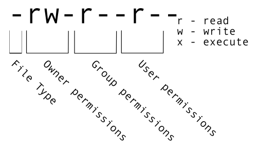

```{r setup2, include=FALSE}
knitr::opts_chunk$set(comment = "#>", echo = TRUE, fig.width=6)
```


# Week 2: Working With Files

Before we start, make sure to clone or update the github folder MarineGenomics in the user directory 

```html
cd /home/margeno/
wget https://raw.githubusercontent.com/BayLab/MarineGenomicsData/main/week2.tar.gz
```

use tar to uncompress and unzip the file

```html

tar -xzvf week2.tar.gz

```

* Questions:
  + How can I view and search file contents?
  + How can I create, copy and delete files and directories?
  + How can I control who has permission to modify a file?
  + How can I repeat recently used commands?
* Objectives:
  + View, search within, copy, move, and rename files. Create new directories.
  + Use wildcards (`*`) to perform operations on multiple files.
  + Make a file read only.
  + Use the `history` command to view and repeat recently used commands.
* Keypoints:
  + You can view file contents using `less`, `cat`, `head` or `tail`.
  + The commands `cp`, `mv`, and `mkdir` are useful for manipulating existing files and creating new directories.
  + You can view file permissions using `ls -l` and change permissions using `chmod`.
  + The `history` command and the up arrow on your keyboard can be used to repeat recently used commands.

## Our data set: FASTQ files

Now that we know how to navigate around our directory structure, let's
start working with our sequencing files. We did a sequencing experiment and 
have two results files, which are stored in our `untrimmed_fastq` directory. 

## Wildcards

Navigate to your `untrimmed_fastq` directory:


```html
$ cd ~/MarineGenomics/Week2/untrimmed_fastq
```


We are interested in looking at the FASTQ files in this directory. We can list
all files with the .fastq extension using the command:

```html
$ ls *.fastq
```


```html
SRR097977.fastq  SRR098026.fastq
```


The `*` character is a special type of character called a wildcard, which can be used to represent any number of any type of character. 
Thus, `*.fastq` matches every file that ends with `.fastq`. 

This command: 

```html
$ ls *977.fastq
```


```html
SRR097977.fastq
```


lists only the file that ends with `977.fastq`.

This command:

```html
$ ls /usr/bin/*.sh
```


```html
/usr/bin/gettext.sh  /usr/bin/rescan-scsi-bus.sh
```


Lists every file in `/usr/bin` that ends in the characters `.sh`.
Note that the output displays __full__ paths to files, since
each result starts with `/`.

## Exercise
Do each of the following tasks from your current directory using a single
`ls` command for each:

1.  List all of the files in `/usr/bin` that start with the letter 'c'.
2.  List all of the files in `/usr/bin` that contain the letter 'a'. 
3.  List all of the files in `/usr/bin` that end with the letter 'o'.

 Bonus: List all of the files in `/usr/bin` that contain the letter 'a' or the letter 'c'.

 Hint: The bonus question requires a Unix wildcard that we haven't talked about yet. Try searching the internet for information about Unix wildcards to find what you need to solve the bonus problem.

<details><summary><span style="color: orange;">Solution</span></summary>
<p>


 1. `ls /usr/bin/c*`
 2. `ls /usr/bin/*a*`
 3. `ls /usr/bin/*o`  
 Bonus: `ls /usr/bin/*[ac]*`
 

</p>
</details>

## Using echo

 `echo` is a built-in shell command that writes its arguments, like a line of text to standard output. 
The `echo` command can also be used with pattern matching characters, such as wildcard characters. 
Here we will use the `echo` command to see how the wildcard character is interpreted by the shell.
 
```html
 $ echo *.fastq
 ```
 
 
 ```html
 SRR097977.fastq SRR098026.fastq
 ```
 
 
The `*` is expanded to include any file that ends with `.fastq`. We can see that the output of
`echo *.fastq` is the same as that of `ls *.fastq`.
 
What would the output look like if the wildcard could *not* be matched? Compare the outputs of `echo *.missing` and `ls *.missing`.

<details><summary><span style="color: orange;">Solution</span></summary>
<p>

 ```html
 $ echo *.missing
 ```
 
 
```html
*.missing
```
 
 
```html
$ ls *.missing
```
 
 
```html
ls: cannot access '*.missing': No such file or directory
```

</p>
</details>
&nbsp;

## Command History

If you want to repeat a command that you've run recently, you can access previous
commands using the up arrow on your keyboard to go back to the most recent
command. Likewise, the down arrow takes you forward in the command history.

A few more useful shortcuts: 

- <kbd>Ctrl</kbd>+<kbd>C</kbd> will cancel the command you are writing, and give you a 
fresh prompt.
- <kbd>Ctrl</kbd>+<kbd>R</kbd> will do a reverse-search through your command history.  This
is very useful.
- <kbd>Ctrl</kbd>+<kbd>L</kbd> or the `clear` command will clear your screen.

You can also review your recent commands with the `history` command, by entering:

```html
$ history
```


to see a numbered list of recent commands. You can reuse one of these commands
directly by referring to the number of that command.

For example, if your history looked like this:

```html
259  ls *
260  ls /usr/bin/*.sh
261  ls *R1*fastq
```


then you could repeat command #260 by entering:

```html
$ !260
```


Type `!` (exclamation point) and then the number of the command from your history.
You will be glad you learned this when you need to re-run very complicated commands.
For more information on advanced usage of `history`, read section 9.3 of
[Bash manual](https://www.gnu.org/software/bash/manual/html_node/index.html).

You can also do this with <kbd>Ctrl</kbd>+<kbd>R</kbd> and a search for `ls` which may be more of less usefull depending on how often you use the command `ls`


## Examining Files

We now know how to switch directories, run programs, and look at the
contents of directories, but how do we look at the contents of files?

One way to examine a file is to print out all of the
contents using the program `cat`. 

Enter the following command from within the `untrimmed_fastq` directory: 

```html
$ cat SRR098026.fastq
```


This will print out all of the contents of the `SRR098026.fastq` to the screen.


## Exercise

1. Print out the contents of the `~/MarineGenomics/week2/untrimmed_fastq/SRR097977.fastq` file. What is the last line of the file? 
2. From your home directory, and without changing directories, use one short command to print the contents of all of the files in
the `./MarineGenomics/Week2/untrimmed_fastq` directory.
 
<details><summary><span style="color: orange;">Solution</span></summary>
<p>

 1. The last line of the file is `C:CCC::CCCCCCCC<8?6A:C28C<608'&&&,'$`.
 2. `cat ./data_week2/Week2/data_week2/untrimmed_fastq/*`
 
</p>
</details>
&nbsp;

`cat` is a terrific program, but when the file is really big, it can
be annoying to use. The program, `less`, is useful for this
case. `less` opens the file as read only, and lets you navigate through it. The navigation commands
are identical to the `man` program.

Enter the following command:

```html
$ less SRR097977.fastq
```


Some navigation commands in `less`:

| key     | action |
| ------- | ---------- |
| <kbd>Space</kbd> | to go forward |
|  <kbd>b</kbd>    | to go backward |
|  <kbd>g</kbd>    | to go to the beginning |
|  <kbd>G</kbd>    | to go to the end |
|  <kbd>q</kbd>    | to quit |

`less` also gives you a way of searching through files. Use the
"/" key to begin a search. Enter the word you would like
to search for and press `enter`. The screen will jump to the next location where
that word is found. 

**Shortcut:** If you hit "/" then "enter", `less` will  repeat
the previous search. `less` searches from the current location and
works its way forward. Scroll up a couple lines on your terminal to verify
you are at the beginning of the file. Note, if you are at the end of the file and search
for the sequence "CAA", `less` will not find it. You either need to go to the
beginning of the file (by typing `g`) and search again using `/` or you
can use `?` to search backwards in the same way you used `/` previously.

For instance, let's search forward for the sequence `TTTTT` in our file. 
You can see that we go right to that sequence, what it looks like,
and where it is in the file. If you continue to type `/` and hit return, you will move 
forward to the next instance of this sequence motif. If you instead type `?` and hit 
return, you will search backwards and move up the file to previous examples of this motif.

## Exercise

What are the next three nucleotides (characters) after the first instance of the sequence quoted above?
 
<details><summary><span style="color: orange;">Solution</span></summary>
<p>

`CAC`
 
</p>
</details>
&nbsp;

Remember, the `man` program actually uses `less` internally and
therefore uses the same commands, so you can search documentation
using "/" as well!

There's another way that we can look at files, and in this case, just
look at part of them. This can be particularly useful if we just want
to see the beginning or end of the file, or see how it's formatted.

The commands are `head` and `tail` and they let you look at
the beginning and end of a file, respectively.

```html
$ head SRR098026.fastq
```


```html
@SRR098026.1 HWUSI-EAS1599_1:2:1:0:968 length=35
NNNNNNNNNNNNNNNNCNNNNNNNNNNNNNNNNNN
+SRR098026.1 HWUSI-EAS1599_1:2:1:0:968 length=35
!!!!!!!!!!!!!!!!#!!!!!!!!!!!!!!!!!!
@SRR098026.2 HWUSI-EAS1599_1:2:1:0:312 length=35
NNNNNNNNNNNNNNNNANNNNNNNNNNNNNNNNNN
+SRR098026.2 HWUSI-EAS1599_1:2:1:0:312 length=35
!!!!!!!!!!!!!!!!#!!!!!!!!!!!!!!!!!!
@SRR098026.3 HWUSI-EAS1599_1:2:1:0:570 length=35
NNNNNNNNNNNNNNNNANNNNNNNNNNNNNNNNNN
```


```html
$ tail SRR098026.fastq
```


```html
+SRR098026.247 HWUSI-EAS1599_1:2:1:2:1311 length=35
#!##!#################!!!!!!!######
@SRR098026.248 HWUSI-EAS1599_1:2:1:2:118 length=35
GNTGNGGTCATCATACGCGCCCNNNNNNNGGCATG
+SRR098026.248 HWUSI-EAS1599_1:2:1:2:118 length=35
B!;?!A=5922:##########!!!!!!!######
@SRR098026.249 HWUSI-EAS1599_1:2:1:2:1057 length=35
CNCTNTATGCGTACGGCAGTGANNNNNNNGGAGAT
+SRR098026.249 HWUSI-EAS1599_1:2:1:2:1057 length=35
A!@B!BBB@ABAB#########!!!!!!!######
```


The `-n` option to either of these commands can be used to print the
first or last `n` lines of a file. 

```html
$ head -n 1 SRR098026.fastq
```


```html
@SRR098026.1 HWUSI-EAS1599_1:2:1:0:968 length=35
```


```html
$ tail -n 1 SRR098026.fastq
```


```html
A!@B!BBB@ABAB#########!!!!!!!######
```


## Details on the FASTQ format

Although it looks complicated (and it is), it's easy to understand the
[fastq](https://en.wikipedia.org/wiki/FASTQ_format) format with a little decoding. Some rules about the format
include...

|Line|Description|
|----|-----------|
|1|Always begins with '@' and then information about the read|
|2|The actual DNA sequence|
|3|Always begins with a '+' and sometimes the same info in line 1|
|4|Has a string of characters which represent the quality scores; must have same number of characters as line 2|

We can view the first complete read in one of the files in our dataset by using `head` to look at
the first four lines.

```html
$ head -n 4 SRR098026.fastq
```


```html
@SRR098026.1 HWUSI-EAS1599_1:2:1:0:968 length=35
NNNNNNNNNNNNNNNNCNNNNNNNNNNNNNNNNNN
+SRR098026.1 HWUSI-EAS1599_1:2:1:0:968 length=35
!!!!!!!!!!!!!!!!#!!!!!!!!!!!!!!!!!!
```


All but one of the nucleotides in this read are unknown (`N`). This is a pretty bad read!

Line 4 shows the quality for each nucleotide in the read. Quality is interpreted as the 
probability of an incorrect base call (e.g. 1 in 10) or, equivalently, the base call 
accuracy (e.g. 90%). To make it possible to line up each individual nucleotide with its quality
score, the numerical score is converted into a code where each individual character 
represents the numerical quality score for an individual nucleotide. For example, in the line
above, the quality score line is: 

```html
!!!!!!!!!!!!!!!!#!!!!!!!!!!!!!!!!!!
```


The `#` character and each of the `!` characters represent the encoded quality for an 
individual nucleotide. The numerical value assigned to each of these characters depends on the 
sequencing platform that generated the reads. The sequencing machine used to generate our data 
uses the standard Sanger quality PHRED score encoding, Illumina version 1.8 onwards.

Here is a link showing what those different symbols mean for quality scores:  https://support.illumina.com/help/BaseSpace_OLH_009008/Content/Source/Informatics/BS/QualityScoreEncoding_swBS.htm


Each character is assigned a quality score between 0 and 42 as shown in the chart below.

```html
Quality encoding: !"#$%&'()*+,-./0123456789:;<=>?@ABCDEFGHIJK
                  |         |         |         |         |
Quality score:    0........10........20........30........40..                          
```


Each quality score represents the probability that the corresponding nucleotide call is
incorrect. This quality score is logarithmically based, so a quality score of 10 reflects a
base call accuracy of 90%, but a quality score of 20 reflects a base call accuracy of 99%. 
These probability values are the results from the base calling algorithm and dependent on how 
much signal was captured for the base incorporation. 

Looking back at our read: 

```html
@SRR098026.1 HWUSI-EAS1599_1:2:1:0:968 length=35
NNNNNNNNNNNNNNNNCNNNNNNNNNNNNNNNNNN
+SRR098026.1 HWUSI-EAS1599_1:2:1:0:968 length=35
!!!!!!!!!!!!!!!!#!!!!!!!!!!!!!!!!!!
```


we can now see that the quality of each of the `N`s is 0 and the quality of the only
nucleotide call (`C`) is also very poor (`#` = a quality score of 2). This is indeed a very
bad read. 


## Creating, moving, copying, and removing

Now we can move around in the file structure, look at files, and search files. But what if we want to copy files or move
them around or get rid of them? Most of the time, you can do these sorts of file manipulations without the command line,
but there will be some cases (like when you're working with a remote computer like we are for this lesson) where it will be
impossible. You'll also find that you may be working with hundreds of files and want to do similar manipulations to all 
of those files. In cases like this, it's much faster to do these operations at the command line.

### Copying Files

When working with computational data, it's important to keep a safe copy of that data that can't be accidentally overwritten or deleted. 
For this lesson, our raw data is our FASTQ files.  We don't want to accidentally change the original files, so we'll make a copy of them
and change the file permissions so that we can read from, but not write to, the files.

First, let's make a copy of one of our FASTQ files using the `cp` command. 

Navigate to the `~/MarineGenomics/week2/untrimmed_fastq` directory and enter:

```html
$ cp SRR098026.fastq SRR098026-copy.fastq
$ ls -F
```


```html
SRR097977.fastq  SRR098026-copy.fastq  SRR098026.fastq
```


We now have two copies of the `SRR098026.fastq` file, one of them named `SRR098026-copy.fastq`. We'll move this file to a new directory
called `backup` where we'll store our backup data files.

### Creating Directories

The `mkdir` command is used to make a directory. Enter `mkdir`
followed by a space, then the directory name you want to create:

```html
$ mkdir backup
```


### Moving / Renaming 

We can now move our backup file to this directory. We can
move files around using the command `mv`: 

```html
$ mv SRR098026-copy.fastq backup
$ ls backup
```

 
```html
SRR098026-copy.fastq
```


The `mv` command is also how you rename files. Let's rename this file to make it clear that this is a backup:

```html
$ cd backup
$ mv SRR098026-copy.fastq SRR098026-backup.fastq
$ ls
```


```html
SRR098026-backup.fastq
```


## File Permissions

We've now made a backup copy of our file, but just because we have two copies, it doesn't make us safe. We can still accidentally delete or 
overwrite both copies. To make sure we can't accidentally mess up this backup file, we're going to change the permissions on the file so
that we're only allowed to read (i.e. view) the file, not write to it (i.e. make new changes).

View the current permissions on a file using the `-l` (long) flag for the `ls` command: 

```html
$ ls -l
```


```html
-rw-rw-r-- 1 margeno margeno 43K Apr 6 12:15 SRR098026-backup.fastq
```


The first part of the output for the `-l` flag gives you information about the file's current permissions. There are ten slots in the
permissions list. The first character in this list is related to file type, not permissions, so we'll ignore it for now. The next three
characters relate to the permissions that the file owner has, the next three relate to the permissions for group members, and the final
three characters specify what other users outside of your group can do with the file. We're going to concentrate on the three positions
that deal with your permissions (as the file owner). 



Here the three positions that relate to the file owner are `rw-`. The `r` means that you have permission to read the file, the `w` 
indicates that you have permission to write to (i.e. make changes to) the file, and the third position is a `-`, indicating that you 
don't have permission to carry out the ability encoded by that space (this is the space where `x` or executable ability is stored, we'll 
talk more about this in [a later lesson](http://www.datacarpentry.org/shell-genomics/05-writing-scripts/)).

Our goal for now is to change permissions on this file so that you no longer have `w` or write permissions. We can do this using the `chmod` (change mode) command and subtracting (`-`) the write permission `-w`. 

```html
$ chmod -w SRR098026-backup.fastq
$ ls -l 
```

```html
-r--r--r-- 1 dcuser dcuser 43332 Nov 15 23:02 SRR098026-backup.fastq
```

Chmod can also change the permission to only the user (u), group (g), and/or other (o). Let's add reading (r), writing (x), and execute (x) permissions to user group.

```html
$ chmod u=rwx SRR098026-backup.fastq
$ ls -l 
```

## Removing

To prove to ourselves that you no longer have the ability to modify this file, try deleting it with the `rm` command:

```html
$ rm SRR098026-backup.fastq
```


You'll be asked if you want to override your file permissions:

```html
rm: remove write-protected regular file ‘SRR098026-backup.fastq’? 
```


You should enter `n` for no. If you enter `n` (for no), the file will not be deleted. If you enter `y`, you will delete the file. This gives us an extra 
measure of security, as there is one more step between us and deleting our data files.

**Important**: The `rm` command permanently removes the file. Be careful with this command. It doesn't
just nicely put the files in the Trash. They're really gone.

By default, `rm` will not delete directories. You can tell `rm` to
delete a directory using the `-r` (recursive) option. Let's delete the backup directory
we just made. 

Enter the following command:

```html
$ cd ..
$ rm -r backup
```


This will delete not only the directory, but all files within the directory. If you have write-protected files in the directory, 
you will be asked whether you want to override your permission settings. 

## Exercise

Starting in the `~/MarineGenomics/Week2/untrimmed_fastq/` directory, do the following:
1. Make sure that you have deleted your backup directory and all files it contains.  
2. Create a backup of each of your FASTQ files using `cp`. (Note: You'll need to do this individually for each of the two FASTQ files. We haven't learned yet how to do this with a wildcard.)  
3. Use a wildcard to move all of your backup files to a new backup directory.   
4. Change the permissions on all of your backup files to be write-protected.  

<details><summary><span style="color: orange;">Solution</span></summary>
<p>


1. `rm -r backup`  
2. `cp SRR098026.fastq SRR098026-backup.fastq` and `cp SRR097977.fastq SRR097977-backup.fastq`  
3. `mkdir backup` and `mv *-backup.fastq backup`
4. `chmod -w backup/*-backup.fastq`   
It's always a good idea to check your work with `ls -l backup`. You should see something like: 
 
 ```html
-r--r--r-- 1 dcuser dcuser 47552 Nov 15 23:06 SRR097977-backup.fastq
-r--r--r-- 1 dcuser dcuser 43332 Nov 15 23:06 SRR098026-backup.fastq
```

</p>
</details>
&nbsp;


## Redirections

* Questions:
  + How can I search within files?
  + How can I combine existing commands to do new things?
* Objectives:
  + Employ the `grep` command to search for information within files.
  + Print the results of a command to a file.
  + Construct command pipelines with two or more stages.
  + Use `for` loops to run the same command for several input files.
* Keypoints:
  + `grep` is a powerful search tool with many options for customization.
  + `>`, `>>`, and `|` are different ways of redirecting output.
  + `command > file` redirects a command's output to a file.
  + `command >> file` redirects a command's output to a file without overwriting the existing contents of the file.
  + `command_1 | command_2` redirects the output of the first command as input to the second command.
  + `for` loops are used for iteration.
  + `basename` gets rid of repetitive parts of names.

## Searching files

We discussed in a previous episode how to search within a file using `less`. We can also
search within files without even opening them, using `grep`. `grep` is a command-line
utility for searching plain-text files for lines matching a specific set of 
characters (sometimes called a string) or a particular pattern 
(which can be specified using something called regular expressions). We're not going to work with 
regular expressions in this lesson, and are instead going to specify the strings 
we are searching for.
Let's give it a try!

> ### Nucleotide abbreviations
> 
> The four nucleotides that appear in DNA are abbreviated `A`, `C`, `T` and `G`. 
> Unknown nucleotides are represented with the letter `N`. An `N` appearing
> in a sequencing file represents a position where the sequencing machine was not able to 
> confidently determine the nucleotide in that position. You can think of an `N` as being aNy 
> nucleotide at that position in the DNA sequence. 
> 

We'll search for strings inside of our fastq files. Let's first make sure we are in the correct 
directory:

```html
$ cd ~/MarineGenomics/Week2/untrimmed_fastq
```


Suppose we want to see how many reads in our file have really bad segments containing 10 consecutive unknown nucleotides (Ns).

> ### Determining quality
> 
> In this lesson, we're going to be manually searching for strings of `N`s within our sequence
> results to illustrate some principles of file searching. It can be really useful to do this
> type of searching to get a feel for the quality of your sequencing results, however, in your 
> research you will most likely use a bioinformatics tool that has a built-in program for
> filtering out low-quality reads. You'll learn how to use one such tool in 
> [a later lesson](https://datacarpentry.org/wrangling-genomics/02-quality-control/index.html).
> 

Let's search for the string NNNNNNNNNN in the SRR098026 file:
```html
$ grep NNNNNNNNNN SRR098026.fastq
```


This command returns a lot of output to the terminal. Every single line in the SRR098026 
file that contains at least 10 consecutive Ns is printed to the terminal, regardless of how long or short the file is. 
We may be interested not only in the actual sequence which contains this string, but 
in the name (or identifier) of that sequence. We discussed in a previous lesson 
that the identifier line immediately precedes the nucleotide sequence for each read
in a FASTQ file. We may also want to inspect the quality scores associated with
each of these reads. To get all of this information, we will return the line 
immediately before each match and the two lines immediately after each match.

We can use the `-B` argument for grep to return a specific number of lines before
each match. The `-A` argument returns a specific number of lines after each matching line. Here we want the line *before* and the two lines *after* each 
matching line, so we add `-B1 -A2` to our grep command:

```html
$ grep -B1 -A2 NNNNNNNNNN SRR098026.fastq
```


One of the sets of lines returned by this command is: 

```html
@SRR098026.177 HWUSI-EAS1599_1:2:1:1:2025 length=35
CNNNNNNNNNNNNNNNNNNNNNNNNNNNNNNNNNN
+SRR098026.177 HWUSI-EAS1599_1:2:1:1:2025 length=35
#!!!!!!!!!!!!!!!!!!!!!!!!!!!!!!!!!!
```


## Exercise

1. Search for the sequence `GNATNACCACTTCC` in the `SRR098026.fastq` file.
Have your search return all matching lines and the name (or identifier) for each sequence
that contains a match.
 
2. Search for the sequence `AAGTT` in both FASTQ files.
Have your search return all matching lines and the name (or identifier) for each sequence
that contains a match.
 
<details><summary><span style="color: orange;">Solution</span></summary>
<p>

 1. `grep -B1 GNATNACCACTTCC SRR098026.fastq` 
 
```
@SRR098026.245 HWUSI-EAS1599_1:2:1:2:801 length=35
GNATNACCACTTCCAGTGCTGANNNNNNNGGGATG
```
2. `grep -B1 AAGTT *.fastq`

```
SRR097977.fastq-@SRR097977.11 209DTAAXX_Lenski2_1_7:8:3:247:351 length=36
SRR097977.fastq:GATTGCTTTAATGAAAAAGTCATATAAGTTGCCATG
--
SRR097977.fastq-@SRR097977.67 209DTAAXX_Lenski2_1_7:8:3:544:566 length=36
SRR097977.fastq:TTGTCCACGCTTTTCTATGTAAAGTTTATTTGCTTT
--
SRR097977.fastq-@SRR097977.68 209DTAAXX_Lenski2_1_7:8:3:724:110 length=36
SRR097977.fastq:TGAAGCCTGCTTTTTTATACTAAGTTTGCATTATAA
--
SRR097977.fastq-@SRR097977.80 209DTAAXX_Lenski2_1_7:8:3:258:281 length=36
SRR097977.fastq:GTGGCGCTGCTGCATAAGTTGGGTTATCAGGTCGTT
--
SRR097977.fastq-@SRR097977.92 209DTAAXX_Lenski2_1_7:8:3:353:318 length=36
SRR097977.fastq:GGCAAAATGGTCCTCCAGCCAGGCCAGAAGCAAGTT
--
SRR097977.fastq-@SRR097977.139 209DTAAXX_Lenski2_1_7:8:3:703:655 length=36
SRR097977.fastq:TTTATTTGTAAAGTTTTGTTGAAATAAGGGTTGTAA
--
SRR097977.fastq-@SRR097977.238 209DTAAXX_Lenski2_1_7:8:3:592:919 length=36
SRR097977.fastq:TTCTTACCATCCTGAAGTTTTTTCATCTTCCCTGAT
--
SRR098026.fastq-@SRR098026.158 HWUSI-EAS1599_1:2:1:1:1505 length=35
SRR098026.fastq:GNNNNNNNNCAAAGTTGATCNNNNNNNNNTGTGCG
```

</p>
</details>
&nbsp;

## Redirecting output

`grep` allowed us to identify sequences in our FASTQ files that match a particular pattern. 
All of these sequences were printed to our terminal screen, but in order to work with these 
sequences and perform other operations on them, we will need to capture that output in some
way. 

We can do this with something called "redirection". The idea is that
we are taking what would ordinarily be printed to the terminal screen and redirecting it to another location. 
In our case, we want to print this information to a file so that we can look at it later and 
use other commands to analyze this data.

The command for redirecting output to a file is `>`.

Let's try out this command and copy all the records (including all four lines of each record) 
in our FASTQ files that contain 
'NNNNNNNNNN' to another file called `bad_reads.txt`.

```html
$ grep -B1 -A2 NNNNNNNNNN SRR098026.fastq > bad_reads.txt
```


> ### File extensions
> 
> You might be confused about why we're naming our output file with a `.txt` extension. After all,
> it will be holding FASTQ formatted data that we're extracting from our FASTQ files. Won't it 
> also be a FASTQ file? The answer is, yes - it will be a FASTQ file and it would make sense to 
> name it with a `.fastq` extension. However, using a `.fastq` extension will lead us to problems
> when we move to using wildcards later in this episode. We'll point out where this becomes
> important. For now, it's good that you're thinking about file extensions! 
> 


The prompt should sit there a little bit, and then it should look like nothing
happened. But type `ls`. You should see a new file called `bad_reads.txt`. 

We can check the number of lines in our new file using a command called `wc`. 
`wc` stands for **word count**. This command counts the number of words, lines, and characters
in a file. The FASTQ file may change over time, so given the potential for updates, 
make sure your file matches your instructor's output. 

As of Sept. 2020, wc gives the following output:  


```html
$ wc bad_reads.txt
```


```html
  537  1073 23217 bad_reads.txt
```


This will tell us the number of lines, words and characters in the file. If we
want only the number of lines, we can use the `-l` flag for `lines`.

```html
$ wc -l bad_reads.txt
```


```html
537 bad_reads.txt
```


### Exercise

How many sequences are there in `SRR098026.fastq`? Remember that every sequence is formed by four lines.

<details><summary><span style="color: orange;">Solution</span></summary>
<p>


```html
$ wc -l SRR098026.fastq
```
 

```html
996
```
Now you can divide this number by four to get the number of sequences in your fastq file

</p>
</details>
&nbsp;


We might want to search multiple FASTQ files for sequences that match our search pattern.
However, we need to be careful, because each time we use the `>` command to redirect output
to a file, the new output will replace the output that was already present in the file. 
This is called "overwriting" and, just like you don't want to overwrite your video recording
of your kid's first birthday party, you also want to avoid overwriting your data files.

```html
$ grep -B1 -A2 NNNNNNNNNN SRR098026.fastq > bad_reads.txt
$ wc -l bad_reads.txt
```


```html
537 bad_reads.txt
```


```html
$ grep -B1 -A2 NNNNNNNNNN SRR097977.fastq > bad_reads.txt
$ wc -l bad_reads.txt
```


```html
0 bad_reads.txt
```


Here, the output of our second  call to `wc` shows that we no longer have any lines in our `bad_reads.txt` file. This is 
because the second file we searched (`SRR097977.fastq`) does not contain any lines that match our
search sequence. So our file was overwritten and is now empty.

We can avoid overwriting our files by using the command `>>`. `>>` is known as the "append redirect" and will 
append new output to the end of a file, rather than overwriting it.

```html
$ grep -B1 -A2 NNNNNNNNNN SRR098026.fastq > bad_reads.txt
$ wc -l bad_reads.txt
```


```html
537 bad_reads.txt
```


```html
$ grep -B1 -A2 NNNNNNNNNN SRR097977.fastq >> bad_reads.txt
$ wc -l bad_reads.txt
```


```html
537 bad_reads.txt
```


The output of our second call to `wc` shows that we have not overwritten our original data. 

We can also do this with a single line of code by using a wildcard: 

```html
$ grep -B1 -A2 NNNNNNNNNN *.fastq > bad_reads.txt
$ wc -l bad_reads.txt
```


```html
537 bad_reads.txt
```


> ### File extensions - part 2
> 
> This is where we would have trouble if we were naming our output file with a `.fastq` extension. 
> If we already had a file called `bad_reads.fastq` (from our previous `grep` practice) 
> and then ran the command above using a `.fastq` extension instead of a `.txt` extension, `grep`
> would give us a warning. 
> 
> ```html
> grep -B1 -A2 NNNNNNNNNN *.fastq > bad_reads.fastq
> ```
> 
> 
> ```html
> grep: input file ‘bad_reads.fastq’ is also the output
> ```
> 
> 
> `grep` is letting you know that the output file `bad_reads.fastq` is also included in your
> `grep` call because it matches the `*.fastq` pattern. Be careful with this as it can lead to
> some unintended results.
> 

Since we might have multiple different criteria we want to search for, 
creating a new output file each time has the potential to clutter up our workspace. We also
thus far haven't been interested in the actual contents of those files, only in the number of 
reads that we've found. We created the files to store the reads and then counted the lines in 
the file to see how many reads matched our criteria. There's a way to do this, however, that
doesn't require us to create these intermediate files - the pipe command (`|`).

What `|` does is take the output that is scrolling by on the terminal and uses that output as input to another command. 
When our output was scrolling by, we might have wished we could slow it down and
look at it, like we can with `less`. Well it turns out that we can! We can redirect our output
from our `grep` call through the `less` command.

```html
$ grep -B1 -A2 NNNNNNNNNN SRR098026.fastq | less
```


We can now see the output from our `grep` call within the `less` interface. We can use the up and down arrows 
to scroll through the output and use `q` to exit `less`.

If we don't want to create a file before counting lines of output from our `grep` search, we could directly pipe
the output of the grep search to the command `wc -l`. This can be helpful for investigating your output if you are not sure
you would like to save it to a file. 

```html
$ grep -B1 -A2 NNNNNNNNNN SRR098026.fastq | wc -l 
```


Because we asked `grep` for all four lines of each FASTQ record, we need to divide the output by
four to get the number of sequences that match our search pattern. Since 802 / 4 = 200.5 and we
are expecting an integer number of records, there is something added or missing in `bad_reads.txt`. 
If we explore `bad_reads.txt` using `less`, we might be able to notice what is causing the uneven 
number of lines. Luckily, this issue happens by the end of the file so we can also spot it with `tail`.

```html
$ grep -B1 -A2 NNNNNNNNNN SRR098026.fastq > bad_reads.txt
$ tail bad_reads.txt
```


```html
@SRR098026.133 HWUSI-EAS1599_1:2:1:0:1978 length=35
ANNNNNNNNNTTCAGCGACTNNNNNNNNNNGTNGN
+SRR098026.133 HWUSI-EAS1599_1:2:1:0:1978 length=35
#!!!!!!!!!##########!!!!!!!!!!##!#!
--
--
@SRR098026.177 HWUSI-EAS1599_1:2:1:1:2025 length=35
CNNNNNNNNNNNNNNNNNNNNNNNNNNNNNNNNNN
+SRR098026.177 HWUSI-EAS1599_1:2:1:1:2025 length=35
#!!!!!!!!!!!!!!!!!!!!!!!!!!!!!!!!!!
```


The fifth and six lines in the output display "--" which is the default action for `grep` to separate groups of 
lines matching the pattern, and indicate groups of lines which did not match the pattern so are not displayed. 
To fix this issue, we can redirect the output of grep to a second instance of `grep` as follows.

```html
$ grep -B1 -A2 NNNNNNNNNN SRR098026.fastq | grep -v '^--' > bad_reads.fastq
tail bad_reads.fastq
```


```html
+SRR098026.132 HWUSI-EAS1599_1:2:1:0:320 length=35
#!!!!!!!!!##########!!!!!!!!!!##!#!
@SRR098026.133 HWUSI-EAS1599_1:2:1:0:1978 length=35
ANNNNNNNNNTTCAGCGACTNNNNNNNNNNGTNGN
+SRR098026.133 HWUSI-EAS1599_1:2:1:0:1978 length=35
#!!!!!!!!!##########!!!!!!!!!!##!#!
@SRR098026.177 HWUSI-EAS1599_1:2:1:1:2025 length=35
CNNNNNNNNNNNNNNNNNNNNNNNNNNNNNNNNNN
+SRR098026.177 HWUSI-EAS1599_1:2:1:1:2025 length=35
#!!!!!!!!!!!!!!!!!!!!!!!!!!!!!!!!!!
```

The `-v` option in the second `grep` search stands for `--invert-match` meaning `grep` will now only display the 
lines which do not match the searched pattern, in this case `'^--'`. The caret (`^`) is an **anchoring** 
character matching the beginning of the line, and the pattern has to be enclose by single quotes so `grep` does 
not interpret the pattern as an extended option (starting with --).


> ### Custom `grep` control
> 
> Use `man grep` to read more about other options to customize the output of `grep` including extended options, 
> anchoring characters, and much more.
> 

Redirecting output is often not intuitive, and can take some time to get used to. Once you're 
comfortable with redirection, however, you'll be able to combine any number of commands to
do all sorts of exciting things with your data!

None of the command line programs we've been learning
do anything all that impressive on their own, but when you start chaining
them together, you can do some really powerful things very
efficiently. 


## Writing for loops

Loops are key to productivity improvements through automation as they allow us to execute commands repeatedly. 
Similar to wildcards and tab completion, using loops also reduces the amount of typing (and typing mistakes). 
Loops are helpful when performing operations on groups of sequencing files, such as unzipping or trimming multiple
files. We will use loops for these purposes in subsequent analyses, but will cover the basics of them for now.

When the shell sees the keyword `for`, it knows to repeat a command (or group of commands) once for each item in a list. 
Each time the loop runs (called an iteration), an item in the list is assigned in sequence to the **variable**, and 
the commands inside the loop are executed, before moving on to the next item in the list. Inside the loop, we call for 
the variable's value by putting `$` in front of it. The `$` tells the shell interpreter to treat the **variable**
as a variable name and substitute its value in its place, rather than treat it as text or an external command. In shell programming, this is usually called "expanding" the variable.

Sometimes, we want to expand a variable without any whitespace to its right.
Suppose we have a variable named `foo` that contains the text `abc`, and would
like to expand `foo` to create the text `abcEFG`.

```html
$ foo=abc
$ echo foo is $foo
foo is abc
$ echo foo is $fooEFG      # doesn't work
foo is
```


The interpreter is trying to expand a variable named `fooEFG`, which (probably)
doesn't exist. We can avoid this problem by enclosing the variable name in 
braces (`{` and `}`, sometimes called "squiggle braces"). `bash` treats the `#`
character as a comment character. Any text on a line after a `#` is ignored by
bash when evaluating the text as code.

```html
$ foo=abc
$ echo foo is $foo
foo is abc
$ echo foo is ${foo}EFG      # now it works!
foo is abcEFG
```


Let's write a for loop to show us the first two lines of the fastq files we downloaded earlier. You will notice the shell prompt changes from `$` to `>` and back again as we were typing in our loop. The second prompt, `>`, is different to remind us that we haven’t finished typing a complete command yet. A semicolon, `;`, can be used to separate two commands written on a single line.

```html
$ cd ~/MarineGenomics/week2/untrimmed_fastq
```


```html
$ for filename in *.fastq
> do
> head -n 2 ${filename}
> done
```


The for loop begins with the formula `for <variable> in <group to iterate over>`. In this case, the word `filename` is designated 
as the variable to be used over each iteration. In our case `SRR097977.fastq` and `SRR098026.fastq` will be substituted for `filename` 
because they fit the pattern of ending with .fastq in the directory we've specified. The next line of the for loop is `do`. The next line is 
the code that we want to execute. We are telling the loop to print the first two lines of each variable we iterate over. Finally, the
word `done` ends the loop.

After executing the loop, you should see the first two lines of both fastq files printed to the terminal. Let's create a loop that 
will save this information to a file.

```html
$ for filename in *.fastq
> do
> head -n 2 ${filename} >> seq_info.txt
> done
```


When writing a loop, you will not be able to return to previous lines once you have pressed Enter. Remember that we can cancel the current command using

- <kbd>Ctrl</kbd>+<kbd>C</kbd>

If you notice a mistake that is going to prevent your loop for executing correctly.

Note that we are using `>>` to append the text to our `seq_info.txt` file. If we used `>`, the `seq_info.txt` file would be rewritten
every time the loop iterates, so it would only have text from the last variable used. Instead, `>>` adds to the end of the file.

## Using Basename in for loops
Basename is a function in UNIX that is helpful for removing a uniform part of a name from a list of files. In this case, we will use basename to remove the `.fastq` extension from the files that we’ve been working with. 

```html
$ basename SRR097977.fastq .fastq
```


We see that this returns just the SRR accession, and no longer has the .fastq file extension on it.

```html
SRR097977
```


If we try the same thing but use `.fasta` as the file extension instead, nothing happens. This is because basename only works when it exactly matches a string in the file.

```html
$ basename SRR097977.fastq .fasta
```


```html
SRR097977.fastq
```


Basename is really powerful when used in a for loop. It allows to access just the file prefix, which you can use to name things. Let's try this.

Inside our for loop, we create a new name variable. We call the basename function inside the parenthesis, then give our variable name from the for loop, in this case `${filename}`, and finally state that `.fastq` should be removed from the file name. It’s important to note that we’re not changing the actual files, we’re creating a new variable called name. The line > echo $name will print to the terminal the variable name each time the for loop runs. Because we are iterating over two files, we expect to see two lines of output.

```html
$ for filename in *.fastq
> do
> name=$(basename ${filename} .fastq)
> echo ${name}
> done
```

<details><summary>Exercise</summary>
<p>


## Exercise

Print the file prefix of all of the `.txt` files in our current directory.

<details><summary><span style="color: orange;">Solution</span></summary>
<p>

 ```html
$ for filename in *.txt
> do
> name=$(basename ${filename} .txt)
> echo ${name}
> done
```

</p>
</details>
&nbsp;


One way this is really useful is to move files. Let's rename all of our .txt files using `mv` so that they have the years on them, which will document when we created them. 

```html
$ for filename in *.txt
> do
> name=$(basename ${filename} .txt)
> mv ${filename}  ${name}_2021.txt
> done
```

<details><summary>Exercise</summary>
<p>

## Exercise

Remove `_2021` from all of the `.txt` files. 


<details><summary><span style="color: orange;">Solution</span></summary>
<p>

```html
$ for filename in *_2021.txt
  > do
  > name=$(basename ${filename} _2021.txt)    
  > mv ${filename} ${name}.txt
  > done
```

 
</p>
</details>
&nbsp;


## Writing Scripts and Working with Data

* Questions:
  + How can we automate a commonly used set of commands?
* Objectives:
  + Use the `nano` text editor to modify text files.
  + Write a basic shell script.
  + Use the `bash` command to execute a shell script.
  + Use `chmod` to make a script an executable program.
* Keypoints:
  + Scripts are a collection of commands executed together.
  + Transferring information to and from virtual and local computers.

<script language="javascript" type="text/javascript">
function set_page_view_defaults() {
    document.getElementById('div_win').style.display = 'block';
    document.getElementById('div_unix').style.display = 'none';
};

function change_content_by_platform(form_control){
    if (!form_control || document.getElementById(form_control).value == 'win') {
        set_page_view_defaults();
    } else if (document.getElementById(form_control).value == 'unix') {
        document.getElementById('div_win').style.display = 'none';
        document.getElementById('div_unix').style.display = 'block';
    } else {
        alert("Error: Missing platform value for 'change_content_by_platform()' script!");
    }
}

window.onload = set_page_view_defaults;
</script>


## Writing files

We've been able to do a lot of work with files that already exist, but what if we want to write our own files? We're not going to type in a FASTA file, but we'll see as we go through other tutorials, there are a lot of reasons we'll want to write a file, or edit an existing file.

To add text to files, we're going to use a text editor called Nano. We're going to create a file to take notes about what we've been doing with the data files in `~/MarineGenomics/week2/untrimmed_fastq`.

This is good practice when working in bioinformatics. We can create a file called `README.txt` that describes the data files in the directory or documents how the files in that directory were generated.  As the name suggests, it's a file that we or others should read to understand the information in that directory.

Let's change our working directory to `~/MarineGenomics/week2/untrimmed_fastq` using `cd`,
then run `nano` to create a file called `README.txt`:

```html
$ cd ~/MarineGenomics/week2/untrimmed_fastq
$ nano README.txt
```


You should see something like this: 


The text at the bottom of the screen shows the keyboard shortcuts for performing various tasks in `nano`. We will talk more about how to interpret this information soon.


<details><summary>Which Editor?</summary>
<p>

> ### Which Editor?
>
> When we say, "`nano` is a text editor," we really do mean "text": it can
> only work with plain character data, not tables, images, or any other
> human-friendly media. We use it in examples because it is one of the 
> least complex text editors. However, because of this trait, it may 
> not be powerful enough or flexible enough for the work you need to do
> after this workshop. On Unix systems (such as Linux and Mac OS X),
> many programmers use [Emacs](http://www.gnu.org/software/emacs/) or
> [Vim](http://www.vim.org/) (both of which require more time to learn), 
> or a graphical editor such as
> [Gedit](http://projects.gnome.org/gedit/). On Windows, you may wish to
> use [Notepad++](http://notepad-plus-plus.org/).  Windows also has a built-in
> editor called `notepad` that can be run from the command line in the same
> way as `nano` for the purposes of this lesson.  
>
> No matter what editor you use, you will need to know where it searches
> for and saves files. If you start it from the shell, it will (probably)
> use your current working directory as its default location. If you use
> your computer's start menu, it may want to save files in your desktop or
> documents directory instead. You can change this by navigating to
> another directory the first time you "Save As..."

</p>
</details>
&nbsp;

Let's type in a few lines of text. Describe what the files in this
directory are or what you've been doing with them.
Once we're happy with our text, we can press <kbd>Ctrl</kbd>-<kbd>O</kbd> (press the <kbd>Ctrl</kbd> or <kbd>Control</kbd> key and, while
holding it down, press the <kbd>O</kbd> key) to write our data to disk. You'll be asked what file we want to save this to:
press <kbd>Return</kbd> to accept the suggested default of `README.txt`.

Once our file is saved, we can use <kbd>Ctrl</kbd>-<kbd>X</kbd> to quit the editor and
return to the shell.

> ### Control, Ctrl, or ^ Key
>
> The Control key is also called the "Ctrl" key. There are various ways
> in which using the Control key may be described. For example, you may
> see an instruction to press the <kbd>Ctrl</kbd> key and, while holding it down,
> press the <kbd>X</kbd> key, described as any of:
>
> * `Control-X`
> * `Control+X`
> * `Ctrl-X`
> * `Ctrl+X`
> * `^X`
> * `C-x`
>
> In `nano`, along the bottom of the screen you'll see `^G Get Help ^O WriteOut`.
> This means that you can use <kbd>Ctrl</kbd>-<kbd>G</kbd> to get help and <kbd>Ctrl</kbd>-<kbd>O</kbd> to save your
> file.

Now you've written a file. You can take a look at it with `less` or `cat`, or open it up again and edit it with `nano`.


<details><summary>Exercise</summary>
<p>

## Exercise

Open `README.txt` and add the date to the top of the file and save the file. 

<details><summary><span style="color: orange;">Solution</span></summary>
<p>

Use `nano README.txt` to open the file.  
Add today's date and then use <kbd>Ctrl</kbd>-<kbd>X</kbd> followed by `y` and <kbd>Enter</kbd> to save.


</p>
</details>
&nbsp;


## Writing scripts

A really powerful thing about the command line is that you can write scripts. Scripts let you save commands to run them and also lets you put multiple commands together. Though writing scripts may require an additional time investment initially, this can save you time as you run them repeatedly. Scripts can also address the challenge of reproducibility: if you need to repeat an analysis, you retain a record of your command history within the script.

One thing we will commonly want to do with sequencing results is pull out bad reads and write them to a file to see if we can figure out what's going on with them. We're going to look for reads with long sequences of N's like we did before, but now we're going to write a script, so we can run it each time we get new sequences, rather than type the code in by hand each time.

We're going to create a new file to put this command in. We'll call it `bad-reads-script.sh`. The `sh` isn't required, but using that extension tells us that it's a shell script.

```html
$ nano bad-reads-script.sh
```


Bad reads have a lot of N's, so we're going to look for  `NNNNNNNNNN` with `grep`. We want the whole FASTQ record, so we're also going to get the one line above the sequence and the two lines below. We also want to look in all the files that end with `.fastq`, so we're going to use the `*` wildcard.

```html
grep -B1 -A2 -h NNNNNNNNNN *.fastq | grep -v '^--' > scripted_bad_reads.txt
```


> ### Custom `grep` control
>
> We introduced the `-v` option in [the previous episode](http://www.datacarpentry.org/shell-genomics/04-redirection/), now we 
> are using `-h` to "Suppress the prefixing of file names on output" according to the documentation shown by `man grep`.
> 

Type your `grep` command into the file and save it as before. Be careful that you did not add the `$` at the beginning of the line.

Now comes the neat part. We can run this script. Type:

```html
$ bash bad-reads-script.sh
```


It will look like nothing happened, but now if you look at `scripted_bad_reads.txt`, you can see that there are now reads in the file.


## Exercise


We want the script to tell us when it's done.  
1. Open `bad-reads-script.sh` and add the line `echo "Script finished!"` after the `grep` command and save the file.  
2. Run the updated script.

<details><summary><span style="color: orange;">Solution</span></summary>
<p>

```
$ bash bad-reads-script.sh
Script finished!
```

</p>
</details>
&nbsp;


## Making the script into a program


We had to type `bash` because we needed to tell the computer what program to use to run this script. Instead, we can turn this script into its own program. We need to tell it that it's a program by making it executable. We can do this by changing the file permissions. We talked about permissions in [an earlier episode](http://www.datacarpentry.org/shell-genomics/03-working-with-files/).

First, let's look at the current permissions.

```html
$ ls -l bad-reads-script.sh
```


```html
-rw-rw-r-- 1 margeno margeno 75 Apr  8 12:46 bad-reads-script.sh
```


We see that it says `-rw-r--r--`. This shows that the file can be read by any user and written to by the file owner (you). We want to change these permissions so that the file can be executed as a program using `./` . 

We use the command `chmod` like we did earlier when we removed write permissions. Here we are adding (`+`) executable permissions (`+x`).


```html
$ chmod +x bad-reads-script.sh
```


Now let's look at the permissions again.

```html
$ ls -l bad-reads-script.sh
```


```html
-rwxrwxr-x 1 margeno margeno 75 Apr  8 12:48 bad-reads-script.sh
```


Now we see that it says `-rwxr-xr-x`. The `x`'s that are there now tell us we can run it as a program. So, let's try it! We'll need to put `./` at the beginning so the computer knows to look here in this directory for the program.

```html
$ ./bad-reads-script.sh
```

The script should run the same way as before, but now we've created our very own computer program!


## Creature of the Week!

