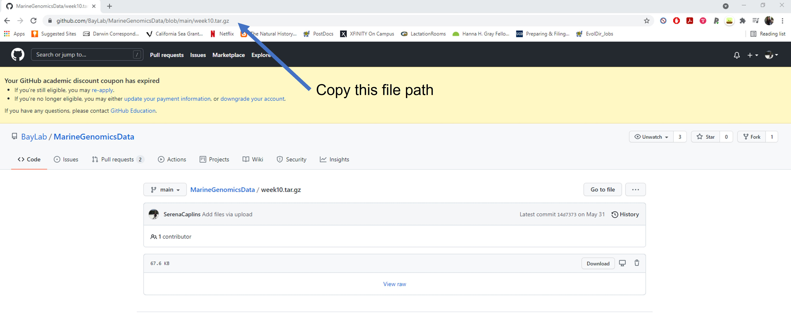
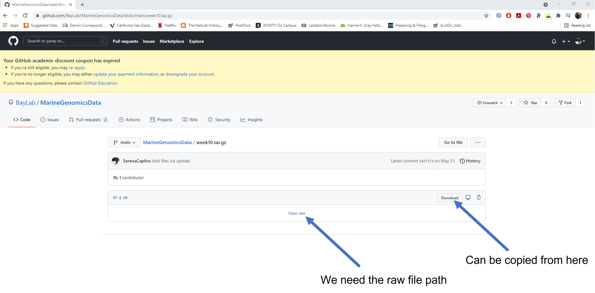

# Week3: Awk and how to download files

<center>


</center>


For this week, we'll continue to use the data that you downloaded last week. If you need to download it again please use the wget link below to download the tar file. 


```html
cd /home/margeno/
wget https://raw.githubusercontent.com/BayLab/MarineGenomicsData/main/week2.tar.gz
```

use tar to uncompress and unzip the file

```html

tar -xzvf week2.tar.gz

```

This will create a week2 directory in your MarineGenomics directory (it will also create the MarineGenomics directory if you don't already have one). 

## AWK

`Awk` is a fast and versatile pattern matching programming language. `Awk` can do the same tasks that `sed`, `grep`, `cat`, and `wc`; and then it can do a lot more https://www.gnu.org/software/gawk/manual/gawk.html. This program deserves a full class to go into details, so instead we just have this section to make you aware that the program exists. 

Let's see how awk can behave like `wc`.

```html
$ cd /home/margeno/MarineGenomics/week2/
```

```html
$ ls 

TableS2_QTL_Bay_2017.txt  sra_metadata  untrimmed_fastq
```

This table is from the Bay et al. 2017 publication ~/MarineGenomics/week2/TableS2_QTL_Bay_2017.txt and we will use it as our example file for this section.

We can look inside the file by using `cat` or `awk`

```html 
$ awk '{print $0}' TableS2_QTL_Bay_2017.txt
```

The instructions are enclosed in single quotes

This command has the same output of "cat": it prints each line from the example file TableS2_QTL_Bay_2017.txt

The structure of the instruction is the following:
- curly braces surround the set of instructions
- print is the instruction that sends its arguments to the terminal
- $0 is a variable, it means "the content of the current line"

As you can see, the file contains a table.

```html
Trait 	n	LOD	Chr	Position (cM) 	Nearest SNP 
mate choice	200	4.5	14	22.43	chrXIV:1713227 
mate choice 	200	4.61	21	8	chrXXI:9373717 
discriminant function 	200	4.83	12	17	chrXII:7504339 
discriminant function 	200	4.23	14	8.1	chrXIV:4632223 
PC2	200	4.04	4	30.76	chrIV:11367975 
PC2	200	6.67	7	47	chrVII:26448674 
centroid size	200	6.97	9	47.8	chrIX:19745222 
x2*	200	3.93	7	60	chrUn:29400087 
y2*	200	9.99	4	32	chrIV:11367975 
x3	200	4.45	1	32.3	chrI:15145305 
x4	200	5.13	16	30.9	chrXVI:12111717 
x5*	200	4.54	15	6	chrXV:505537 
y5	200	4.21	4	24.9	chrIV:15721538 
x6	200	3.96	16	29.5	chrXVI:13588796 
y6*	200	4.14	9	30.2	chrIX:18942598 
y15*	200	5.3	2	27	chrII:19324477 
x16	200	5.49	7	60	chrUn:29400087 
x17 	200	4.92	1	32.8	chrI:14261764 
Table S2. Significant QTL loci for mate choice and morphology
``` 

Now let's use `awk` to count the lines of a file, similarly to what `wc -l` would do. 

As you probably remember, -l is an option that asks for the number of lines only.

However, wc counts the number of newlines in the file, if the last line does
not contain a carriage return (i.e. there is no emptyline at the end of the file),
the result is going be the actual number of lines minus one.

```html 
$ wc -l TableS2_QTL_Bay_2017.txt
```

```html
19 TableS2_QTL_Bay_2017.txt
```
	
A workaround is to use `awk`. `Awk` is command line program that takes as input a set
of instructions and one or more files. The instructions are executed on each line
of the input file(s).

```html
$ awk '{print NR;}' TableS2_QTL_Bay_2017.txt | tail -1
```

`Awk` can also search within a file like `grep` can. Let's see if there are any significant QTL loci in the chromosome "chrXIV" 

```html
$ awk '/chrXIV/' TableS2_QTL_Bay_2017.txt
```
This chromosome had two significant QTL Loci for mate choice and morphology. 

</p>
</details>
&nbsp;


When to use awk? 

 *  for search and replacement of large files (it's fast!)
 *  when manipulating multiple large files


## Moving and Downloading Data

Below we'll show you some commands to download data onto your instance, or to move data between your computer and the cloud.

## Getting data from the cloud

There are two programs that will download data from a remote server to your local
(or remote) machine: ``wget`` and ``curl``. They were designed to do slightly different
tasks by default, so you'll need to give the programs somewhat different options to get
the same behaviour, but they are mostly interchangeable.

 - ``wget`` is short for "world wide web get", and it's basic function is to *download*
 web pages or data at a web address.

 - ``cURL`` is a pun, it is supposed to be read as "see URL", so its basic function is
 to *display* webpages or data at a web address.

Which one you need to use mostly depends on your operating system, as most computers will
only have one or the other installed by default.

Today we will use wget to download some data from Ensembl.


<details><summary>Exercise</summary>
<p>

Before we can start our download, we need to know whether we're using ``curl`` or ``wget``.

To see which program you have, type:
 
```html
$ which curl
$ which wget
```


``which`` is a BASH program that looks through everything you have
installed, and tells you what folder it is installed to. If it can't
find the program you asked for, it returns nothing, i.e. gives you no
results.

On Mac OSX, you'll likely get the following output:


```html
$ which wget
```


```html
$ /usr/bin/wget
```

Once you know whether you have ``curl`` or ``wget``, use one of the
following commands to download the file:

</p>
</details>
&nbsp;


```html
$ cd
$ wget ftp://ftp.ensemblgenomes.org/pub/release-37/bacteria/species_EnsemblBacteria.txt
```

Let's see if the file from ensembl downloaded

```html
ls species_EnsemblBacteria.txt
```

it did!

## Downloading files from Github

Github is a useful place to store data files and scripts and it is widely used by researchers in many different fields, including genomics. There are a few useful tricks to understanding how to best transfer files from github to your own terminal. 

There are two main ways to transfer files from github:
+ Use `git clone` to download an entire repository (Directory)
+ use wget to download a single file 


If you're interested in getting a repository and all of its contents you can use `git clone`. This can be useful if you're interested in using data files and the scripts that come with them. 


First navigate to your home directory with cd (leaving it blank takes you to your home automatically).

And then use `git clone` to download the repository reallycoolrepo

```html

cd

git clone https://github.com/SerenaCaplins/reallycoolrepo.git
```

This should make a new directory called reallycoolrepo. Let's ls in this directory to see what's in it.

```html
ls reallycoolrepo/

files forloop.sh MarineGenomics.txt README.md

```

We have three files and one directory here. You can view the MarineGenomics.txt file with `cat`

```html

cat reallycoolrepo/MarineGenomics.txt

  __  __                  _                     _____                                      _              
 |  \/  |                (_)                   / ____|                                    (_)             
 | \  / |   __ _   _ __   _   _ __     ___    | |  __    ___   _ __     ___    _ __ ___    _    ___   ___ 
 | |\/| |  / _` | | '__| | | | '_ \   / _ \   | | |_ |  / _ \ | '_ \   / _ \  | '_ ` _ \  | |  / __| / __|
 | |  | | | (_| | | |    | | | | | | |  __/   | |__| | |  __/ | | | | | (_) | | | | | | | | | | (__  \__ \
 |_|  |_|  \__,_| |_|    |_| |_| |_|  \___|    \_____|  \___| |_| |_|  \___/  |_| |_| |_| |_|  \___| |___/
                                                                                                          

```

Pretty cool huh?

Using git clone to get an entire repository can be useful, but often we're just interested in getting a single file. We've already learned how to get files using wget, but this isn't as straightforward on git hub. To illustrate when it doesn't work let's navigate to a repository where there's a file that we're interested in:

copy and paste this link into your browser:

```html
https://github.com/BayLab/MarineGenomicsData
```

This is the repository where we have been storing all of the data for the class. We typically download a single tar file each week instead of cloning the whole repository all at once (this allows us to make changes to each week without having to download the whole repo every week, which would also override your files).

Say you wanted to get the week10.tar.gz file

If you click on the file you can copy the file path from your browser. A few ways to do this but perhaps easiest is to click the file and copy the path that shows up in your browser.



```html
https://github.com/BayLab/MarineGenomicsData/blob/main/week10.tar.gz

```

Seems fine right? Let's use wget to try and import this into our home directory.

```html
wget https://github.com/BayLab/MarineGenomicsData/blob/main/week10.tar.gz

```
Now let's try and untar it

```html

tar -xvzf week10.tar.gz

```

This prints an error message:

```html

gzip: stdin: not in gzip format
tar: Child returned status 1
tar: Error is not recoverable: exiting now
```

What seems to have gone wrong. We get a clue if we use less to view the file (you normally wouldn't use less to view to a tar.gz file, but in this case it will tell us something useful). Useful tip: `less` does work on `.gz` files!


```html

less week10.tar.gz

```

You will see something like this:

```

<!DOCTYPE html>
<html lang="en" data-color-mode="auto" data-light-theme="light" data-dark-theme="dark">
  <head>
    <meta charset="utf-8">
  <link rel="dns-prefetch" href="https://github.githubassets.com">
  <link rel="dns-prefetch" href="https://avatars.githubusercontent.com">
  <link rel="dns-prefetch" href="https://github-cloud.s3.amazonaws.com">
  <link rel="dns-prefetch" href="https://user-images.githubusercontent.com/">
  <link rel="preconnect" href="https://github.githubassets.com" crossorigin>
  <link rel="preconnect" href="https://avatars.githubusercontent.com">


  <link crossorigin="anonymous" media="all" integrity="sha512-Xvl7qd6ZFq6aBrViMpY+7UKRL79QzxxYG1kyELGe/sH4sV3eCks8DDXxa3WolACcKPac42eqrfe6m0jazyAIPQ==" rel="stylesheet" href="https://github.githubassets.com/assets/frameworks-5ef97ba9de9916ae9a06b56232963eed.css" />
  <link crossorigin="anonymous" media="all" integrity="sha512-24GJDHWJro3USSMV5JFy5QbE8eCNYG61UucNp7vJMTaeJMrBy6FLiLFgX9jXnWlddv2VRu/rTLIkxzuRDF9ZVA==" rel="stylesheet" href="https://github.githubassets.com/assets/colors-v2-db81890c7589ae8dd4492315e49172e5.css" />
    <link crossorigin="anonymous" media="all" integrity="sha512-rcBopHrwspQORpXVLihZMP22sFwuIo3fL1DyFo5aXwWnV5FzV/nlAGnX/36fI9GQVc2VN7MiIT34RMCwq8jemg==" rel="stylesheet" href="https://github.githubassets.com/assets/behaviors-adc068a47af0b2940e4695d52e285930.css" />
```    
This is not what should be in the file. We're seeing html coding like what you would see for a website. The reason for this is because the link we got from github was to the html page showing the file, not the location of the actual file itself. 

Let's remove this week10.tar.gz file

```html

rm week10.tar.gz
```

So all of the repositories are encoded as html files to make the github website, we need to get the actual file path of the file itself to use wget. 

You can do this by copying the **raw** file path, which you will find by clicking `view raw` or by using control-c or right clicking and selecting copy link address (for pc users) the `download` tab.



Let's try this again with our new link. It should say the word `raw` somewhere in the file path

```html

wget https://github.com/BayLab/MarineGenomicsData/raw/main/week10.tar.gz
```

Now untar it

```html

tar -xzvf week10.tar.gz
```

You should see something like this, which tells us that it worked!!

```html
MarineGenomicsData/Week10/
MarineGenomicsData/Week10/candidate_fastas.fa
```
You can remove this as we won't be using it later in the course

```html
rm -r MarineGenomicsData
```
So we need to find that raw file path to use wget on any single file that we want in git hub. 


## Final bash wrap-up

We've covered a lot of ground so far in the last 2 and a half weeks! It's a good time to review the commands we've learned and the skills we're starting to develop. 

In week 1, we showed you:

+ how to access jetstream a cloud computing resourse
+ how to navigate the terminal with bash/UNIX commands such as `ls`, cd`, `mv`, `mkdir`, and `cp`
+ the differnce between full and relative file paths:
  ++ full path example: /home/margeno/MarineGenomics/week2/README.txt
  ++ relative path from the MarineGenomics directroy: week2/README.txt
+ how to use `Tab` to autofill commands and file paths
+ the `man` command to see full parameters for bash commands

In week 2, we covered:

+ how to view files using `less`, `cat`, `head`, `tail` 
+ how to view and modify file and directory permissions using `chmod`
+ how to use wildcards like `*` to view directory contents 
+ to oh so cautiously use `rm` to permanently delete a file
+ use `grep` to search a file and `>>` to append search results to a new file
+ how to write a script using a text editor `nano` in our case
+ executing a script from a saved file with `bash` or by making it an executable program with `chmod`
+ writing for loops

Finally in week3, we learned 

+ how to use Awk to edit the contents of a file
+ how to move and download data

At this point if you haven't already it's a good time to make a cheat sheet of the commands we've learned to keep by your computer so you can reference them at anytime. 

There are several very good bash/Unix cheat sheets available online. Here are links to a few of them:

https://cheatography.com/gregcheater/cheat-sheets/bash/

https://cheatography.com/davechild/cheat-sheets/linux-command-line/

https://www.loggly.com/blog/the-essential-cheat-sheet-for-linux-admins/?utm_source=LinkInPDF&utm_medium=social-media&utm_campaign=SocialPush


  
