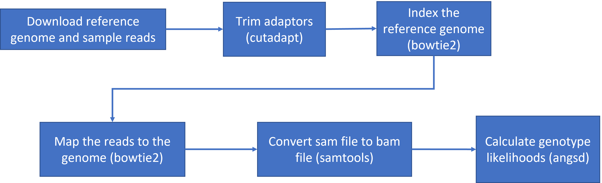

```{r setup4, include=FALSE}
knitr::opts_chunk$set(comment = "#>", echo = TRUE, fig.width=6)
```

# Week 4- What is a Genetic Variant?

You'll find the lecture discussing the definition and identification of genetic variation [here](https://github.com/BayLab/MarineGenomicsSemester/blob/main/ppt/MarineGenomics_Lecture_W4.pdf)

We'll be working on the terminal in jetstream for the entirety of this lesson.

Here is the road map of our actions for this class (as shown in lecture):



## To get started lets download the data and install a few programs

Download the data from the MarineGenomicsData repository on git hub. We'll be working in the week4_semester.tar.gz file

The data for this week comes from an excellent marine genomics study on sea cucumber population genetics ([Xuereb et al. 2018](https://onlinelibrary.wiley.com/doi/abs/10.1111/mec.14589)). I have taken a sub-sample of the reference genome used in the paper (from the closely related sea cucumber Parastichopus parvimensis). I have also sub-sampled raw reads from 5 individuals of the study species  Parastichopus californicus from the paper. 

```html
wget https://raw.githubusercontent.com/BayLab/MarineGenomicsData/main/week4_semester.tar.gz
```

Uncompress the file using tar:

```html
tar -xzvf week4_semester.tar.gz

```

Next we need to install a few programs that will allow us to do what we need to do. This will all take a few minutes!

The programs that we are installing:

+ samtools: allows us to filter and view our mapped data
+ bowtie2: to map our reads to the reference genome
+ cutadapt: will trim adaptor sequences from the reads
+ fastqc: used to view the quality of the read files

```html
  sudo apt-get -y update && \
  sudo apt-get -y install samtools bowtie2 cutadapt fastqc 
  
```

And one more program that we'll install separately. This is `angsd` which we will use to find variants in our data. The first command navigates you to your home directory.

```html
  cd
  git clone --recursive https://github.com/samtools/htslib.git
  git clone https://github.com/ANGSD/angsd.git 
  cd htslib;make;cd ../angsd ;make HTSSRC=../htslib
  
```

Now we're ready to get going. The first thing we'll do is have a look at our data and directories to make sure we know where everything is. 

```html
$ ls


```
Change directories to the one that has the data MarineGenomics/week4. If you `ls` into this directory you should see 6 files with a `.fastq.gz` extension and 1 tiny genome file with a `.fna.gz` extension.


## Raw read quality control

For the sake of time we've make this an optional activity for you to pursue on your own time

<details><summary>Raw read quality control</summary>
<p>


Next let's use the program fastqc to check the quality of our data files

```html
$ fastqc SRR6805880.tiny.fastq.gz

```
* Readout will say: 
  + Started analysis for SRR6805880.tiny.fastq.gz
  + Analysis complete for SRR6805880.tiny.fastq.gz


Let's look to see that it worked
```html
$ ls

Ppar_tinygenome.fna.gz       SRR6805880.tiny_fastqc.zip  SRR6805883.tiny.fastq.gz
SRR6805880.tiny.fastq.gz     SRR6805881.tiny.fastq.gz    SRR6805884.tiny.fastq.gz
SRR6805880.tiny_fastqc.html  SRR6805882.tiny.fastq.gz    SRR6805885.tiny.fastq.gz


```

Looks good! Fastqc generated two outputs for us, a `.html` and a `.zip` directory

Let's run fastqc on the remaining files, and then we'll take a look at the output. You may have noticed fastqc just used the same file name to produce our output with different extensions. We can take advantage of that by running fastqc on all our datafiles with the wildcard `*`.

```html
$ fastqc SRR680588*

```
You'll see you initially get an error message because fastqc doesn't see the .fastq file extension on some of our files. It simply skips these and moves on the the next file. 

To view the output of fastqc, we'll minimize our terminal and look at our `Home` folder on our jetstream desktop. This is the same home directory that we've been working in through the terminal. Go to the directory where you were running fastqc and find an .html file. Double click it and it should open a web browser with the output data. We'll go over how to interpret this file in class.

</p>
</details>
&nbsp;

## Trimming to remove adapters

There are many programs that can be used to trim sequence files. We'll use the same paper that was used in the Xuereb et al. 2018 paper [here](https://onlinelibrary.wiley.com/doi/abs/10.1111/mec.14589). Cutadapt is relatively easy to run with the code below, once we have identified our adaptor sequence and takes the general form below.


```html
$ cutadapt -g SEQUENCETOTRIM -o name_of_input_file name_of_output_file 

```

Let's do this on one of our files to test it out.

```html
cutadapt -g TGCAG SRR6805880.tiny.fastq.gz -o SRR6805880.tiny_trimmed.fastq.gz 

```
This works for a single file, but if we want to do it for all our read files we need to either do them all individually (slow and error prone) or use a for loop.

```html

for filename in *.tiny.fastq.gz
do

  base=$(basename $filename .tiny.fastq.gz)
  echo ${base}

  cutadapt -g TGCAG ${base}.tiny.fastq.gz -o ${base}.tiny_trimmed.fastq.gz 

done

```

Yay! You should see a little report for each of these files that showing how many reads were trimmed and some other info (how long are the reads, etc)

You can check if the trimmed files are there with:
```html
ls *trimmed*
```

Our reads are now ready to be mapped to the genome.

## Building an index of our genome

First we have to index our genome. We'll do that with the bowtie2-build command. This will generate a lot of files that describe different aspects of our genome

We give bowtie2-build two things, the name of our genome, and a general name to label the output files. I always keep the name of the output files the same as the original genome file (without the .fna.gz extension) to avoid confusion (what's this file for?).

```html

bowtie2-build Ppar_tinygenome.fna.gz Ppar_tinygenome

```
This should produce several output files with extensions including: .bt2 and rev.1.bt2 etc (six files in total)

## Map reads to the genome

Let's map those reads using a for loop

```html
for filename in *.tiny_trimmed.fastq.gz
do

  base=$(basename $filename .tiny_trimmed.fastq.gz)
  echo ${base}

  bowtie2 -x Ppar_tinygenome -U ${base}.tiny_trimmed.fastq.gz -S ${base}.sam

done

```

You should see a bunch of text telling you all about how well our reads mapped to the genome. For this example we're getting a low percentage (20-30%) because of how the genome and reads were subset for this exercise. The full genome and full read files have a much higher mapping rate (70-80%) than our subset. 

You'll also notice that we have made a bunch of .sam files. .sam stands for Sequence Alignment Map file. Let's use `less` to look at one of these files using `less`

There are several columns of data in a sam file

## sam to bam file conversion

The next step is to convert our sam file to a bam (Binary Alignment Map file). This gets our file ready to be read by angsd the program we're going to use to call SNPs.

```html
for filename in *.sam
do

  base=$(basename $filename .sam)
  echo ${base}
  
  samtools view -bhS ${base}.sam | samtools sort -o ${base}.bam

done

```

## Genotype likelihoods

There are many ways and many programs that call genotypes. The program that we will use calculates genotype likelihoods, which account for uncertainty due to sequencing errors and/or mapping errors and is one of several programs in the package ANGSD. The purpose of this class is not to discuss which program is the "best", but to teach you to use some commonly used programs.

angsd needs a text file with the `.bam` file names listed. We can make that by running the command below

```html

ls *.bam > bam.filelist

```

Look at the list:
```html
cat bam.filelist
```

Run the following code to calculate genotype likelihoods

```html

../../angsd/angsd -bam bam.filelist -GL 1 -out genotype_likelihoods -doMaf 2 -SNP_pval 1e-2 -doMajorMinor 1

```

This will generate two files, one with a .arg extension, this has a record of the script we ran to generate the output, and a .maf file that will give you the minor allele frequencies and is the main output file. If you see these two files, Yay!! We did it!


### Suggested Exercises
> For our coding session you can re-run through the above code as it is written. You can also do the below suggestions to extend or modify what we did in Tuesdays class. 

> A possible answer is located beneath each activity, but it's possible you will correctly perform the suggestion in a different way. 


> 1. map the untrimmed files to the genome. How do the alignments compare?

<details><summary><span style="color: purple;">Solution</span></summary>
<p>

> 1. As a for loop:
> `for filename in *tiny.fastq.gz; do base=$(basename $filename .tiny.fastq.gz); echo=${base}; bowtie2 -x Ppar_tinygenome -U ${base}.tiny.fastq.gz -S ${base}.nottrimmed.sam; done`

> You should see something that by trimming the adapters off we get a higher overall mapping rate:

> 

</p>
</details>
&nbsp;


> 2. Run the mapping for loop as a shell script using bash (i.e., store the for loop in a text editor (NANOs or other) and execute the .sh script with bash)

<details><summary><span style="color: purple;">Solution</span></summary>
<p>

> 2. this can be done by copying and pasting the for loop in a text editor that you save as for example `map_samples_bowtie2.sh`. This script is then executed by `bash map_samples_bowtie2.sh`

</p>
</details>
&nbsp;


> 3. use cutadapt to trim the sequences to 70 bp like they did in the Xuereb et al. 2018 paper. Write the output of cutadapt to an .70bp.trimmed.fastq.gz and then map these 70bp, trimmed reads to the genome. How do they compare to our .trimmed reads?

<details><summary><span style="color: purple;">Solution</span></summary>
<p>
> 3. to find the parameter for maximum read length in cutadapt: `cutadapt - help` There are a few ways to do this.
> `cutadapt -g TGCAG ${base}.tiny.fastq.gz -u 70 -o ${base}.tiny_70bp_trimmed.fastq.gz` 

</p>
</details>
&nbsp;


> 4. change the parameters of the angsd genotype likelihoods command. How many more/less SNPs do we recover if we lower or raise the SNP p-value? To see what the other parameters do run `../../angsd/angsd -h

<details><summary><span style="color: purple;">Solution</span></summary>
<p>

> 4. If we remove the `-SNP_pval` command entirely we get ~72000 sites retained! Wow! That seems like a lot given our ~20% maping rate. If you instead increase the p-value threshold to 1e-3 we find 3 SNPs.

</p>
</details>
&nbsp;

> 5. Run fastqc on our .trimmed reads and compare the html with the untrimmed files. 

<details><summary><span style="color: purple;">Solution</span></summary>
<p>

> 5. We should no longer see the red error flag for the per base sequence quality or base pairs conten. code: fastqc *trimmed.fastq.gz 

</p>
</details>
&nbsp;


## Creature of the Week!