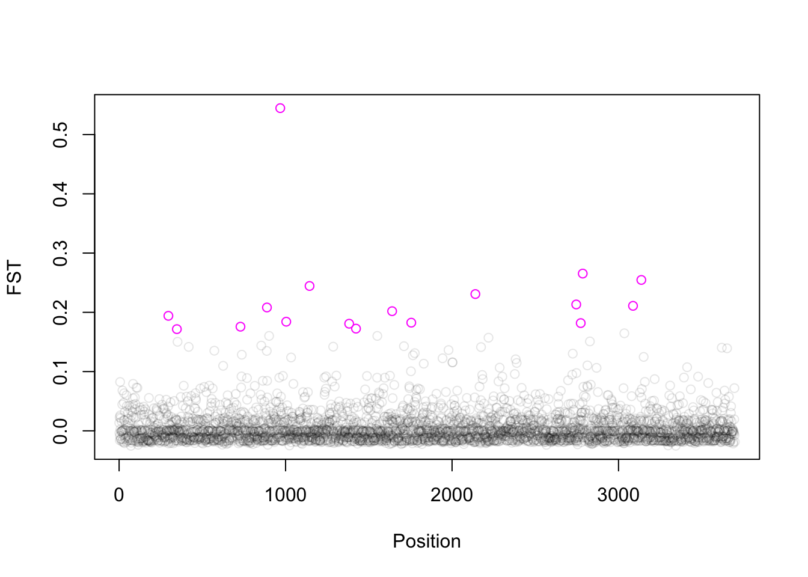

```{r setup13, include=FALSE}
knitr::opts_chunk$set(echo = TRUE)
```

# Week 13- Genomics is a BLAST


Through this course we've taken genomic data in the form of whole genome sequences or reduced representation sequences (i.e., RADtags) and searched for correlations between phenotypes (via GWAS) and population structure (Fst Outliers) to identify "candidate SNP" that may have some role in producing the phenotypes we're interested in. 

The next logical step when you've identified a candidate SNP is to ask "what's the function of the gene region near the candidate SNP?" This seems like a straight forward question, as the main goal of many of these studies is to identify the genetic basis of a given phenotype. However, as we dig into this question we will see that it is rather opaque. First we need to consider whether the SNP we identified is "the" SNP itself that is under selection or is the SNP associated through physical linkage (aka hitchhiking), with the gene or gene region that is under selection?

## Genome Annotation and BLAST searches
This question can be addressed through whole genome resequencing and identification of regions with reduced heterozygosity which indicate patterns of linked-selection. This is reviewed more fully [here](http://cooplab.github.io/popgen-notes/#the-effect-of-linked-selection-on-patterns-of-neutral-diversity)

Once a region under selection is identified we can refer to a genome annotation to determine whether this gene region is a coding or non-coding sequence (does it produce a protein or not?) and make some guesses as to the functionalization of this region. Your ability to do this is heavily influenced by the species you're working on and the degree to which your genome is successfully annotated (if at all). This is described in more detail in the lecture for the week [here](https://github.com/BayLab/MarineGenomicsSemester/blob/main/ppt/MarineGenomics_Lecture_w13.pdf)

For this weeks exercise we'll go through a brief illustration of the difficulties in "assigning" putative function to a region surrounding a candidate SNP, using the Fst outliers that we identified in week 7 with the sea cucumber (**Parastichipus californicus**) data published by [Xuereb et al.](http://www2.bio.ulaval.ca/louisbernatchez/pdf/(417)%20Xuereb_Molecular_Ecology_2018.pdf) 

For this data we found 17 Fst outliers (see the pink open circles in the plot below). 

I selected a region spanning 20kb around each SNP from the closely related Parastichipus parvimensis genome.This is a relatively large region which should capture any coding sequences that may occur near our SNP. For these regions we will performed a "small scale" annotation by identifying coding regions with the program transdecoder and then running these regions through ncbi-blast which will provide us with a list of similar sequences in other organisms and their gene ids.     



## Download the data

You'll download one fasta file that contains the 17 regions in which we found our Fst outlier SNPs.

```html

wget https://raw.githubusercontent.com/BayLab/MarineGenomicsData/main/week13_semester.tar.gz

tar -xzvf week13_semester.tar.gz

```


## Install Transdecoder

We'll use transdecoder to identify coding regions in our nucleotide sequences. 

```html

sudo apt update #this just updates our currently installed packages

sudo apt install transdecoder

```


## Run Transdecoder

Transdecoder is run in two parts, the first `TransDecoder.LongOrfs` identifies open read frames or regions that contain either a start or stop codon. This is followed by `TransDecoder.Predict` which 

```html

TransDecoder.LongOrfs -t candidate_fastas.fa

TransDecoder.Predict -t candidate_fastas.fa

```

This produces an output directory and pulls from that several files with different extensions (.gff3, .bed, .cds, .pep) which correspond to different formats specifically, `.gff3` is a general feature format file (version 3) and contains information about each of our sequences. The `.bed` format is a browser extensible data format which describes the chromosome, position and length of our sequences, the `.cds` contains the nucleotide sequences for the open reading frames, and finally the file we want is the `.pep` file which contains our open reading frames from our regions converted into protein codes.

## Run NCBI-BLAST

NCBI-BLAST is commonly called "blast" and stands for Basic Local Alignment Search Tool. This program is often a part of the annotation process as it compares your sequences (or query) to those contained in a database. As such blast results are highly dependent on the database in which you search for results and whether your species of interest (or a close relative) is present in that database. This program can be run in the command line, but in my testing I found it to be incredibly slow on jetstream. So We're going to run our file on the NCBI-BLAST web browser which should only take a few minutes as we only have 14 protein sequences. 

Once you have the `.pep` file from transdecoder, navigate to the web browser on jetstream (the default is firefox). Search for NCBI-Blast. 

We'll do a protein to protein search (blastp) against the nr database, which contains protein sequences from a variety of taxa, but does not include SRA data (which would include the genome sequence for our sea cucumbers). 


## What did we find?

Nine out of our 14 protein sequences came back with a blast hit. Many of those that found a hit in Blast were for the other sea cucumber species Parastichipus ja. Many of these sequences are listed as "uncharacterized" or "hypothetical" protein meaning that there has not yet been any downstream classification of these sequences. This is a pretty common result for marine organisms, as they are rarely as highly studied as model organisms such as Drosophila or zebra fish. 


## The importance of Genomic Architecture

Even though we often don't get satisfying answers about which genes are doing what in Marine Genomics, we can learn a lot about trait evolution from using Fst outliers and tests of Genome Wide Association. These tests give us some idea of the number of genes and their effect on a given trait and that in turn has big implications on how that trait can respond to evolution. And that in turn has implications for climate change, conservation, and biodiversity.  


## Exercises

> # Practice Questions:

> 1. Instead of doing a blast search for the protein translated sequences, do one for the nucleotide sequences. Use the original `candidate_fastas.fa file, and do a blastn for somewhat similar sequences. How do these results differ from our search with the translated open reading frames? Why? Try again as a megablast for highly similar sequences (you can do this by editing your original search). How do these differ?

<details><summary><span style="color: SeaGreen;">Solution</span></summary>
<p>

```{r echo=T}
#coming soon :) 
```
</p>
</details>


> 2. Now use the `.cds` file from transdecoder which contains the open reading frame as nucleotides. 

<details><summary><span style="color: SeaGreen;">Solution</span></summary>
<p>

```{r echo=T}
#coming soon :) 
```
</p>
</details>

