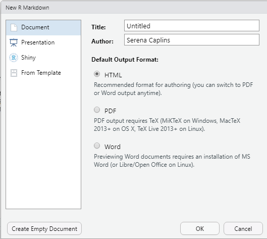

```{r setupweek14, include=FALSE}
knitr::opts_chunk$set(echo = F,error = F,fig.width = 8,message = FALSE)
knitr::opts_knit$set(root.dir = "C:/Users/SAPCaps/MarineGenomicsSemester/figs/FinalWeek/")
```

# Final week (R markdown tutorial)

For our final week of instruction we read the [Xuereb et al.](http://www2.bio.ulaval.ca/louisbernatchez/pdf/(417)%20Xuereb_Molecular_Ecology_2018.pdf) paper in depth as we have at this point done so many similar analyses to what's presented there. We thank the authors for providing a well documented and useful dataset.


## R markdown tutorial

For your final assignments we've asked you to prepare your code in R markdown format. You may work in Jetstream for this class, but it may also be more convenient to work on your own laptop for this lesson and for making your final R markdown document for your final assignment. 

This is a brief tutorial showing you how to use R markdown. There are many other ways to extend your R markdown skills including these guides [here](https://rmarkdown.rstudio.com/articles_intro.html), and a helpful cheatsheet here [here](https://www.rstudio.com/wp-content/uploads/2015/02/rmarkdown-cheatsheet.pdf). 


R Markdown comes pre-installed with RStudio, but if you're using base R (not RStudio) you can install it with `install.packages("Rmarkdown")`


To launch an R Markdown script you go to the new file icon on the upper left of your screen and select *File > New File > R Markdown...*

This will open up a page as below.




You can leave it untitled for now and the output as HTML. So just click `OK`


You should now have a template that looks like this: 


R markdown has two phases, a build or edit phase where you can write the kind of document you want, and a render phase where you turn that document into a pdf, or html file. 

We'll spend a little bit of time editing our R Markdown template and then we'll use the package `knitr` to make our final document. 

R markdown allows you to have separate sections, namely sections devoted to text where you can use html encoding to make headers or make text bold or italicized, and other sections that allow you to place code that R markdown will run each time you render your document. 

For the normal text sections you can just start writing, note that you can modify headers or make words or phrases bold using the tips in the cheatsheet [here](https://www.rstudio.com/wp-content/uploads/2015/02/rmarkdown-cheatsheet.pdf)


FOr the code sections you need to start each section with three ````` which is a character you'll find with the `~` or tilde button (top left on a PC keyboard). You also need to tell it what kind of code you're writing so for R this will typically look something like:


You can now start editing your R markdown document using the example below.


## Example with the baby name dataset

You can write an introduction in your R markdown to state that this is an R markdown tutorial using the baby names dataset and then include the following sections as `{r, echo=T}` code.

## Load the packages and data

```{r, echo=T}

#load the two required packages

library(ggplot2)
library(babynames)

#load the data
data("babynames")

```


## Explore the data

By running the code below you will find that the babynames dataset has the names of baby's each year if their name was given to at least 5 baby's born in that year. 

```{r, echo=T}

head(babynames)

?babynames

```


## Make a plot 

This plot allows you to choose a name and then plots the title of the plot using a manipulation of the facet_wrap and theme function. For this plot you can choose any name you're interested in seeing by changing it in the original subsetting command and it will also plot that name as the title of the plot.

```{r, label="babynameplot", echo=T}

ggplot(data=babynames[babynames$name == "Serena",], aes(x=year, y=prop, group=sex, color=sex))+
  geom_point()+
  facet_wrap(~name)+
  theme(strip.background = element_blank(),
        strip.text = element_text(hjust = 0, size = 14))


```

I always like to plot my name because we know the recent history around the peak in the early 2000's (it wasn't anything that I was up to!) but many congrats to Serena Williams (and Venus!) for Winning a gold medal in the 2000 summer olympics and starting a naming trend. 


Now let's render our R markdown by selecting `Knit` from the upper left options in Rstudio. Note that you will need to save your script somewhere to do this. *Make sure you save it as an `.Rmd` file.*

This should be what you see as an html file (with all your own modifications of course!)


You can now go back to your R markdown script and do the exercises below. Create a new header called exercises and start a new code chunk. 

## To export as a pdf

In order to export your RMarkdown file as a pdf from RStudio you will need to install a LaTex distribution. You can do this from your RStudio console with the following command:

```{r, echo=T}

tinytex::install_tinytex()

```

This will allow you to select *Knit* and *pdf* from the *Knit* pulldown menu. 


## To transfer your Rmarkdown files and submit your final assignment

Once you've generated an `html` file of your Rmarkdown script and have confirmed that the code for each plot shows up and generates the plot that it is intended to generate (this depends on the final video prompt that you select, some of which ask for more than one plot), you're ready to transfer it from jetstream to your own computer. 

The easiest way to transfer a relatively small file from jetstream is to use the firefox web browser to log into your CSULA (or other: gmail, hotmail, etc) email service and attach the files to an email that you can address to yourself (so you can for example review the .pdf file on your own computer). You can then upload it to canvas or submit it directly to Dr. Krug via email. 


## Exercises

Add these following exercises to the example RMarkdown that we've been working on. You can also test the html output and try emailing an html or pdf version to yourself through jetstream. 

For the same name you choose for your plot above find out what year was the peak (maximum) number given. Does the maximum number match the year for which the proportion is greatest?

<details><summary><span style="color: SeaGreen;">Solution</span></summary>
<p>

```{r, echo=T}

#when was the max? 

max(babynames[babynames$name=="Serena",]$n)

# what year was it?

babynames[babynames$n==1504 & babynames$name =="Serena",]

# this matches the plot above! (not all names do though!)


```


</p>
</details>

## Final tips and tricks

R markdown has a ton of flexibility. In fact the class website has been made in R markdown (via bookdown). For example if you're curiuos about how to make the pull down solution option we use the code below:

```html

<details><summary><span style="color: SeaGreen;">Solution</span></summary>
<p>


##the code you want hidden behind a "solutions" tab


</p>
</details>

```

Which gives something like this after you knit the document: 

<details><summary><span style="color: SeaGreen;">Solution</span></summary>
<p>

```{r echo=T}
##the code you want hidden behind a "solutions" tab
```

</p>
</details>


You can see all the code for each week on our [github](https://github.com/BayLab/MarineGenomicsSemester)


