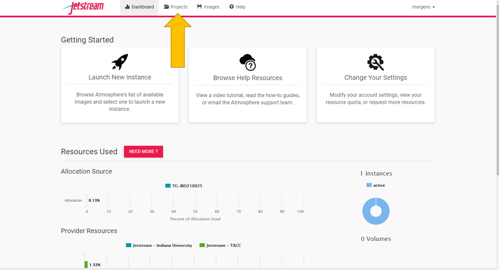
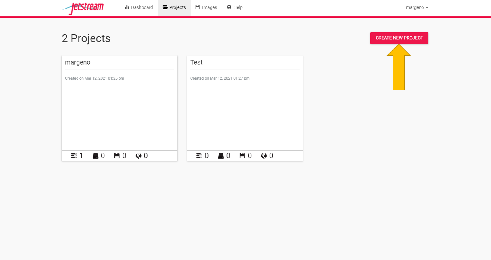
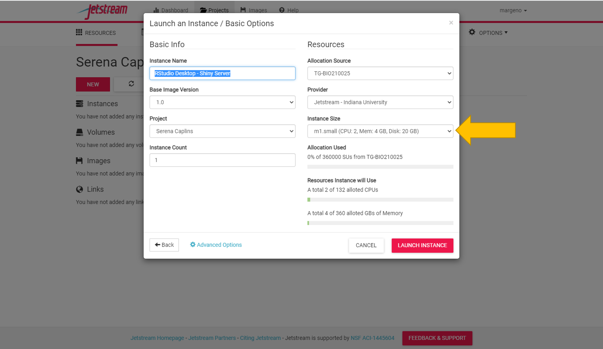
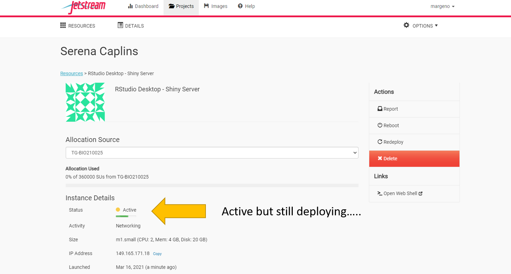
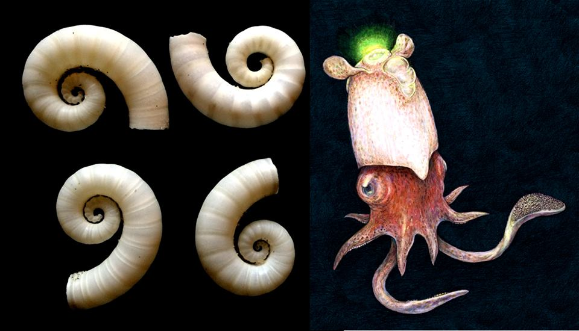
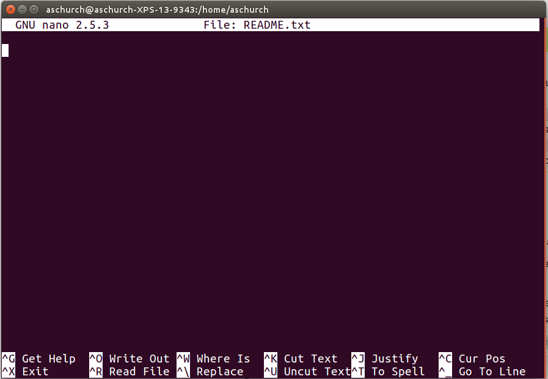

--- 
title: 
site: bookdown::bookdown_site
documentclass: book
bibliography: [book.bib, packages.bib]
biblio-style: apalike
link-citations: yes
description: ""
---
```{r setupintro, include=FALSE}
knitr::opts_chunk$set(comment = "#>", echo = TRUE, fig.width=6, fig.align = "center")
```

# Marine Genomics Semester edition

<center>


</center>

Welcome to Marine Genomics! This is a course on learning how to analyze genomic data for undergraduate and graduate students. We focused on marine organisms but these lessons can easily be applied to any taxa. We required that students have a background in biology and have completed the general biology series. Additionally, it is helpful if students have taken a course in Evolution, though this was not a requirement. We did not require any coding experience in R or Bash/UNIX. 

For most weeks, our course consists of one 75 min lecture and one 75 minute coding session per week. The lectures begin with a power point presentation where we introduce the weeks concept (for example, PCAs) and then are followed by a live coding demonstration carrier out by the instructor. The coding sessions provide an opportunity for the students to either repeat the same coding demonstration carried out during the lecture, or to extend the demonstration via coding exercises which we have written for each week and for which the solutions are available on our website (under each exercise). 

The first 5 weeks are primarily training in bash/UNIX and R basics and are structured as 2 lectures a week that are broken up with exercises for the students to practice each skill they are shown in live-coding demonstrations. The exercises typically take 5-15 minutes to complete. The remaining weeks are focused on performing a specific analysis (PCA, GWAS, Fst outlier analyses, etc). 

We provide all the data for the students to complete each weeks coding activities along with instructions for how to download the data. Additionally, the students found the website a phenomenally helpful resource.

## Cloud computing versus individual laptops

This course was designed to be carried out on the NSF funded Extreme Science and Engineering Discovery Environment (XSEDE) cloud computing resource [Jetstream](https://portal.xsede.org/jetstream). 

Jetstream is a unique user-friendly cloud computing resource in that it provides the students with an environment with root privileges, making program installation less complicated. Jetstream also provides a Desktop simulator which allows students to transition between bash and R using the same exact directory paths as the instructor, reducing the confusion of students having unique file paths and providing a more streamlined approach to what for many students is their first coding class. 

Jetstream educational allocations can be applied for through [XSEDE](https://portal.xsede.org/jetstream#allocations:education). The process of applying for a jetstream allocation for educational purposes is relatively straightforward and simply requires a course description, the number of students anticipated to participate, and a calculation of the computing resources required, and the instructors CV. Allocations are typically approved in two to three days and can be submitted ~2 weeks prior to the start of the course.

Alternatively, these course materials can be used on students and instructors individual laptops. The file paths will need to be modified and we cannot guarantee that the installation of programs and R packages will proceed as they did on Jetstream. Thus, progam installation will need to be verified for each week by the instructor.

## Assessment

We will be using a transparent module-based form of assessment. For each section of material covered in the course, a module will be released which will consist of several quizzes with multiple-choice questions relevant to that module’s material. These modules will reinforce your understanding of the material and you will be able to take each quiz multiple times to ensure accurate completion. There will be nine modules throughout the course. You will also have the option of submitting short recorded demonstrations that can be recorded through Zoom, for additional graded credit. There is no need to have sound or video showing during these recordings; further instructions will be provided on how to make and submit a recording. The option of submitting a final recorded project demonstration that will showcase multiple skills learned throughout the course will be discussed later in the course, for maximum graded credit. 


## Short recorded demonstrations

The purpose of these demonstrations is to showcase the skills you have learned in the course. There will be a list of possible demonstrations for each module once the assessment for that module is released. These demonstrations will include no more than four related skills per recording. For example, in the bash/UNIX module you could record a demonstration of yourself changing directories, making a new directory, and generating a new file in that new directory, and editing that file. These recordings are expected to be no more than 5-10 minutes long (and many could be recorded in much less time). You are free to choose which module(s) you would like to prepare a demonstration for, with the only restriction being that your three recorded demonstrations must each come from a different module. 

## Final demonstration

This demonstration will allow you to show that you have mastered the skills we have covered in class, but can also extend your abilities and complete somewhat “novel” analyses. These optional demonstrations focus on the final set of modules (#s 4-9) using skills in both bash and R, focusing on questions that we pose to you at the end of each module. For example, we may ask you to repeat an analysis that we did in class but with a different parameter, and then compare the difference between what we did in class and your results with the changed parameter. We will also require you to submit your code which can be saved as a simple text document (instructions on how to do this will be provided). For a sense of the types of questions that we will ask, please look at the end of each section of this website from a previous iteration of the course where we ended each week with Exercises/Practice Questions: https://baylab.github.io/MarineGenomics/


<!--chapter:end:index.Rmd-->

---
title: "Marine Genomics"
author: 
date:
output:
  bookdown::html_book:
    toc: yes
    css: toc.css
---

```{r setup, include=FALSE}
knitr::opts_chunk$set(comment = "#>", echo = TRUE, fig.width=6)
knitr::opts_knit$set(root.dir = "C:/Users/SAPCaps/MarineGenomicsSemester/")
```

# Week 1- Welcome!

Welcome to Marine Genomics Fall 2021 at Cal State LA!

You will find the lecture for week one [here](https://github.com/BayLab/MarineGenomicsSemester/blob/main/ppt/MarineGenomics_Lecture1.pdf)

## Introduction to shell computing via the data carpentry tutorial

We will be following the data carpentry tutorial (Copyright 2016 @ Software Carpentry) "Introduction to the command line for genomics". We have made some modifications to the data carpentry tutorial to fit our course. 

What is a shell and why should I care?

A shell is a computer program that presents a command line interface which allows you to control your computer using commands entered with a keyboard instead of controlling graphical user interfaces (GUIs) with a mouse/keyboard combination.

There are many reasons to learn about the shell:

+ Many bioinformatics tools can only be used through a command line interface, or have extra capabilities in the command line version that are not available in the GUI. This is true, for example, of BLAST, which offers many advanced functions only accessible to users who know how to use a shell.
+ The shell makes your work less boring. In bioinformatics you often need to do the same set of tasks with a large number of files. Learning the shell will allow you to automate those repetitive tasks and leave you free to do more exciting things.
+ The shell makes your work less error-prone. When humans do the same thing a hundred different times (or even ten times), they’re likely to make a mistake. Your computer can do the same thing a thousand times with no mistakes.
+ The shell makes your work more reproducible. When you carry out your work in the command-line (rather than a GUI), your computer keeps a record of every step that you’ve carried out, which you can use to re-do your work when you need to. It also gives you a way to communicate unambiguously what you’ve done, so that others can check your work or apply your process to new data.
+ Many bioinformatic tasks require large amounts of computing power and can’t realistically be run on your own machine. These tasks are best performed using remote computers or cloud computing, which can only be accessed through a shell.

In this lesson you will learn how to use the command line interface to move around in your file system.

## How to access the shell

For this course we will be using the shell in our Jetstream allocation through xsede. Jetstream is a cloud computing resource for which we have been allocated resources for the purposes of this course. Below is a guide for accessing and using jetstream.

In jetstream we launch what they call an "instance" which is a small allocation that specifies how much memory you need and reflects how much computing you might do (we'll guide you through this).

You'll find the jetstream login [here](https://use.jetstream-cloud.org/application) 

Navigate to the login with xsede tab in the upper right

```{r one, echo=FALSE, out.width = '100%'}
knitr::include_graphics("./figs/jetstream/Fig1.png")
```


```{r two, echo=FALSE, out.width = '100%'}

```

This will redirect you to the xsede login page. Your organization should say xsede. 

Click continue

```{r three, echo=FALSE, out.width = '100%'}
knitr::include_graphics("./figs/jetstream/Fig3.png")
```

The username for our course is **margeno**. The password will be given out in class. If you missed it please contact Serena Caplins (sacaplins@ucdavis.edu) or Maddie Armstrong (mlarmstrong@ucdavis.edu)

```{r four, echo=FALSE, out.width = '100%'}

```

Once you've logged in you should be redirected to jetstream. 

You now need to create your own projects folder. This is where you will carry out all of your analyses for the course. 
Everyone will get one project folder. So please only make one. If you make a mistake you can delete it and start again.

```{r five, echo=FALSE, out.width = '100%'}

```

```{r six, echo=FALSE, out.width = '100%'}
knitr::include_graphics("./figs/jetstream/Fig6.png")
```

```{r seven, echo=FALSE, out.width = '100%'}
knitr::include_graphics("./figs/jetstream/Fig7.png")
```

Once you have a project folder we can create our first instance. Go to the "New" tab and select "instance".

```{r eight, echo=FALSE, out.width = '100%'}
knitr::include_graphics("./figs/jetstream/Fig8.png")
```

Select the RStudio Desktop Shiny Server instance

```{r nine, echo=FALSE, out.width = '100%'}

```

Select a small instance size if it isn't already selected (should be the default).

```{r ten, echo=FALSE, out.width = '100%'}
knitr::include_graphics("./figs/jetstream/Fig10.png")
```

It will take several minutes (5-10) to build our instance. Once it says active it will take a few more minutes to deploy.

```{r eleven, echo=FALSE, out.width = '100%'}

```

```{r twelve, echo=FALSE, out.width = '100%'}
knitr::include_graphics("./figs/jetstream/Fig12.png")
```

Once it's ready to go you should see several actions on the right side of the screen including report, suspend, stop, etc. 

Select open web desktop.

```{r thirteen, echo=FALSE, out.width = '100%'}
knitr::include_graphics("./figs/jetstream/Fig13.png")
```

You should see something like the little desktop above. It's not pretty but this is where we'll be spending a lot of time. 

Select the black box on the bottom menu bar to access the command line. It will open a new window that has the `$` prompt.

```{r fourteen, echo=FALSE, out.width = '100%'}
knitr::include_graphics("./figs/jetstream/Fig14.png")
```

## Best practices for Jetstream

Once you launch your instance and it's "active" it's ready to use. 

When you're done coding it's best to close your jetstream desktop and projects folder browser window. If you are going to step away from jetstream for a while (say over the weekend), it's best to 'Shelve' or 'Suspend' your instance.

Once you're ready to code again you just have to select 'Resume' to start your instance again. This will take a few minutes. 

If in doubt of whether you should 'shelve/suspend' or keep active, it's our recommendation to shelve/suspend your instance. This frees up resources for other users and should reduce the likelihood of your active instance freezing up and being inaccessible. 


If you get an error while trying to log in or open the web shell or web desktop, follow these tips:

+ log out of the jetstream home page and log back in
+ relaunch your instance
+ reboot your instance

If those options fail then it is likely best to delete the instance and relaunch a new instance. This will result in you losing your data or work, but that should not be terribly detrimental to the course as everything resets with new data each week. 

## Week 1 Objectives

Questions to Answer:

+ How can I perform operations on files outside of my working directory?

+ What are some navigational shortcuts I can use to make my work more efficient?

Main Tasks:

+ Use a single command to navigate multiple steps in your directory structure, including moving backwards (one level up).

+ Perform operations on files in directories outside your working directory.

+ Work with hidden directories and hidden files.

+ Interconvert between absolute and relative paths.

+ Employ navigational shortcuts to move around your file system.

## Navigating your file system
The part of the operating system responsible for managing files and directories is called the file system. It organizes our data into files, which hold information, and directories (also called “folders”), which hold files or other directories.

Several commands are frequently used to create, inspect, rename, and delete files and directories.
```html
$
```

The dollar sign is a prompt, which shows us that the shell is waiting for input; your shell may use a different character as a prompt and may add information before the prompt. When typing commands, either from these lessons or from other sources, do not type the prompt, only the commands that follow it.

Let’s find out where we are by running a command called pwd (which stands for “print working directory”). At any moment, our current working directory is our current default directory, i.e., the directory that the computer assumes we want to run commands in, unless we explicitly specify something else. Here, the computer’s response is /home/margeno, which is the top level directory within our cloud system:

```html
$ pwd
```
```html
/home/margeno
```
Let’s look at how our file system is organized. We can see what files and subdirectories are in this directory by running `ls`, which stands for “listing”:
```html
$ ls
```
```html
 Desktop  Documents  Downloads  Music  Pictures  Public  Templates  Videos
```  
`ls` prints the names of the files and directories in the current directory in alphabetical order, arranged neatly into columns. We’ll make a new subdirectory MarineGenomics where we will be creating new subdirectories, throughout this workshop.

To make a new directory type the command `mkdir` followed by the name of the directory, in this case MarineGenomics.
```html
$ mkdir MarineGenomics
```
Check that it's there with ls
```html
$ ls
```
```html
Desktop  Documents  Downloads  Music  Pictures  Public  Templates  Videos MarineGenomics
```
The command to change locations in our file system is cd, followed by a directory name to change our working directory. cd stands for “change directory”.

Let’s say we want to navigate to the MarineGenomics directory we saw above. We can use the following command to get there:
```html
$ cd MarineGenomics
```
```html
$ pwd
```
```html
/home/margeno/MarineGenomics
```
Use `ls` to see what is inside MarineGenomics
```html
$ ls
```
```html
```

It should be empty because we just created it and haven't put anything in it yet. Let's download some data to work with. We'll put it in our MarineGenomics directory. 

Let's first navigate back to our home directory. 

```html
cd 
```


There are many ways to do transfer files and download data. We can use the command `wget` which needs a link to the file that we want to download. If there's a file saved on a website somewhere (anywhere on the internet) `wget` will download it for you. 

```html
$ wget https://raw.githubusercontent.com/BayLab/MarineGenomicsData/main/week1.tar.gz
```

We now need to untar that file so we can access the contents

```html
tar -xzvf week1.tar.gz
```

Now that we have something in our MarineGenomics directory we can use the `ls` command a bit more.

We can make the ls output more comprehensible by using the flag -F, which tells ls to add a trailing / to the names of directories:

```html
$ ls -F
```
```html
week1/
```

Great, it's there! Let's cd into the data directory and then use ls to see what's in that directory.

```html
$ cd week1
$ ls -F
```
```html
Week1/
```
Anything with a “/” after it is a directory. Things with a “*” after them are programs. If there are no decorations, it’s a file.

`ls` has lots of other options. To find out what they are, we can type:

```html
$ man ls
```

`man` (short for manual) displays detailed documentation (also referred as man page or man file) for `bash` commands. It is a powerful resource to explore bash commands, understand their usage and flags. Some manual files are very long. You can scroll through the file using your keyboard’s down arrow or use the Space key to go forward one page and the `b` key to go backwards one page. When you are done reading, hit `q` to quit.

Use the `-l` option for the `ls` command to display more information for each item in the directory. What is one piece of additional information this long format gives you that you don’t see with the bare `ls` command?

```html
$ ls -l
```

No one can possibly learn all of these arguments, that’s what the manual page is for. You can (and should) refer to the manual page or other help files as needed.

Let’s go into the Week1 directory and see what is in there.

```html
$ cd week1
$ ls -F
```

```html
SRR6805880_1.fastq SRR6805880_2.fastq
```

This directory contains two files with .fastq extensions. FASTQ is a format for storing information about sequencing reads and their quality. We will be learning more about FASTQ files in a later lesson.

## Shortcut: Tab Completion

Typing out file or directory names can waste a lot of time and it’s easy to make typing mistakes. Instead we can use tab complete as a shortcut. When you start typing out the name of a directory or file, then hit the Tab key, the shell will try to fill in the rest of the directory or file name.

Return to your home directory:

```html
$ cd
```

then enter

```html
$ cd Mar<tab>
```
The shell will fill in the rest of the directory name for `MarineGenomics`.

Now change directories to `Week1` in `data` in `MarineGenomics`

```html
$ cd MarineGenomics
$ cd data
$ cd Week1
```

Using tab complete can be very helpful. However, it will only autocomplete a file or directory name if you’ve typed enough characters to provide a unique identifier for the file or directory you are trying to access.

For example, if we now try to list the files which names start with SR by using tab complete:

```html
$ ls SR<tab.
```
The shell auto-completes your command to `SRR6805880_`, because all file names in the directory begin with this prefix. When you hit Tab again, the shell will list the possible choices.

```html
$ ls SRR68<tab><tab>
```
```html
SRR6805880_1.fastq SRR6805880_2.fastq
```
Tab completion can also fill in the names of programs, which can be useful if you remember the beginning of a program name.

```html
$ pw<tab><tab>
```
```html
pwck      pwconv    pwd       pwdx      pwunconv
```
Displays the name of every program that starts with `pw`.

## Summary & Key Points

We now know how to move around our file system using the command line. This gives us an advantage over interacting with the file system through a GUI as it allows us to work on a remote server, carry out the same set of operations on a large number of files quickly, and opens up many opportunities for using bioinformatic software that is only available in command line versions.

In the next few episodes, we’ll be expanding on these skills and seeing how using the command line shell enables us to make our workflow more efficient and reproducible.

+ The shell gives you the ability to work more efficiently by using keyboard commands rather than a GUI.

+ Useful commands for navigating your file system include: ls, pwd, and cd.

+ Most commands take options (flags) which begin with a -.

+ Tab completion can reduce errors from mistyping and make work more efficient in the shell.

\newpage

## Navigating Files and Directories

This continues the shell module from Data Carpentry's introduction to the shell, which can be found here https://datacarpentry.org/shell-genomics/02-the-filesystem/index.html


## Moving around the file system

We’ve learned how to use `pwd` to find our current location within our file system. We’ve also learned how to use cd to change locations and ls to list the contents of a directory. Now we’re going to learn some additional commands for moving around within our file system.

Use the commands we’ve learned so far to navigate to the `MarineGenomics/data/Week1` directory, if you’re not already there.

```html
$ cd
$ cd MarineGenomics
$ cd Week1
```

What if we want to move back up and out of this directory and to our top level directory? Can we type cd MarineGenomics? Try it and see what happens.

```html
$ cd MarineGenomics
```

```html
-bash: cd: MarineGenomics: No such file or directory
```
Your computer looked for a directory or file called MarineGenomics within the directory you were already in. It didn’t know you wanted to look at a directory level above the one you were located in.

We have a special command to tell the computer to move us back or up one directory level.

```html
$ cd ..
```
Now we can use `pwd` to make sure that we are in the directory we intended to navigate to, and ls to check that the contents of the directory are correct.

```html
$ pwd

home/margeno/MarineGenomics
```

```html
$ ls

data
```

From this output, we can see that `..` did indeed take us back one level in our file system.

You can chain these together like so:

```html
$ ls ../../
```
prints the contents of `/home`.

## Navigating practice and finding hidden directories

Go back to your home directory. From there list the contents of the home directory. There are hidden directories in our home directory. Explore the options for `ls` to find out how to see hidden directories. List the contents of the directory and identify the name of the text file in that directory. 

Hint: hidden files and folders in Unix start with `.`, for example `.my_hidden_directory`

<details><summary><span style="color: red;">Solution</span></summary>
<p>

```html
$ cd
```

Let's look at some of the options for the `ls` function using the `man` command (note this will print out several lines of text)

```html
$ man ls
```
The `-a` option is short for all and says that it causes `ls` to “not ignore entries starting with .” This is the option we want.

```html
$ ls -a

.   .ICEauthority  .Rhistory    .ansible       .bash_logout  .cache   .dbus     .fontconfig  .local    .r                .ssh  .wget-hsts        Desktop    Downloads  Pictures  Templates
..  .Renviron      .Xauthority  .bash_history  .bashrc       .config  .emacs.d  .gnupg       .profile  .rstudio-desktop  .vnc  .xsession-errors  Documents  Music      Public    Videos

```

You'll see there are many more files shown now that we can look at the hidden ones. 

In most commands the flags can be combined together in no particular order to obtain the desired results/output.

```html
$ ls -Fa
$ ls -laF
```

</p>
</details>


## Examining the contents of other directories

By default, the `ls` commands lists the contents of the working directory (i.e. the directory you are in). You can always find the directory you are in using the `pwd` command. However, you can also give `ls` the names of other directories to view. Navigate to your home directory if you are not already there.

```html
$ cd
```

Then enter the command:

```html
$ ls MarineGenomics

data
```

This will list the contents of the MarineGenomics directory without you needing to navigate there.

The `cd` command works in a similar way.

Try entering:

```html
$ cd
$ cd MarineGenomics/week1
```
This will take you to the MarineGenomics directory without having to go through the intermediate directory.

Navigating practice

Navigate to your home directory. From there, list the contents of the Week1 directory.

```html
$ cd
$ ls MarineGenomics/Week1

SRR6805880_1.fastq SRR6805880_2.fastq
```

## Full vs Relative Paths

The `cd` command takes an argument which is a directory name. Directories can be specified using either a relative path or a full absolute path. The directories on the computer are arranged into a hierarchy. The full path tells you where a directory is in that hierarchy.

Navigate to the home directory, then enter the `pwd` command.

```html
$ cd
$ pwd
```
You should see:

```html
/home/margeno
```

This is the full name of your home directory. This tells you that you are in a directory called `margeno`, which sits inside a directory called home which sits inside the very top directory in the hierarchy. The very top of the hierarchy is a directory called `/` which is usually referred to as the `root` directory. So, to summarize: margeno is a directory in `home` which is a directory in /. More on `root` and `home` in the next section.

Now enter the following command:

```html
$ cd /home/margeno/MarineGenomics/Week1
```

This jumps several levels to the `Week1` directory. Now go back to the home directory.

```html
$ cd 
```

You can also navigate to the `Week1` directory using:

```html
$ cd MarineGenomics/Week1
```
These two commands have the same effect, they both take us to the `Week1` directory. The first uses the absolute path, giving the full address from the home directory. The second uses a relative path, giving only the address from the working directory. A full path always starts with a /. A relative path does not.

A relative path is like getting directions from someone on the street. They tell you to “go right at the stop sign, and then turn left on Main Street”. That works great if you’re standing there together, but not so well if you’re trying to tell someone how to get there from another country. A full path is like GPS coordinates. It tells you exactly where something is no matter where you are right now.

You can usually use either a full path or a relative path depending on what is most convenient. If we are in the home directory, it is more convenient to enter the full path. If we are in the working directory, it is more convenient to enter the relative path since it involves less typing.

Over time, it will become easier for you to keep a mental note of the structure of the directories that you are using and how to quickly navigate amongst them.

## Navigational shortcuts

The root directory is the highest level directory in your file system and contains files that are important for your computer to perform its daily work. While you will be using the root (/) at the beginning of your absolute paths, it is important that you avoid working with data in these higher-level directories, as your commands can permanently alter files that the operating system needs to function. In many cases, trying to run commands in root directories will require special permissions which will be discussed later, so it’s best to avoid them and work within your home directory. Dealing with the home directory is very common. The tilde character, ~, is a shortcut for your home directory. In our case, the root directory is two levels above our home directory, so cd or cd ~ will take you to `/home/margeno` and cd `/` will take you to `/`. 

Navigate to the MarineGenomics directory:
```html
$ cd
$ cd MarineGenomics
```
Then enter the command:
```html
$ ls ~

Desktop  Documents  Downloads  Music  Pictures  Public  Templates  Videos MarineGenomics
```

This prints the contents of your home directory, without you needing to type the full path.

The commands `cd`, and `cd ~` are very useful for quickly navigating back to your home directory. We will be using the ~ character in later lessons to specify our home directory.

## Key Points

+ The /, ~, and .. characters represent important navigational shortcuts.

+ Hidden files and directories start with . and can be viewed using ls -a.

+ Relative paths specify a location starting from the current location, while absolute paths specify a location from the root of the file system.

## Creature of the Week!



<!--chapter:end:01-intro.Rmd-->

---
title: "Marine Genomics"
author: 
date: 
output:
  bookdown::html_book:
    toc: yes
    css: toc.css
---

```{r setup2, include=FALSE}
knitr::opts_chunk$set(comment = "#>", echo = TRUE, fig.width=6, fig.align = "center")
```

# Week 2: Working With Files

<center>


</center>


Before we start, make sure to clone or update the github folder MarineGenomics in the user directory 

```html
cd /home/margeno/
wget https://raw.githubusercontent.com/BayLab/MarineGenomicsData/main/week2.tar.gz
```

use tar to uncompress and unzip the file

```html

tar -xzvf week2.tar.gz

```

* Questions:
  + How can I view and search file contents?
  + How can I create, copy and delete files and directories?
  + How can I control who has permission to modify a file?
  + How can I repeat recently used commands?
* Objectives:
  + View, search within, copy, move, and rename files. Create new directories.
  + Use wildcards (`*`) to perform operations on multiple files.
  + Make a file read only.
  + Use the `history` command to view and repeat recently used commands.
* Keypoints:
  + You can view file contents using `less`, `cat`, `head` or `tail`.
  + The commands `cp`, `mv`, and `mkdir` are useful for manipulating existing files and creating new directories.
  + You can view file permissions using `ls -l` and change permissions using `chmod`.
  + The `history` command and the up arrow on your keyboard can be used to repeat recently used commands.

## Our data set: FASTQ files

Now that we know how to navigate around our directory structure, let's
start working with our sequencing files. We did a sequencing experiment and 
have two results files, which are stored in our `untrimmed_fastq` directory. 

## Wildcards

Navigate to your `untrimmed_fastq` directory:


```html
$ cd ~/MarineGenomics/Week2/untrimmed_fastq
```


We are interested in looking at the FASTQ files in this directory. We can list
all files with the .fastq extension using the command:

```html
$ ls *.fastq
```


```html
SRR097977.fastq  SRR098026.fastq
```


The `*` character is a special type of character called a wildcard, which can be used to represent any number of any type of character. 
Thus, `*.fastq` matches every file that ends with `.fastq`. 

This command: 

```html
$ ls *977.fastq
```


```html
SRR097977.fastq
```


lists only the file that ends with `977.fastq`.

This command:

```html
$ ls /usr/bin/*.sh
```


```html
/usr/bin/gettext.sh  /usr/bin/rescan-scsi-bus.sh
```


Lists every file in `/usr/bin` that ends in the characters `.sh`.
Note that the output displays __full__ paths to files, since
each result starts with `/`.

## Exercise
Do each of the following tasks from your current directory using a single
`ls` command for each:

1.  List all of the files in `/usr/bin` that start with the letter 'c'.
2.  List all of the files in `/usr/bin` that contain the letter 'a'. 
3.  List all of the files in `/usr/bin` that end with the letter 'o'.

 Bonus: List all of the files in `/usr/bin` that contain the letter 'a' or the letter 'c'.

 Hint: The bonus question requires a Unix wildcard that we haven't talked about yet. Try searching the internet for information about Unix wildcards to find what you need to solve the bonus problem.

<details><summary><span style="color: orange;">Solution</span></summary>
<p>


 1. `ls /usr/bin/c*`
 2. `ls /usr/bin/*a*`
 3. `ls /usr/bin/*o`  
 Bonus: `ls /usr/bin/*[ac]*`
 

</p>
</details>

## Using echo

 `echo` is a built-in shell command that writes its arguments, like a line of text to standard output. 
The `echo` command can also be used with pattern matching characters, such as wildcard characters. 
Here we will use the `echo` command to see how the wildcard character is interpreted by the shell.
 
```html
 $ echo *.fastq
 ```
 
 
 ```html
 SRR097977.fastq SRR098026.fastq
 ```
 
 
The `*` is expanded to include any file that ends with `.fastq`. We can see that the output of
`echo *.fastq` is the same as that of `ls *.fastq`.
 
What would the output look like if the wildcard could *not* be matched? Compare the outputs of `echo *.missing` and `ls *.missing`.

<details><summary><span style="color: orange;">Solution</span></summary>
<p>

 ```html
 $ echo *.missing
 ```
 
 
```html
*.missing
```
 
 
```html
$ ls *.missing
```
 
 
```html
ls: cannot access '*.missing': No such file or directory
```

</p>
</details>
&nbsp;

## Command History

If you want to repeat a command that you've run recently, you can access previous
commands using the up arrow on your keyboard to go back to the most recent
command. Likewise, the down arrow takes you forward in the command history.

A few more useful shortcuts: 

- <kbd>Ctrl</kbd>+<kbd>C</kbd> will cancel the command you are writing, and give you a 
fresh prompt.
- <kbd>Ctrl</kbd>+<kbd>R</kbd> will do a reverse-search through your command history.  This
is very useful.
- <kbd>Ctrl</kbd>+<kbd>L</kbd> or the `clear` command will clear your screen.

You can also review your recent commands with the `history` command, by entering:

```html
$ history
```


to see a numbered list of recent commands. You can reuse one of these commands
directly by referring to the number of that command.

For example, if your history looked like this:

```html
259  ls *
260  ls /usr/bin/*.sh
261  ls *R1*fastq
```


then you could repeat command #260 by entering:

```html
$ !260
```


Type `!` (exclamation point) and then the number of the command from your history.
You will be glad you learned this when you need to re-run very complicated commands.
For more information on advanced usage of `history`, read section 9.3 of
[Bash manual](https://www.gnu.org/software/bash/manual/html_node/index.html).

You can also do this with <kbd>Ctrl</kbd>+<kbd>R</kbd> and a search for `ls` which may be more of less usefull depending on how often you use the command `ls`


## Examining Files

We now know how to switch directories, run programs, and look at the
contents of directories, but how do we look at the contents of files?

One way to examine a file is to print out all of the
contents using the program `cat`. 

Enter the following command from within the `untrimmed_fastq` directory: 

```html
$ cat SRR098026.fastq
```


This will print out all of the contents of the `SRR098026.fastq` to the screen.


## Exercise

1. Print out the contents of the `~/MarineGenomics/week2/untrimmed_fastq/SRR097977.fastq` file. What is the last line of the file? 
2. From your home directory, and without changing directories, use one short command to print the contents of all of the files in
the `./MarineGenomics/Week2/untrimmed_fastq` directory.
 
<details><summary><span style="color: orange;">Solution</span></summary>
<p>

 1. The last line of the file is `C:CCC::CCCCCCCC<8?6A:C28C<608'&&&,'$`.
 2. `cat ./data_week2/Week2/data_week2/untrimmed_fastq/*`
 
</p>
</details>
&nbsp;

`cat` is a terrific program, but when the file is really big, it can
be annoying to use. The program, `less`, is useful for this
case. `less` opens the file as read only, and lets you navigate through it. The navigation commands
are identical to the `man` program.

Enter the following command:

```html
$ less SRR097977.fastq
```


Some navigation commands in `less`:

| key     | action |
| ------- | ---------- |
| <kbd>Space</kbd> | to go forward |
|  <kbd>b</kbd>    | to go backward |
|  <kbd>g</kbd>    | to go to the beginning |
|  <kbd>G</kbd>    | to go to the end |
|  <kbd>q</kbd>    | to quit |

`less` also gives you a way of searching through files. Use the
"/" key to begin a search. Enter the word you would like
to search for and press `enter`. The screen will jump to the next location where
that word is found. 

**Shortcut:** If you hit "/" then "enter", `less` will  repeat
the previous search. `less` searches from the current location and
works its way forward. Scroll up a couple lines on your terminal to verify
you are at the beginning of the file. Note, if you are at the end of the file and search
for the sequence "CAA", `less` will not find it. You either need to go to the
beginning of the file (by typing `g`) and search again using `/` or you
can use `?` to search backwards in the same way you used `/` previously.

For instance, let's search forward for the sequence `TTTTT` in our file. 
You can see that we go right to that sequence, what it looks like,
and where it is in the file. If you continue to type `/` and hit return, you will move 
forward to the next instance of this sequence motif. If you instead type `?` and hit 
return, you will search backwards and move up the file to previous examples of this motif.

## Exercise

What are the next three nucleotides (characters) after the first instance of the sequence quoted above?
 
<details><summary><span style="color: orange;">Solution</span></summary>
<p>

`CAC`
 
</p>
</details>
&nbsp;

Remember, the `man` program actually uses `less` internally and
therefore uses the same commands, so you can search documentation
using "/" as well!

There's another way that we can look at files, and in this case, just
look at part of them. This can be particularly useful if we just want
to see the beginning or end of the file, or see how it's formatted.

The commands are `head` and `tail` and they let you look at
the beginning and end of a file, respectively.

```html
$ head SRR098026.fastq
```


```html
@SRR098026.1 HWUSI-EAS1599_1:2:1:0:968 length=35
NNNNNNNNNNNNNNNNCNNNNNNNNNNNNNNNNNN
+SRR098026.1 HWUSI-EAS1599_1:2:1:0:968 length=35
!!!!!!!!!!!!!!!!#!!!!!!!!!!!!!!!!!!
@SRR098026.2 HWUSI-EAS1599_1:2:1:0:312 length=35
NNNNNNNNNNNNNNNNANNNNNNNNNNNNNNNNNN
+SRR098026.2 HWUSI-EAS1599_1:2:1:0:312 length=35
!!!!!!!!!!!!!!!!#!!!!!!!!!!!!!!!!!!
@SRR098026.3 HWUSI-EAS1599_1:2:1:0:570 length=35
NNNNNNNNNNNNNNNNANNNNNNNNNNNNNNNNNN
```


```html
$ tail SRR098026.fastq
```


```html
+SRR098026.247 HWUSI-EAS1599_1:2:1:2:1311 length=35
#!##!#################!!!!!!!######
@SRR098026.248 HWUSI-EAS1599_1:2:1:2:118 length=35
GNTGNGGTCATCATACGCGCCCNNNNNNNGGCATG
+SRR098026.248 HWUSI-EAS1599_1:2:1:2:118 length=35
B!;?!A=5922:##########!!!!!!!######
@SRR098026.249 HWUSI-EAS1599_1:2:1:2:1057 length=35
CNCTNTATGCGTACGGCAGTGANNNNNNNGGAGAT
+SRR098026.249 HWUSI-EAS1599_1:2:1:2:1057 length=35
A!@B!BBB@ABAB#########!!!!!!!######
```


The `-n` option to either of these commands can be used to print the
first or last `n` lines of a file. 

```html
$ head -n 1 SRR098026.fastq
```


```html
@SRR098026.1 HWUSI-EAS1599_1:2:1:0:968 length=35
```


```html
$ tail -n 1 SRR098026.fastq
```


```html
A!@B!BBB@ABAB#########!!!!!!!######
```


## Details on the FASTQ format

Although it looks complicated (and it is), it's easy to understand the
[fastq](https://en.wikipedia.org/wiki/FASTQ_format) format with a little decoding. Some rules about the format
include...

|Line|Description|
|----|-----------|
|1|Always begins with '@' and then information about the read|
|2|The actual DNA sequence|
|3|Always begins with a '+' and sometimes the same info in line 1|
|4|Has a string of characters which represent the quality scores; must have same number of characters as line 2|

We can view the first complete read in one of the files in our dataset by using `head` to look at
the first four lines.

```html
$ head -n 4 SRR098026.fastq
```


```html
@SRR098026.1 HWUSI-EAS1599_1:2:1:0:968 length=35
NNNNNNNNNNNNNNNNCNNNNNNNNNNNNNNNNNN
+SRR098026.1 HWUSI-EAS1599_1:2:1:0:968 length=35
!!!!!!!!!!!!!!!!#!!!!!!!!!!!!!!!!!!
```


All but one of the nucleotides in this read are unknown (`N`). This is a pretty bad read!

Line 4 shows the quality for each nucleotide in the read. Quality is interpreted as the 
probability of an incorrect base call (e.g. 1 in 10) or, equivalently, the base call 
accuracy (e.g. 90%). To make it possible to line up each individual nucleotide with its quality
score, the numerical score is converted into a code where each individual character 
represents the numerical quality score for an individual nucleotide. For example, in the line
above, the quality score line is: 

```html
!!!!!!!!!!!!!!!!#!!!!!!!!!!!!!!!!!!
```


The `#` character and each of the `!` characters represent the encoded quality for an 
individual nucleotide. The numerical value assigned to each of these characters depends on the 
sequencing platform that generated the reads. The sequencing machine used to generate our data 
uses the standard Sanger quality PHRED score encoding, Illumina version 1.8 onwards.

Here is a link showing what those different symbols mean for quality scores:  https://support.illumina.com/help/BaseSpace_OLH_009008/Content/Source/Informatics/BS/QualityScoreEncoding_swBS.htm


Each character is assigned a quality score between 0 and 42 as shown in the chart below.

```html
Quality encoding: !"#$%&'()*+,-./0123456789:;<=>?@ABCDEFGHIJK
                  |         |         |         |         |
Quality score:    0........10........20........30........40..                          
```


Each quality score represents the probability that the corresponding nucleotide call is
incorrect. This quality score is logarithmically based, so a quality score of 10 reflects a
base call accuracy of 90%, but a quality score of 20 reflects a base call accuracy of 99%. 
These probability values are the results from the base calling algorithm and dependent on how 
much signal was captured for the base incorporation. 

Looking back at our read: 

```html
@SRR098026.1 HWUSI-EAS1599_1:2:1:0:968 length=35
NNNNNNNNNNNNNNNNCNNNNNNNNNNNNNNNNNN
+SRR098026.1 HWUSI-EAS1599_1:2:1:0:968 length=35
!!!!!!!!!!!!!!!!#!!!!!!!!!!!!!!!!!!
```


we can now see that the quality of each of the `N`s is 0 and the quality of the only
nucleotide call (`C`) is also very poor (`#` = a quality score of 2). This is indeed a very
bad read. 


## Creating, moving, copying, and removing

Now we can move around in the file structure, look at files, and search files. But what if we want to copy files or move
them around or get rid of them? Most of the time, you can do these sorts of file manipulations without the command line,
but there will be some cases (like when you're working with a remote computer like we are for this lesson) where it will be
impossible. You'll also find that you may be working with hundreds of files and want to do similar manipulations to all 
of those files. In cases like this, it's much faster to do these operations at the command line.

### Copying Files

When working with computational data, it's important to keep a safe copy of that data that can't be accidentally overwritten or deleted. 
For this lesson, our raw data is our FASTQ files.  We don't want to accidentally change the original files, so we'll make a copy of them
and change the file permissions so that we can read from, but not write to, the files.

First, let's make a copy of one of our FASTQ files using the `cp` command. 

Navigate to the `~/MarineGenomics/week2/untrimmed_fastq` directory and enter:

```html
$ cp SRR098026.fastq SRR098026-copy.fastq
$ ls -F
```


```html
SRR097977.fastq  SRR098026-copy.fastq  SRR098026.fastq
```


We now have two copies of the `SRR098026.fastq` file, one of them named `SRR098026-copy.fastq`. We'll move this file to a new directory
called `backup` where we'll store our backup data files.

### Creating Directories

The `mkdir` command is used to make a directory. Enter `mkdir`
followed by a space, then the directory name you want to create:

```html
$ mkdir backup
```


### Moving / Renaming 

We can now move our backup file to this directory. We can
move files around using the command `mv`: 

```html
$ mv SRR098026-copy.fastq backup
$ ls backup
```

 
```html
SRR098026-copy.fastq
```


The `mv` command is also how you rename files. Let's rename this file to make it clear that this is a backup:

```html
$ cd backup
$ mv SRR098026-copy.fastq SRR098026-backup.fastq
$ ls
```


```html
SRR098026-backup.fastq
```


## File Permissions

We've now made a backup copy of our file, but just because we have two copies, it doesn't make us safe. We can still accidentally delete or 
overwrite both copies. To make sure we can't accidentally mess up this backup file, we're going to change the permissions on the file so
that we're only allowed to read (i.e. view) the file, not write to it (i.e. make new changes).

View the current permissions on a file using the `-l` (long) flag for the `ls` command: 

```html
$ ls -l
```


```html
-rw-rw-r-- 1 margeno margeno 43K Apr 6 12:15 SRR098026-backup.fastq
```


The first part of the output for the `-l` flag gives you information about the file's current permissions. There are ten slots in the
permissions list. The first character in this list is related to file type, not permissions, so we'll ignore it for now. The next three
characters relate to the permissions that the file owner has, the next three relate to the permissions for group members, and the final
three characters specify what other users outside of your group can do with the file. We're going to concentrate on the three positions
that deal with your permissions (as the file owner). 


Here the three positions that relate to the file owner are `rw-`. The `r` means that you have permission to read the file, the `w` 
indicates that you have permission to write to (i.e. make changes to) the file, and the third position is a `-`, indicating that you 
don't have permission to carry out the ability encoded by that space (this is the space where `x` or executable ability is stored, we'll 
talk more about this in [a later lesson](http://www.datacarpentry.org/shell-genomics/05-writing-scripts/)).

Our goal for now is to change permissions on this file so that you no longer have `w` or write permissions. We can do this using the `chmod` (change mode) command and subtracting (`-`) the write permission `-w`. 

```html
$ chmod -w SRR098026-backup.fastq
$ ls -l 
```

```html
-r--r--r-- 1 dcuser dcuser 43332 Nov 15 23:02 SRR098026-backup.fastq
```

Chmod can also change the permission to only the user (u), group (g), and/or other (o). Let's add reading (r), writing (x), and execute (x) permissions to user group.

```html
$ chmod u=rwx SRR098026-backup.fastq
$ ls -l 
```

## Removing

To prove to ourselves that you no longer have the ability to modify this file, try deleting it with the `rm` command:

```html
$ rm SRR098026-backup.fastq
```


You'll be asked if you want to override your file permissions:

```html
rm: remove write-protected regular file ‘SRR098026-backup.fastq’? 
```


You should enter `n` for no. If you enter `n` (for no), the file will not be deleted. If you enter `y`, you will delete the file. This gives us an extra 
measure of security, as there is one more step between us and deleting our data files.

**Important**: The `rm` command permanently removes the file. Be careful with this command. It doesn't
just nicely put the files in the Trash. They're really gone.

By default, `rm` will not delete directories. You can tell `rm` to
delete a directory using the `-r` (recursive) option. Let's delete the backup directory
we just made. 

Enter the following command:

```html
$ cd ..
$ rm -r backup
```


This will delete not only the directory, but all files within the directory. If you have write-protected files in the directory, 
you will be asked whether you want to override your permission settings. 

## Exercise

Starting in the `~/MarineGenomics/Week2/untrimmed_fastq/` directory, do the following:
1. Make sure that you have deleted your backup directory and all files it contains.  
2. Create a backup of each of your FASTQ files using `cp`. (Note: You'll need to do this individually for each of the two FASTQ files. We haven't learned yet how to do this with a wildcard.)  
3. Use a wildcard to move all of your backup files to a new backup directory.   
4. Change the permissions on all of your backup files to be write-protected.  

<details><summary><span style="color: orange;">Solution</span></summary>
<p>


1. `rm -r backup`  
2. `cp SRR098026.fastq SRR098026-backup.fastq` and `cp SRR097977.fastq SRR097977-backup.fastq`  
3. `mkdir backup` and `mv *-backup.fastq backup`
4. `chmod -w backup/*-backup.fastq`   
It's always a good idea to check your work with `ls -l backup`. You should see something like: 
 
 ```html
-r--r--r-- 1 dcuser dcuser 47552 Nov 15 23:06 SRR097977-backup.fastq
-r--r--r-- 1 dcuser dcuser 43332 Nov 15 23:06 SRR098026-backup.fastq
```

</p>
</details>
&nbsp;


## Redirections

* Questions:
  + How can I search within files?
  + How can I combine existing commands to do new things?
* Objectives:
  + Employ the `grep` command to search for information within files.
  + Print the results of a command to a file.
  + Construct command pipelines with two or more stages.
  + Use `for` loops to run the same command for several input files.
* Keypoints:
  + `grep` is a powerful search tool with many options for customization.
  + `>`, `>>`, and `|` are different ways of redirecting output.
  + `command > file` redirects a command's output to a file.
  + `command >> file` redirects a command's output to a file without overwriting the existing contents of the file.
  + `command_1 | command_2` redirects the output of the first command as input to the second command.
  + `for` loops are used for iteration.
  + `basename` gets rid of repetitive parts of names.

## Searching files

We discussed in a previous episode how to search within a file using `less`. We can also
search within files without even opening them, using `grep`. `grep` is a command-line
utility for searching plain-text files for lines matching a specific set of 
characters (sometimes called a string) or a particular pattern 
(which can be specified using something called regular expressions). We're not going to work with 
regular expressions in this lesson, and are instead going to specify the strings 
we are searching for.
Let's give it a try!

> ### Nucleotide abbreviations
> 
> The four nucleotides that appear in DNA are abbreviated `A`, `C`, `T` and `G`. 
> Unknown nucleotides are represented with the letter `N`. An `N` appearing
> in a sequencing file represents a position where the sequencing machine was not able to 
> confidently determine the nucleotide in that position. You can think of an `N` as being aNy 
> nucleotide at that position in the DNA sequence. 
> 

We'll search for strings inside of our fastq files. Let's first make sure we are in the correct 
directory:

```html
$ cd ~/MarineGenomics/Week2/untrimmed_fastq
```


Suppose we want to see how many reads in our file have really bad segments containing 10 consecutive unknown nucleotides (Ns).

> ### Determining quality
> 
> In this lesson, we're going to be manually searching for strings of `N`s within our sequence
> results to illustrate some principles of file searching. It can be really useful to do this
> type of searching to get a feel for the quality of your sequencing results, however, in your 
> research you will most likely use a bioinformatics tool that has a built-in program for
> filtering out low-quality reads. You'll learn how to use one such tool in 
> [a later lesson](https://datacarpentry.org/wrangling-genomics/02-quality-control/index.html).
> 

Let's search for the string NNNNNNNNNN in the SRR098026 file:
```html
$ grep NNNNNNNNNN SRR098026.fastq
```


This command returns a lot of output to the terminal. Every single line in the SRR098026 
file that contains at least 10 consecutive Ns is printed to the terminal, regardless of how long or short the file is. 
We may be interested not only in the actual sequence which contains this string, but 
in the name (or identifier) of that sequence. We discussed in a previous lesson 
that the identifier line immediately precedes the nucleotide sequence for each read
in a FASTQ file. We may also want to inspect the quality scores associated with
each of these reads. To get all of this information, we will return the line 
immediately before each match and the two lines immediately after each match.

We can use the `-B` argument for grep to return a specific number of lines before
each match. The `-A` argument returns a specific number of lines after each matching line. Here we want the line *before* and the two lines *after* each 
matching line, so we add `-B1 -A2` to our grep command:

```html
$ grep -B1 -A2 NNNNNNNNNN SRR098026.fastq
```


One of the sets of lines returned by this command is: 

```html
@SRR098026.177 HWUSI-EAS1599_1:2:1:1:2025 length=35
CNNNNNNNNNNNNNNNNNNNNNNNNNNNNNNNNNN
+SRR098026.177 HWUSI-EAS1599_1:2:1:1:2025 length=35
#!!!!!!!!!!!!!!!!!!!!!!!!!!!!!!!!!!
```


## Exercise

1. Search for the sequence `GNATNACCACTTCC` in the `SRR098026.fastq` file.
Have your search return all matching lines and the name (or identifier) for each sequence
that contains a match.
 
2. Search for the sequence `AAGTT` in both FASTQ files.
Have your search return all matching lines and the name (or identifier) for each sequence
that contains a match.
 
<details><summary><span style="color: orange;">Solution</span></summary>
<p>

 1. `grep -B1 GNATNACCACTTCC SRR098026.fastq` 
 
```
@SRR098026.245 HWUSI-EAS1599_1:2:1:2:801 length=35
GNATNACCACTTCCAGTGCTGANNNNNNNGGGATG
```
2. `grep -B1 AAGTT *.fastq`

```
SRR097977.fastq-@SRR097977.11 209DTAAXX_Lenski2_1_7:8:3:247:351 length=36
SRR097977.fastq:GATTGCTTTAATGAAAAAGTCATATAAGTTGCCATG
--
SRR097977.fastq-@SRR097977.67 209DTAAXX_Lenski2_1_7:8:3:544:566 length=36
SRR097977.fastq:TTGTCCACGCTTTTCTATGTAAAGTTTATTTGCTTT
--
SRR097977.fastq-@SRR097977.68 209DTAAXX_Lenski2_1_7:8:3:724:110 length=36
SRR097977.fastq:TGAAGCCTGCTTTTTTATACTAAGTTTGCATTATAA
--
SRR097977.fastq-@SRR097977.80 209DTAAXX_Lenski2_1_7:8:3:258:281 length=36
SRR097977.fastq:GTGGCGCTGCTGCATAAGTTGGGTTATCAGGTCGTT
--
SRR097977.fastq-@SRR097977.92 209DTAAXX_Lenski2_1_7:8:3:353:318 length=36
SRR097977.fastq:GGCAAAATGGTCCTCCAGCCAGGCCAGAAGCAAGTT
--
SRR097977.fastq-@SRR097977.139 209DTAAXX_Lenski2_1_7:8:3:703:655 length=36
SRR097977.fastq:TTTATTTGTAAAGTTTTGTTGAAATAAGGGTTGTAA
--
SRR097977.fastq-@SRR097977.238 209DTAAXX_Lenski2_1_7:8:3:592:919 length=36
SRR097977.fastq:TTCTTACCATCCTGAAGTTTTTTCATCTTCCCTGAT
--
SRR098026.fastq-@SRR098026.158 HWUSI-EAS1599_1:2:1:1:1505 length=35
SRR098026.fastq:GNNNNNNNNCAAAGTTGATCNNNNNNNNNTGTGCG
```

</p>
</details>
&nbsp;

## Redirecting output

`grep` allowed us to identify sequences in our FASTQ files that match a particular pattern. 
All of these sequences were printed to our terminal screen, but in order to work with these 
sequences and perform other operations on them, we will need to capture that output in some
way. 

We can do this with something called "redirection". The idea is that
we are taking what would ordinarily be printed to the terminal screen and redirecting it to another location. 
In our case, we want to print this information to a file so that we can look at it later and 
use other commands to analyze this data.

The command for redirecting output to a file is `>`.

Let's try out this command and copy all the records (including all four lines of each record) 
in our FASTQ files that contain 
'NNNNNNNNNN' to another file called `bad_reads.txt`.

```html
$ grep -B1 -A2 NNNNNNNNNN SRR098026.fastq > bad_reads.txt
```


> ### File extensions
> 
> You might be confused about why we're naming our output file with a `.txt` extension. After all,
> it will be holding FASTQ formatted data that we're extracting from our FASTQ files. Won't it 
> also be a FASTQ file? The answer is, yes - it will be a FASTQ file and it would make sense to 
> name it with a `.fastq` extension. However, using a `.fastq` extension will lead us to problems
> when we move to using wildcards later in this episode. We'll point out where this becomes
> important. For now, it's good that you're thinking about file extensions! 
> 


The prompt should sit there a little bit, and then it should look like nothing
happened. But type `ls`. You should see a new file called `bad_reads.txt`. 

We can check the number of lines in our new file using a command called `wc`. 
`wc` stands for **word count**. This command counts the number of words, lines, and characters
in a file. The FASTQ file may change over time, so given the potential for updates, 
make sure your file matches your instructor's output. 

As of Sept. 2020, wc gives the following output:  


```html
$ wc bad_reads.txt
```


```html
  537  1073 23217 bad_reads.txt
```


This will tell us the number of lines, words and characters in the file. If we
want only the number of lines, we can use the `-l` flag for `lines`.

```html
$ wc -l bad_reads.txt
```


```html
537 bad_reads.txt
```


### Exercise

How many sequences are there in `SRR098026.fastq`? Remember that every sequence is formed by four lines.

<details><summary><span style="color: orange;">Solution</span></summary>
<p>


```html
$ wc -l SRR098026.fastq
```
 

```html
996
```
Now you can divide this number by four to get the number of sequences in your fastq file

</p>
</details>
&nbsp;


We might want to search multiple FASTQ files for sequences that match our search pattern.
However, we need to be careful, because each time we use the `>` command to redirect output
to a file, the new output will replace the output that was already present in the file. 
This is called "overwriting" and, just like you don't want to overwrite your video recording
of your kid's first birthday party, you also want to avoid overwriting your data files.

```html
$ grep -B1 -A2 NNNNNNNNNN SRR098026.fastq > bad_reads.txt
$ wc -l bad_reads.txt
```


```html
537 bad_reads.txt
```


```html
$ grep -B1 -A2 NNNNNNNNNN SRR097977.fastq > bad_reads.txt
$ wc -l bad_reads.txt
```


```html
0 bad_reads.txt
```


Here, the output of our second  call to `wc` shows that we no longer have any lines in our `bad_reads.txt` file. This is 
because the second file we searched (`SRR097977.fastq`) does not contain any lines that match our
search sequence. So our file was overwritten and is now empty.

We can avoid overwriting our files by using the command `>>`. `>>` is known as the "append redirect" and will 
append new output to the end of a file, rather than overwriting it.

```html
$ grep -B1 -A2 NNNNNNNNNN SRR098026.fastq > bad_reads.txt
$ wc -l bad_reads.txt
```


```html
537 bad_reads.txt
```


```html
$ grep -B1 -A2 NNNNNNNNNN SRR097977.fastq >> bad_reads.txt
$ wc -l bad_reads.txt
```


```html
537 bad_reads.txt
```


The output of our second call to `wc` shows that we have not overwritten our original data. 

We can also do this with a single line of code by using a wildcard: 

```html
$ grep -B1 -A2 NNNNNNNNNN *.fastq > bad_reads.txt
$ wc -l bad_reads.txt
```


```html
537 bad_reads.txt
```


> ### File extensions - part 2
> 
> This is where we would have trouble if we were naming our output file with a `.fastq` extension. 
> If we already had a file called `bad_reads.fastq` (from our previous `grep` practice) 
> and then ran the command above using a `.fastq` extension instead of a `.txt` extension, `grep`
> would give us a warning. 
> 
> ```html
> grep -B1 -A2 NNNNNNNNNN *.fastq > bad_reads.fastq
> ```
> 
> 
> ```html
> grep: input file ‘bad_reads.fastq’ is also the output
> ```
> 
> 
> `grep` is letting you know that the output file `bad_reads.fastq` is also included in your
> `grep` call because it matches the `*.fastq` pattern. Be careful with this as it can lead to
> some unintended results.
> 

Since we might have multiple different criteria we want to search for, 
creating a new output file each time has the potential to clutter up our workspace. We also
thus far haven't been interested in the actual contents of those files, only in the number of 
reads that we've found. We created the files to store the reads and then counted the lines in 
the file to see how many reads matched our criteria. There's a way to do this, however, that
doesn't require us to create these intermediate files - the pipe command (`|`).

What `|` does is take the output that is scrolling by on the terminal and uses that output as input to another command. 
When our output was scrolling by, we might have wished we could slow it down and
look at it, like we can with `less`. Well it turns out that we can! We can redirect our output
from our `grep` call through the `less` command.

```html
$ grep -B1 -A2 NNNNNNNNNN SRR098026.fastq | less
```


We can now see the output from our `grep` call within the `less` interface. We can use the up and down arrows 
to scroll through the output and use `q` to exit `less`.

If we don't want to create a file before counting lines of output from our `grep` search, we could directly pipe
the output of the grep search to the command `wc -l`. This can be helpful for investigating your output if you are not sure
you would like to save it to a file. 

```html
$ grep -B1 -A2 NNNNNNNNNN SRR098026.fastq | wc -l 
```


Because we asked `grep` for all four lines of each FASTQ record, we need to divide the output by
four to get the number of sequences that match our search pattern. Since 802 / 4 = 200.5 and we
are expecting an integer number of records, there is something added or missing in `bad_reads.txt`. 
If we explore `bad_reads.txt` using `less`, we might be able to notice what is causing the uneven 
number of lines. Luckily, this issue happens by the end of the file so we can also spot it with `tail`.

```html
$ grep -B1 -A2 NNNNNNNNNN SRR098026.fastq > bad_reads.txt
$ tail bad_reads.txt
```


```html
@SRR098026.133 HWUSI-EAS1599_1:2:1:0:1978 length=35
ANNNNNNNNNTTCAGCGACTNNNNNNNNNNGTNGN
+SRR098026.133 HWUSI-EAS1599_1:2:1:0:1978 length=35
#!!!!!!!!!##########!!!!!!!!!!##!#!
--
--
@SRR098026.177 HWUSI-EAS1599_1:2:1:1:2025 length=35
CNNNNNNNNNNNNNNNNNNNNNNNNNNNNNNNNNN
+SRR098026.177 HWUSI-EAS1599_1:2:1:1:2025 length=35
#!!!!!!!!!!!!!!!!!!!!!!!!!!!!!!!!!!
```


The fifth and six lines in the output display "--" which is the default action for `grep` to separate groups of 
lines matching the pattern, and indicate groups of lines which did not match the pattern so are not displayed. 
To fix this issue, we can redirect the output of grep to a second instance of `grep` as follows.

```html
$ grep -B1 -A2 NNNNNNNNNN SRR098026.fastq | grep -v '^--' > bad_reads.fastq
tail bad_reads.fastq
```


```html
+SRR098026.132 HWUSI-EAS1599_1:2:1:0:320 length=35
#!!!!!!!!!##########!!!!!!!!!!##!#!
@SRR098026.133 HWUSI-EAS1599_1:2:1:0:1978 length=35
ANNNNNNNNNTTCAGCGACTNNNNNNNNNNGTNGN
+SRR098026.133 HWUSI-EAS1599_1:2:1:0:1978 length=35
#!!!!!!!!!##########!!!!!!!!!!##!#!
@SRR098026.177 HWUSI-EAS1599_1:2:1:1:2025 length=35
CNNNNNNNNNNNNNNNNNNNNNNNNNNNNNNNNNN
+SRR098026.177 HWUSI-EAS1599_1:2:1:1:2025 length=35
#!!!!!!!!!!!!!!!!!!!!!!!!!!!!!!!!!!
```

The `-v` option in the second `grep` search stands for `--invert-match` meaning `grep` will now only display the 
lines which do not match the searched pattern, in this case `'^--'`. The caret (`^`) is an **anchoring** 
character matching the beginning of the line, and the pattern has to be enclose by single quotes so `grep` does 
not interpret the pattern as an extended option (starting with --).


> ### Custom `grep` control
> 
> Use `man grep` to read more about other options to customize the output of `grep` including extended options, 
> anchoring characters, and much more.
> 

Redirecting output is often not intuitive, and can take some time to get used to. Once you're 
comfortable with redirection, however, you'll be able to combine any number of commands to
do all sorts of exciting things with your data!

None of the command line programs we've been learning
do anything all that impressive on their own, but when you start chaining
them together, you can do some really powerful things very
efficiently. 


## Writing for loops

Loops are key to productivity improvements through automation as they allow us to execute commands repeatedly. 
Similar to wildcards and tab completion, using loops also reduces the amount of typing (and typing mistakes). 
Loops are helpful when performing operations on groups of sequencing files, such as unzipping or trimming multiple
files. We will use loops for these purposes in subsequent analyses, but will cover the basics of them for now.

When the shell sees the keyword `for`, it knows to repeat a command (or group of commands) once for each item in a list. 
Each time the loop runs (called an iteration), an item in the list is assigned in sequence to the **variable**, and 
the commands inside the loop are executed, before moving on to the next item in the list. Inside the loop, we call for 
the variable's value by putting `$` in front of it. The `$` tells the shell interpreter to treat the **variable**
as a variable name and substitute its value in its place, rather than treat it as text or an external command. In shell programming, this is usually called "expanding" the variable.

Sometimes, we want to expand a variable without any whitespace to its right.
Suppose we have a variable named `foo` that contains the text `abc`, and would
like to expand `foo` to create the text `abcEFG`.

```html
$ foo=abc
$ echo foo is $foo
foo is abc
$ echo foo is $fooEFG      # doesn't work
foo is
```


The interpreter is trying to expand a variable named `fooEFG`, which (probably)
doesn't exist. We can avoid this problem by enclosing the variable name in 
braces (`{` and `}`, sometimes called "squiggle braces"). `bash` treats the `#`
character as a comment character. Any text on a line after a `#` is ignored by
bash when evaluating the text as code.

```html
$ foo=abc
$ echo foo is $foo
foo is abc
$ echo foo is ${foo}EFG      # now it works!
foo is abcEFG
```


Let's write a for loop to show us the first two lines of the fastq files we downloaded earlier. You will notice the shell prompt changes from `$` to `>` and back again as we were typing in our loop. The second prompt, `>`, is different to remind us that we haven’t finished typing a complete command yet. A semicolon, `;`, can be used to separate two commands written on a single line.

```html
$ cd ~/MarineGenomics/week2/untrimmed_fastq
```


```html
$ for filename in *.fastq
> do
> head -n 2 ${filename}
> done
```


The for loop begins with the formula `for <variable> in <group to iterate over>`. In this case, the word `filename` is designated 
as the variable to be used over each iteration. In our case `SRR097977.fastq` and `SRR098026.fastq` will be substituted for `filename` 
because they fit the pattern of ending with .fastq in the directory we've specified. The next line of the for loop is `do`. The next line is 
the code that we want to execute. We are telling the loop to print the first two lines of each variable we iterate over. Finally, the
word `done` ends the loop.

After executing the loop, you should see the first two lines of both fastq files printed to the terminal. Let's create a loop that 
will save this information to a file.

```html
$ for filename in *.fastq
> do
> head -n 2 ${filename} >> seq_info.txt
> done
```


When writing a loop, you will not be able to return to previous lines once you have pressed Enter. Remember that we can cancel the current command using

- <kbd>Ctrl</kbd>+<kbd>C</kbd>

If you notice a mistake that is going to prevent your loop for executing correctly.

Note that we are using `>>` to append the text to our `seq_info.txt` file. If we used `>`, the `seq_info.txt` file would be rewritten
every time the loop iterates, so it would only have text from the last variable used. Instead, `>>` adds to the end of the file.

## Using Basename in for loops
Basename is a function in UNIX that is helpful for removing a uniform part of a name from a list of files. In this case, we will use basename to remove the `.fastq` extension from the files that we’ve been working with. 

```html
$ basename SRR097977.fastq .fastq
```


We see that this returns just the SRR accession, and no longer has the .fastq file extension on it.

```html
SRR097977
```


If we try the same thing but use `.fasta` as the file extension instead, nothing happens. This is because basename only works when it exactly matches a string in the file.

```html
$ basename SRR097977.fastq .fasta
```


```html
SRR097977.fastq
```


Basename is really powerful when used in a for loop. It allows to access just the file prefix, which you can use to name things. Let's try this.

Inside our for loop, we create a new name variable. We call the basename function inside the parenthesis, then give our variable name from the for loop, in this case `${filename}`, and finally state that `.fastq` should be removed from the file name. It’s important to note that we’re not changing the actual files, we’re creating a new variable called name. The line > echo $name will print to the terminal the variable name each time the for loop runs. Because we are iterating over two files, we expect to see two lines of output.

```html
$ for filename in *.fastq
> do
> name=$(basename ${filename} .fastq)
> echo ${name}
> done
```

<details><summary>Exercise</summary>
<p>


## Exercise

Print the file prefix of all of the `.txt` files in our current directory.

<details><summary><span style="color: orange;">Solution</span></summary>
<p>

 ```html
$ for filename in *.txt
> do
> name=$(basename ${filename} .txt)
> echo ${name}
> done
```

</p>
</details>
&nbsp;


One way this is really useful is to move files. Let's rename all of our .txt files using `mv` so that they have the years on them, which will document when we created them. 

```html
$ for filename in *.txt
> do
> name=$(basename ${filename} .txt)
> mv ${filename}  ${name}_2021.txt
> done
```

<details><summary>Exercise</summary>
<p>

## Exercise

Remove `_2021` from all of the `.txt` files. 


<details><summary><span style="color: orange;">Solution</span></summary>
<p>

```html
$ for filename in *_2021.txt
  > do
  > name=$(basename ${filename} _2021.txt)    
  > mv ${filename} ${name}.txt
  > done
```

 
</p>
</details>
&nbsp;


## Writing Scripts and Working with Data

* Questions:
  + How can we automate a commonly used set of commands?
* Objectives:
  + Use the `nano` text editor to modify text files.
  + Write a basic shell script.
  + Use the `bash` command to execute a shell script.
  + Use `chmod` to make a script an executable program.
* Keypoints:
  + Scripts are a collection of commands executed together.
  + Transferring information to and from virtual and local computers.

<script language="javascript" type="text/javascript">
function set_page_view_defaults() {
    document.getElementById('div_win').style.display = 'block';
    document.getElementById('div_unix').style.display = 'none';
};

function change_content_by_platform(form_control){
    if (!form_control || document.getElementById(form_control).value == 'win') {
        set_page_view_defaults();
    } else if (document.getElementById(form_control).value == 'unix') {
        document.getElementById('div_win').style.display = 'none';
        document.getElementById('div_unix').style.display = 'block';
    } else {
        alert("Error: Missing platform value for 'change_content_by_platform()' script!");
    }
}

window.onload = set_page_view_defaults;
</script>


## Writing files

We've been able to do a lot of work with files that already exist, but what if we want to write our own files? We're not going to type in a FASTA file, but we'll see as we go through other tutorials, there are a lot of reasons we'll want to write a file, or edit an existing file.

To add text to files, we're going to use a text editor called Nano. We're going to create a file to take notes about what we've been doing with the data files in `~/MarineGenomics/week2/untrimmed_fastq`.

This is good practice when working in bioinformatics. We can create a file called `README.txt` that describes the data files in the directory or documents how the files in that directory were generated.  As the name suggests, it's a file that we or others should read to understand the information in that directory.

Let's change our working directory to `~/MarineGenomics/week2/untrimmed_fastq` using `cd`,
then run `nano` to create a file called `README.txt`:

```html
$ cd ~/MarineGenomics/week2/untrimmed_fastq
$ nano README.txt
```


You should see something like this: 



The text at the bottom of the screen shows the keyboard shortcuts for performing various tasks in `nano`. We will talk more about how to interpret this information soon.


<details><summary>Which Editor?</summary>
<p>

> ### Which Editor?
>
> When we say, "`nano` is a text editor," we really do mean "text": it can
> only work with plain character data, not tables, images, or any other
> human-friendly media. We use it in examples because it is one of the 
> least complex text editors. However, because of this trait, it may 
> not be powerful enough or flexible enough for the work you need to do
> after this workshop. On Unix systems (such as Linux and Mac OS X),
> many programmers use [Emacs](http://www.gnu.org/software/emacs/) or
> [Vim](http://www.vim.org/) (both of which require more time to learn), 
> or a graphical editor such as
> [Gedit](http://projects.gnome.org/gedit/). On Windows, you may wish to
> use [Notepad++](http://notepad-plus-plus.org/).  Windows also has a built-in
> editor called `notepad` that can be run from the command line in the same
> way as `nano` for the purposes of this lesson.  
>
> No matter what editor you use, you will need to know where it searches
> for and saves files. If you start it from the shell, it will (probably)
> use your current working directory as its default location. If you use
> your computer's start menu, it may want to save files in your desktop or
> documents directory instead. You can change this by navigating to
> another directory the first time you "Save As..."

</p>
</details>
&nbsp;

Let's type in a few lines of text. Describe what the files in this
directory are or what you've been doing with them.
Once we're happy with our text, we can press <kbd>Ctrl</kbd>-<kbd>O</kbd> (press the <kbd>Ctrl</kbd> or <kbd>Control</kbd> key and, while
holding it down, press the <kbd>O</kbd> key) to write our data to disk. You'll be asked what file we want to save this to:
press <kbd>Return</kbd> to accept the suggested default of `README.txt`.

Once our file is saved, we can use <kbd>Ctrl</kbd>-<kbd>X</kbd> to quit the editor and
return to the shell.

> ### Control, Ctrl, or ^ Key
>
> The Control key is also called the "Ctrl" key. There are various ways
> in which using the Control key may be described. For example, you may
> see an instruction to press the <kbd>Ctrl</kbd> key and, while holding it down,
> press the <kbd>X</kbd> key, described as any of:
>
> * `Control-X`
> * `Control+X`
> * `Ctrl-X`
> * `Ctrl+X`
> * `^X`
> * `C-x`
>
> In `nano`, along the bottom of the screen you'll see `^G Get Help ^O WriteOut`.
> This means that you can use <kbd>Ctrl</kbd>-<kbd>G</kbd> to get help and <kbd>Ctrl</kbd>-<kbd>O</kbd> to save your
> file.

Now you've written a file. You can take a look at it with `less` or `cat`, or open it up again and edit it with `nano`.


<details><summary>Exercise</summary>
<p>

## Exercise

Open `README.txt` and add the date to the top of the file and save the file. 

<details><summary><span style="color: orange;">Solution</span></summary>
<p>

Use `nano README.txt` to open the file.  
Add today's date and then use <kbd>Ctrl</kbd>-<kbd>X</kbd> followed by `y` and <kbd>Enter</kbd> to save.


</p>
</details>
&nbsp;


## Writing scripts

A really powerful thing about the command line is that you can write scripts. Scripts let you save commands to run them and also lets you put multiple commands together. Though writing scripts may require an additional time investment initially, this can save you time as you run them repeatedly. Scripts can also address the challenge of reproducibility: if you need to repeat an analysis, you retain a record of your command history within the script.

One thing we will commonly want to do with sequencing results is pull out bad reads and write them to a file to see if we can figure out what's going on with them. We're going to look for reads with long sequences of N's like we did before, but now we're going to write a script, so we can run it each time we get new sequences, rather than type the code in by hand each time.

We're going to create a new file to put this command in. We'll call it `bad-reads-script.sh`. The `sh` isn't required, but using that extension tells us that it's a shell script.

```html
$ nano bad-reads-script.sh
```


Bad reads have a lot of N's, so we're going to look for  `NNNNNNNNNN` with `grep`. We want the whole FASTQ record, so we're also going to get the one line above the sequence and the two lines below. We also want to look in all the files that end with `.fastq`, so we're going to use the `*` wildcard.

```html
grep -B1 -A2 -h NNNNNNNNNN *.fastq | grep -v '^--' > scripted_bad_reads.txt
```


> ### Custom `grep` control
>
> We introduced the `-v` option in [the previous episode](http://www.datacarpentry.org/shell-genomics/04-redirection/), now we 
> are using `-h` to "Suppress the prefixing of file names on output" according to the documentation shown by `man grep`.
> 

Type your `grep` command into the file and save it as before. Be careful that you did not add the `$` at the beginning of the line.

Now comes the neat part. We can run this script. Type:

```html
$ bash bad-reads-script.sh
```


It will look like nothing happened, but now if you look at `scripted_bad_reads.txt`, you can see that there are now reads in the file.


## Exercise


We want the script to tell us when it's done.  
1. Open `bad-reads-script.sh` and add the line `echo "Script finished!"` after the `grep` command and save the file.  
2. Run the updated script.

<details><summary><span style="color: orange;">Solution</span></summary>
<p>

```
$ bash bad-reads-script.sh
Script finished!
```

</p>
</details>
&nbsp;


## Making the script into a program


We had to type `bash` because we needed to tell the computer what program to use to run this script. Instead, we can turn this script into its own program. We need to tell it that it's a program by making it executable. We can do this by changing the file permissions. We talked about permissions in [an earlier episode](http://www.datacarpentry.org/shell-genomics/03-working-with-files/).

First, let's look at the current permissions.

```html
$ ls -l bad-reads-script.sh
```


```html
-rw-rw-r-- 1 margeno margeno 75 Apr  8 12:46 bad-reads-script.sh
```


We see that it says `-rw-r--r--`. This shows that the file can be read by any user and written to by the file owner (you). We want to change these permissions so that the file can be executed as a program using `./` . 

We use the command `chmod` like we did earlier when we removed write permissions. Here we are adding (`+`) executable permissions (`+x`).


```html
$ chmod +x bad-reads-script.sh
```


Now let's look at the permissions again.

```html
$ ls -l bad-reads-script.sh
```


```html
-rwxrwxr-x 1 margeno margeno 75 Apr  8 12:48 bad-reads-script.sh
```


Now we see that it says `-rwxr-xr-x`. The `x`'s that are there now tell us we can run it as a program. So, let's try it! We'll need to put `./` at the beginning so the computer knows to look here in this directory for the program.

```html
$ ./bad-reads-script.sh
```

The script should run the same way as before, but now we've created our very own computer program!


## Creature of the Week!


<!--chapter:end:02-Week2.Rmd-->

---
title: "Marine Genomics"
author:
date: 
output:
  bookdown::html_book:
    toc: yes
    css: toc.css
---

# Week3: Awk and how to download files

<center>


</center>


For this week, we'll continue to use the data that you downloaded last week. If you need to download it again please use the wget link below to download the tar file. 


```html
cd /home/margeno/
wget https://raw.githubusercontent.com/BayLab/MarineGenomicsData/main/week2.tar.gz
```

use tar to uncompress and unzip the file

```html

tar -xzvf week2.tar.gz

```

This will create a week2 directory in your MarineGenomics directory (it will also create the MarineGenomics directory if you don't already have one). 

## AWK

`Awk` is a fast and versatile pattern matching programming language. `Awk` can do the same tasks that `sed`, `grep`, `cat`, and `wc`; and then it can do a lot more https://www.gnu.org/software/gawk/manual/gawk.html. This program deserves a full class to go into details, so instead we just have this section to make you aware that the program exists. 

Let's see how awk can behave like `wc`.

```html
$ cd /home/margeno/MarineGenomics/week2/
```

```html
$ ls 

TableS2_QTL_Bay_2017.txt  sra_metadata  untrimmed_fastq
```

This table is from the Bay et al. 2017 publication ~/MarineGenomics/week2/TableS2_QTL_Bay_2017.txt and we will use it as our example file for this section.

We can look inside the file by using `cat` or `awk`

```html 
$ awk '{print $0}' TableS2_QTL_Bay_2017.txt
```

The instructions are enclosed in single quotes

This command has the same output of "cat": it prints each line from the example file TableS2_QTL_Bay_2017.txt

The structure of the instruction is the following:
- curly braces surround the set of instructions
- print is the instruction that sends its arguments to the terminal
- $0 is a variable, it means "the content of the current line"

As you can see, the file contains a table.

```html
Trait 	n	LOD	Chr	Position (cM) 	Nearest SNP 
mate choice	200	4.5	14	22.43	chrXIV:1713227 
mate choice 	200	4.61	21	8	chrXXI:9373717 
discriminant function 	200	4.83	12	17	chrXII:7504339 
discriminant function 	200	4.23	14	8.1	chrXIV:4632223 
PC2	200	4.04	4	30.76	chrIV:11367975 
PC2	200	6.67	7	47	chrVII:26448674 
centroid size	200	6.97	9	47.8	chrIX:19745222 
x2*	200	3.93	7	60	chrUn:29400087 
y2*	200	9.99	4	32	chrIV:11367975 
x3	200	4.45	1	32.3	chrI:15145305 
x4	200	5.13	16	30.9	chrXVI:12111717 
x5*	200	4.54	15	6	chrXV:505537 
y5	200	4.21	4	24.9	chrIV:15721538 
x6	200	3.96	16	29.5	chrXVI:13588796 
y6*	200	4.14	9	30.2	chrIX:18942598 
y15*	200	5.3	2	27	chrII:19324477 
x16	200	5.49	7	60	chrUn:29400087 
x17 	200	4.92	1	32.8	chrI:14261764 
Table S2. Significant QTL loci for mate choice and morphology
``` 

Now let's use `awk` to count the lines of a file, similarly to what `wc -l` would do. 

As you probably remember, -l is an option that asks for the number of lines only.

However, wc counts the number of newlines in the file, if the last line does
not contain a carriage return (i.e. there is no emptyline at the end of the file),
the result is going be the actual number of lines minus one.

```html 
$ wc -l TableS2_QTL_Bay_2017.txt
```

```html
19 TableS2_QTL_Bay_2017.txt
```
	
A workaround is to use `awk`. `Awk` is command line program that takes as input a set
of instructions and one or more files. The instructions are executed on each line
of the input file(s).

```html
$ awk '{print NR;}' TableS2_QTL_Bay_2017.txt | tail -1
```

`Awk` can also search within a file like `grep` can. Let's see if there are any significant QTL loci in the chromosome "chrXIV" 

```html
$ awk '/chrXIV/' TableS2_QTL_Bay_2017.txt
```
This chromosome had two significant QTL Loci for mate choice and morphology. 

</p>
</details>
&nbsp;


When to use awk? 

 *  for search and replacement of large files (it's fast!)
 *  when manipulating multiple large files


## Moving and Downloading Data

Below we'll show you some commands to download data onto your instance, or to move data between your computer and the cloud.

## Getting data from the cloud

There are two programs that will download data from a remote server to your local
(or remote) machine: ``wget`` and ``curl``. They were designed to do slightly different
tasks by default, so you'll need to give the programs somewhat different options to get
the same behaviour, but they are mostly interchangeable.

 - ``wget`` is short for "world wide web get", and it's basic function is to *download*
 web pages or data at a web address.

 - ``cURL`` is a pun, it is supposed to be read as "see URL", so its basic function is
 to *display* webpages or data at a web address.

Which one you need to use mostly depends on your operating system, as most computers will
only have one or the other installed by default.

Today we will use wget to download some data from Ensembl.


<details><summary>Exercise</summary>
<p>

Before we can start our download, we need to know whether we're using ``curl`` or ``wget``.

To see which program you have, type:
 
```html
$ which curl
$ which wget
```


``which`` is a BASH program that looks through everything you have
installed, and tells you what folder it is installed to. If it can't
find the program you asked for, it returns nothing, i.e. gives you no
results.

On Mac OSX, you'll likely get the following output:


```html
$ which wget
```


```html
$ /usr/bin/wget
```

Once you know whether you have ``curl`` or ``wget``, use one of the
following commands to download the file:

</p>
</details>
&nbsp;


```html
$ cd
$ wget ftp://ftp.ensemblgenomes.org/pub/release-37/bacteria/species_EnsemblBacteria.txt
```

Let's see if the file from ensembl downloaded

```html
ls species_EnsemblBacteria.txt
```

it did!

## Downloading files from Github

Github is a useful place to store data files and scripts and it is widely used by researchers in many different fields, including genomics. There are a few useful tricks to understanding how to best transfer files from github to your own terminal. 

There are two main ways to transfer files from github:
+ Use `git clone` to download an entire repository (Directory)
+ use wget to download a single file 


If you're interested in getting a repository and all of its contents you can use `git clone`. This can be useful if you're interested in using data files and the scripts that come with them. 


First navigate to your home directory with cd (leaving it blank takes you to your home automatically).

And then use `git clone` to download the repository reallycoolrepo

```html

cd

git clone https://github.com/SerenaCaplins/reallycoolrepo.git
```

This should make a new directory called reallycoolrepo. Let's ls in this directory to see what's in it.

```html
ls reallycoolrepo/

files forloop.sh MarineGenomics.txt README.md

```

We have three files and one directory here. You can view the MarineGenomics.txt file with `cat`

```html

cat reallycoolrepo/MarineGenomics.txt

  __  __                  _                     _____                                      _              
 |  \/  |                (_)                   / ____|                                    (_)             
 | \  / |   __ _   _ __   _   _ __     ___    | |  __    ___   _ __     ___    _ __ ___    _    ___   ___ 
 | |\/| |  / _` | | '__| | | | '_ \   / _ \   | | |_ |  / _ \ | '_ \   / _ \  | '_ ` _ \  | |  / __| / __|
 | |  | | | (_| | | |    | | | | | | |  __/   | |__| | |  __/ | | | | | (_) | | | | | | | | | | (__  \__ \
 |_|  |_|  \__,_| |_|    |_| |_| |_|  \___|    \_____|  \___| |_| |_|  \___/  |_| |_| |_| |_|  \___| |___/
                                                                                                          

```

Pretty cool huh?

Using git clone to get an entire repository can be useful, but often we're just interested in getting a single file. We've already learned how to get files using wget, but this isn't as straightforward on git hub. To illustrate when it doesn't work let's navigate to a repository where there's a file that we're interested in:

copy and paste this link into your browser:

```html
https://github.com/BayLab/MarineGenomicsData
```

This is the repository where we have been storing all of the data for the class. We typically download a single tar file each week instead of cloning the whole repository all at once (this allows us to make changes to each week without having to download the whole repo every week, which would also override your files).

Say you wanted to get the week10.tar.gz file

If you click on the file you can copy the file path from your browser. A few ways to do this but perhaps easiest is to click the file and copy the path that shows up in your browser.


```html
https://github.com/BayLab/MarineGenomicsData/blob/main/week10.tar.gz

```

Seems fine right? Let's use wget to try and import this into our home directory.

```html
wget https://github.com/BayLab/MarineGenomicsData/blob/main/week10.tar.gz

```
Now let's try and untar it

```html

tar -xvzf week10.tar.gz

```

This prints an error message:

```html

gzip: stdin: not in gzip format
tar: Child returned status 1
tar: Error is not recoverable: exiting now
```

What seems to have gone wrong. We get a clue if we use less to view the file (you normally wouldn't use less to view to a tar.gz file, but in this case it will tell us something useful). Useful tip: `less` does work on `.gz` files!


```html

less week10.tar.gz

```

You will see something like this:

```

<!DOCTYPE html>
<html lang="en" data-color-mode="auto" data-light-theme="light" data-dark-theme="dark">
  <head>
    <meta charset="utf-8">
  <link rel="dns-prefetch" href="https://github.githubassets.com">
  <link rel="dns-prefetch" href="https://avatars.githubusercontent.com">
  <link rel="dns-prefetch" href="https://github-cloud.s3.amazonaws.com">
  <link rel="dns-prefetch" href="https://user-images.githubusercontent.com/">
  <link rel="preconnect" href="https://github.githubassets.com" crossorigin>
  <link rel="preconnect" href="https://avatars.githubusercontent.com">


  <link crossorigin="anonymous" media="all" integrity="sha512-Xvl7qd6ZFq6aBrViMpY+7UKRL79QzxxYG1kyELGe/sH4sV3eCks8DDXxa3WolACcKPac42eqrfe6m0jazyAIPQ==" rel="stylesheet" href="https://github.githubassets.com/assets/frameworks-5ef97ba9de9916ae9a06b56232963eed.css" />
  <link crossorigin="anonymous" media="all" integrity="sha512-24GJDHWJro3USSMV5JFy5QbE8eCNYG61UucNp7vJMTaeJMrBy6FLiLFgX9jXnWlddv2VRu/rTLIkxzuRDF9ZVA==" rel="stylesheet" href="https://github.githubassets.com/assets/colors-v2-db81890c7589ae8dd4492315e49172e5.css" />
    <link crossorigin="anonymous" media="all" integrity="sha512-rcBopHrwspQORpXVLihZMP22sFwuIo3fL1DyFo5aXwWnV5FzV/nlAGnX/36fI9GQVc2VN7MiIT34RMCwq8jemg==" rel="stylesheet" href="https://github.githubassets.com/assets/behaviors-adc068a47af0b2940e4695d52e285930.css" />
```    
This is not what should be in the file. We're seeing html coding like what you would see for a website. The reason for this is because the link we got from github was to the html page showing the file, not the location of the actual file itself. 

Let's remove this week10.tar.gz file

```html

rm week10.tar.gz
```

So all of the repositories are encoded as html files to make the github website, we need to get the actual file path of the file itself to use wget. 

You can do this by copying the **raw** file path, which you will find by clicking `view raw` or by using control-c or right clicking and selecting copy link address (for pc users) the `download` tab.


Let's try this again with our new link. It should say the word `raw` somewhere in the file path

```html

wget https://github.com/BayLab/MarineGenomicsData/raw/main/week10.tar.gz
```

Now untar it

```html

tar -xzvf week10.tar.gz
```

You should see something like this, which tells us that it worked!!

```html
MarineGenomicsData/Week10/
MarineGenomicsData/Week10/candidate_fastas.fa
```
You can remove this as we won't be using it later in the course

```html
rm -r MarineGenomicsData
```
So we need to find that raw file path to use wget on any single file that we want in git hub. 


## Final bash wrap-up

We've covered a lot of ground so far in the last 2 and a half weeks! It's a good time to review the commands we've learned and the skills we're starting to develop. 

In week 1, we showed you:

+ how to access jetstream a cloud computing resourse
+ how to navigate the terminal with bash/UNIX commands such as `ls`, cd`, `mv`, `mkdir`, and `cp`
+ the differnce between full and relative file paths:
  ++ full path example: /home/margeno/MarineGenomics/week2/README.txt
  ++ relative path from the MarineGenomics directroy: week2/README.txt
+ how to use `Tab` to autofill commands and file paths
+ the `man` command to see full parameters for bash commands

In week 2, we covered:

+ how to view files using `less`, `cat`, `head`, `tail` 
+ how to view and modify file and directory permissions using `chmod`
+ how to use wildcards like `*` to view directory contents 
+ to oh so cautiously use `rm` to permanently delete a file
+ use `grep` to search a file and `>>` to append search results to a new file
+ how to write a script using a text editor `nano` in our case
+ executing a script from a saved file with `bash` or by making it an executable program with `chmod`
+ writing for loops

Finally in week3, we learned 

+ how to use Awk to edit the contents of a file
+ how to move and download data

At this point if you haven't already it's a good time to make a cheat sheet of the commands we've learned to keep by your computer so you can reference them at anytime. 

There are several very good bash/Unix cheat sheets available online. Here are links to a few of them:

https://cheatography.com/gregcheater/cheat-sheets/bash/

https://cheatography.com/davechild/cheat-sheets/linux-command-line/

https://www.loggly.com/blog/the-essential-cheat-sheet-for-linux-admins/?utm_source=LinkInPDF&utm_medium=social-media&utm_campaign=SocialPush


  

<!--chapter:end:03-Week3.Rmd-->

---
title: 
author: 
date: 
output:
  bookdown::html_book:
    toc: yes
    css: toc.css
---

```{r setup4, include=FALSE}
knitr::opts_chunk$set(comment = "#>", echo = TRUE, fig.width=4)
```
# Week 4- What is a Genetic Variant?

<center>


</center>


You'll find the lecture discussing the definition and identification of genetic variation [here](https://github.com/BayLab/MarineGenomicsSemester/blob/main/ppt/MarineGenomics_Lecture_w4.pdf)

We'll be working on the terminal in jetstream for the entirety of this lesson.

Here is the road map of our actions for this class (as shown in lecture):


## To get started lets download the data and install a few programs

Download the data from the MarineGenomicsData repository on git hub. We'll be working in the week4_semester.tar.gz file

The data for this week comes from an excellent marine genomics study on sea cucumber population genetics ([Xuereb et al. 2018](https://onlinelibrary.wiley.com/doi/abs/10.1111/mec.14589)). I have taken a sub-sample of the reference genome used in the paper (from the closely related sea cucumber Parastichopus parvimensis). I have also sub-sampled raw reads from 5 individuals of the study species  Parastichopus californicus from the paper. 

```html
wget https://raw.githubusercontent.com/BayLab/MarineGenomicsData/main/week4_semester.tar.gz
```

Uncompress the file using tar:

```html
tar -xzvf week4_semester.tar.gz

```

Next we need to install a few programs that will allow us to do what we need to do. This will all take a few minutes!

The programs that we are installing:

+ samtools: allows us to filter and view our mapped data
+ bowtie2: to map our reads to the reference genome
+ cutadapt: will trim adaptor sequences from the reads
+ fastqc: used to view the quality of the read files

```html
  sudo apt-get -y update && \
  sudo apt-get -y install samtools bowtie2 cutadapt fastqc 
  
```

And one more program that we'll install separately. This is `angsd` which we will use to find variants in our data. The first command navigates you to your home directory.

```html
  cd
  git clone --recursive https://github.com/samtools/htslib.git
  git clone https://github.com/ANGSD/angsd.git 
  cd htslib;make;cd ../angsd ;make HTSSRC=../htslib
  
```

Now we're ready to get going. The first thing we'll do is have a look at our data and directories to make sure we know where everything is. 

```html
$ ls


```
Change directories to the one that has the data MarineGenomics/week4. If you `ls` into this directory you should see 6 files with a `.fastq.gz` extension and 1 tiny genome file with a `.fna.gz` extension.


## Raw read quality control

For the sake of time we've make this an optional activity for you to pursue on your own time

<details><summary>Raw read quality control</summary>
<p>


Next let's use the program fastqc to check the quality of our data files

```html
$ fastqc SRR6805880.tiny.fastq.gz

```
* Readout will say: 
  + Started analysis for SRR6805880.tiny.fastq.gz
  + Analysis complete for SRR6805880.tiny.fastq.gz


Let's look to see that it worked
```html
$ ls

Ppar_tinygenome.fna.gz       SRR6805880.tiny_fastqc.zip  SRR6805883.tiny.fastq.gz
SRR6805880.tiny.fastq.gz     SRR6805881.tiny.fastq.gz    SRR6805884.tiny.fastq.gz
SRR6805880.tiny_fastqc.html  SRR6805882.tiny.fastq.gz    SRR6805885.tiny.fastq.gz


```

Looks good! Fastqc generated two outputs for us, a `.html` and a `.zip` directory

Let's run fastqc on the remaining files, and then we'll take a look at the output. You may have noticed fastqc just used the same file name to produce our output with different extensions. We can take advantage of that by running fastqc on all our datafiles with the wildcard `*`.

```html
$ fastqc SRR680588*

```
You'll see you initially get an error message because fastqc doesn't see the .fastq file extension on some of our files. It simply skips these and moves on the the next file. 

To view the output of fastqc, we'll minimize our terminal and look at our `Home` folder on our jetstream desktop. This is the same home directory that we've been working in through the terminal. Go to the directory where you were running fastqc and find an .html file. Double click it and it should open a web browser with the output data. We'll go over how to interpret this file in class.

</p>
</details>
&nbsp;

## Trimming to remove adapters

There are many programs that can be used to trim sequence files. We'll use the same paper that was used in the Xuereb et al. 2018 paper [here](https://onlinelibrary.wiley.com/doi/abs/10.1111/mec.14589). Cutadapt is relatively easy to run with the code below, once we have identified our adaptor sequence and takes the general form below.


```html
$ cutadapt -g SEQUENCETOTRIM -o name_of_input_file name_of_output_file 

```

Let's do this on one of our files to test it out.

```html
cutadapt -g TGCAG SRR6805880.tiny.fastq.gz -o SRR6805880.tiny_trimmed.fastq.gz 

```
This works for a single file, but if we want to do it for all our read files we need to either do them all individually (slow and error prone) or use a for loop.

```html

for filename in *.tiny.fastq.gz
do

  base=$(basename $filename .tiny.fastq.gz)
  echo ${base}

  cutadapt -g TGCAG ${base}.tiny.fastq.gz -o ${base}.tiny_trimmed.fastq.gz 

done

```

Yay! You should see a little report for each of these files that showing how many reads were trimmed and some other info (how long are the reads, etc)

You can check if the trimmed files are there with:
```html
ls *trimmed*
```

Our reads are now ready to be mapped to the genome.

## Building an index of our genome

First we have to index our genome. We'll do that with the bowtie2-build command. This will generate a lot of files that describe different aspects of our genome

We give bowtie2-build two things, the name of our genome, and a general name to label the output files. I always keep the name of the output files the same as the original genome file (without the .fna.gz extension) to avoid confusion (what's this file for?).

```html

bowtie2-build Ppar_tinygenome.fna.gz Ppar_tinygenome

```
This should produce several output files with extensions including: .bt2 and rev.1.bt2 etc (six files in total)

## Map reads to the genome

Let's map those reads using a for loop

```html
for filename in *.tiny_trimmed.fastq.gz
do

  base=$(basename $filename .tiny_trimmed.fastq.gz)
  echo ${base}

  bowtie2 -x Ppar_tinygenome -U ${base}.tiny_trimmed.fastq.gz -S ${base}.sam

done

```

You should see a bunch of text telling you all about how well our reads mapped to the genome. For this example we're getting a low percentage (20-30%) because of how the genome and reads were subset for this exercise. The full genome and full read files have a much higher mapping rate (70-80%) than our subset. 

You'll also notice that we have made a bunch of .sam files. .sam stands for Sequence Alignment Map file. Let's use `less` to look at one of these files using `less`

There are several columns of data in a sam file

## sam to bam file conversion

The next step is to convert our sam file to a bam (Binary Alignment Map file). This gets our file ready to be read by angsd the program we're going to use to call SNPs.

```html
for filename in *.sam
do

  base=$(basename $filename .sam)
  echo ${base}
  
  samtools view -bhS ${base}.sam | samtools sort -o ${base}.bam

done

```

## Genotype likelihoods

There are many ways and many programs that call genotypes. The program that we will use calculates genotype likelihoods, which account for uncertainty due to sequencing errors and/or mapping errors and is one of several programs in the package ANGSD. The purpose of this class is not to discuss which program is the "best", but to teach you to use some commonly used programs.

angsd needs a text file with the `.bam` file names listed. We can make that by running the command below

```html

ls *.bam > bam.filelist

```

Look at the list:
```html
cat bam.filelist
```

Run the following code to calculate genotype likelihoods

```html

../../angsd/angsd -bam bam.filelist -GL 1 -out genotype_likelihoods -doMaf 2 -SNP_pval 1e-2 -doMajorMinor 1

```

This will generate two files, one with a .arg extension, this has a record of the script we ran to generate the output, and a .maf file that will give you the minor allele frequencies and is the main output file. If you see these two files, Yay!! We did it!


### Suggested Exercises
> For our coding session you can re-run through the above code as it is written. You can also do the below suggestions to extend or modify what we did in Tuesdays class. 

> A possible answer is located beneath each activity, but it's possible you will correctly perform the suggestion in a different way. 


> 1. map the untrimmed files to the genome. How do the alignments compare?

<details><summary><span style="color: purple;">Solution</span></summary>
<p>

> 1. As a for loop:
> `for filename in *tiny.fastq.gz; do base=$(basename $filename .tiny.fastq.gz); echo=${base}; bowtie2 -x Ppar_tinygenome -U ${base}.tiny.fastq.gz -S ${base}.nottrimmed.sam; done`

> You should see something that by trimming the adapters off we get a higher overall mapping rate:

> 

</p>
</details>
&nbsp;


> 2. Run the mapping for loop as a shell script using bash (i.e., store the for loop in a text editor (NANOs or other) and execute the .sh script with bash)

<details><summary><span style="color: purple;">Solution</span></summary>
<p>

> 2. this can be done by copying and pasting the for loop in a text editor that you save as for example `map_samples_bowtie2.sh`. This script is then executed by `bash map_samples_bowtie2.sh`

</p>
</details>
&nbsp;


> 3. use cutadapt to trim the sequences to 70 bp like they did in the Xuereb et al. 2018 paper. Write the output of cutadapt to an .70bp.trimmed.fastq.gz and then map these 70bp, trimmed reads to the genome. How do they compare to our .trimmed reads?

<details><summary><span style="color: purple;">Solution</span></summary>
<p>
> 3. to find the parameter for maximum read length in cutadapt: `cutadapt - help` There are a few ways to do this.
> `cutadapt -g TGCAG ${base}.tiny.fastq.gz -u 70 -o ${base}.tiny_70bp_trimmed.fastq.gz` 

</p>
</details>
&nbsp;


> 4. change the parameters of the angsd genotype likelihoods command. How many more/less SNPs do we recover if we lower or raise the SNP p-value? To see what the other parameters do run `../../angsd/angsd -h

<details><summary><span style="color: purple;">Solution</span></summary>
<p>

> 4. If we remove the `-SNP_pval` command entirely we get ~72000 sites retained! Wow! That seems like a lot given our ~20% maping rate. If you instead increase the p-value threshold to 1e-3 we find 3 SNPs.

</p>
</details>
&nbsp;

> 5. Run fastqc on our .trimmed reads and compare the html with the untrimmed files. 

<details><summary><span style="color: purple;">Solution</span></summary>
<p>

> 5. We should no longer see the red error flag for the per base sequence quality or base pairs conten. code: fastqc *trimmed.fastq.gz 

</p>
</details>
&nbsp;


<!--chapter:end:04-Week4.Rmd-->

---
title: 
author:
date: 
output:
  bookdown::html_book:
    toc: yes
    css: toc.css
---

```{r setup_w5, include=FALSE}
knitr::opts_chunk$set(echo = TRUE)
```
# Week 5- The R environment


This lesson is modified from materials of the STEMinist_R lessons produced by several UC Davis graduate student and which can be found [here](https://github.com/ecalfee/STEMinist_R.git). The lessons were shortened here to fit into two sessions 75 minute sessions.

These materials are evenly divided between live coding examples performed by the instructor and exercises performed by the students. 

This class will take place with students typing directly into an R script for the exercises all of which can be found in the Week 5 semester file [here](https://github.com/BayLab/MarineGenomicsData.git) 

You can download the R files for this week via wget in the terminal with the following link:

```{html
wget https://raw.githubusercontent.com/BayLab/MarineGenomicsData/main/week5_semester.tar.gz
```

this is a commpressed file which can be uncompressed via:
```
tar -xzvf week5_semester.tar.gz
```
You can now open R and load in the R_Day_1_Lesson.R file. This is the script that we will work out of for the rest of the week. You can see it contains many commented sections that begin with a `#`. This allows you to add comments to your code, explaining what you are doing for each line of code. Commenting code is very important! It explains to someone else what your code does, and can even be useful when you revisit your own code after a few weeks/months/years. Be nice to your future self, comment your code. 

The next section contains the commented out code and the script that is run in R in a format that is more easily readable on a website.

## Lesson 1: Orientation to R

R can be used for basic arithmetic:

```{r , echo=T}
5+10+23
```


It can also store values in variables:

You can assign an object using an assignment operator `<-` or  `=`.
```{r , echo=T}
number<-10
numbers<-c(10, 11, 12, 14, 16)
```

You can see your assigned object by typing the name you gave it.
```{r , echo=T}
number
numbers
```

Objects can be numbers or characters:
```{r , echo=T}
cat<-"meow"
dog<-"woof"
```


We can use colons to get sequences of numbers:
```{r , echo=T}
n<-1:100
```

Vectors can also include characters (in quotes): 
`c()`=concatenate, aka link things together!
```{r , echo=T}
animals<-c("woof", "meow", "hiss", "baa")
```

## Manipulating a vector object 

We can get summaries of vectors with `summary()`
```{r , echo=T}
summary(n)
```

We can see how long a vector is with `length()`
```{r , echo=T}
length(n)
```  
You can use square brackets `[]` to get parts of vectors.

```{r , echo=T}
n[50]
```  


## Operations act on each element of a vector:
```{r , echo=T}
# +2
numbers+2
# *2
numbers*2
# mean
mean(numbers)
# ^2
numbers^2
# sum
sum(numbers)
```  


## Operations can also work with two vectors:
```{r , echo=T}
#define a new object y
y<-numbers*2
# n + y
numbers + y
# n * y
numbers * y
```

## A few tips below for working with objects:

We can keep track of what objects R is using, with the functions `ls()` and `objects()`
```{r , echo=T}
ls()
objects() #returns the same results as ls() in this case. because we only have objects in our environment.
# how to get help for a function; you can also write help()
?ls
# you can get rid of objects you don't want
rm(numbers)
# and make sure it got rid of them
ls()
```

## EXERCISE 1.1 # 

> 01. Open Rstudio and perform an arithmetic calculation in the command line.

<details><summary><span style="color: blue;">Solution</span></summary>
<p>

```{r, echo=T}
#this can be whatever you decide to do!
5*134
```
</p>
</details>


> 02. Create a numeric vector in the command line containing:
> + the numbers 2, 9, 3, 8, and 3 and assign this vector to a global variable x. 
> + Perform arithmetic with x. 
> + Convince yourself R works as a calculator, and knows order of operations. 
> + Multiply x by 10, and save the result as a new object named y
> + Calculate the difference in the sum of the x vector and the sum of the y vector
        
<details><summary><span style="color: blue;">Solution</span></summary>
<p>
```{r, echo=T}
x <- c(2, 9, 3, 8, 3)
x * 20
x + 4 * 24
y <- x * 10
sum(x) - sum(y)
```

</p>
</details>        


> 03. Call the help files for the functions ls() and rm()
> + What are the arguments for the ls() function?
> + What does the 'sorted' argument do? 

<details><summary><span style="color: blue;">Solution</span></summary>
<p>

```{r, echo=T}
?ls
#From the help file: 	sorted is a logical indicating if the resulting character should be sorted alphabetically. Note that this is part of ls() may take most of the time.
```
</p>
</details>


## 1.2 Characterizing a dataframe


We'll now move from working with objects and vectors to working with dataframes:

* Here are a few useful functions: 
  + install.packages()
  + library()
  + data()
  + str()
  + dim()
  + colnames() and rownames()
  + class()
  + as.factor()
  + as.numeric()
  + unique() 
  + t()
  + max(), min(), mean() and summary()


We're going to use data on sleep patterns in mammals. This requires installing a package (ggplot2) and loading the data
 
Install the package `ggplot2`. This only has to be done once and after installation we should then **comment out the command to install the package with a #.**

```{r, echo=T}
#install.packages("ggplot2")
#load the package
library (ggplot2)
```
 
Load the data (it's called msleep).

```{r, echo=T}
data("msleep")
```


There are many functions in R that allow us to get an idea of what the data looks like. For example, what are it's dimensions (how many rows and columns)? 

```{r, echo=T}
# head() -look at the beginning of the data file
# tail() -look at the end of the data file
head(msleep)
tail(msleep)
# str()
str(msleep)
```
dim(), ncol(), nrow()- dimensions, number of columns, number of rows
colnames(), rownames() - column names, row names

 Rstudio also allows us to just look into the data file with `View()`


## How to access parts of the data:

We can also look at a single column at a time. There are three ways to access this: $, [,#] or [,"a"]. 

**Quick Tip:**
Think about "rc cola" or "remote control car" to remember that [5,] means fifth row and [,5] means fifth column!

Each way has it's own advantages:
```{r, echo=T}
msleep[,3]
msleep[, "vore"]
msleep$vore
```

Sometimes it is useful to know what class() the column is:
```{r, echo=T}
class(msleep$vore)
class(msleep$sleep_total)
```

We can also look at a single row at a time. There are two ways to access this: 1. by indicating the row number in square brackets next to the name of the dataframe `name[#,]` and by calling the actual name of the row (if your rows have names) `name["a",]`.
```{r, echo=T}
msleep[43,]
msleep[msleep$name == "Mountain beaver",]
```

We can select more than one row or column at a time:
```{r, echo=T} 
 # see two columns
msleep[,c(1, 6)]
 # and make a new data frame from these subsets
subsleep<-msleep[,c(1, 6)]
```
But what if we actually care about how many **unique** things are in a column?
```{r, echo=T}
 # unique()
unique(msleep[, "order"])
 # table()
table(msleep$order)
 # levels(), if class is factor (and if not we can make it a factor)
levels(as.factor(msleep$order))
```
## Data Manipulation

If your data is transposed in a way that isn't useful to you, you can switch it. Note that this often changes the class of each column!

In R, each column must have the same type of data:
```{r, echo=T}
 # t()
tr_msleep<-t(msleep)
str(tr_msleep)
```
It's important to know the class of data if you want to manipulate it. For example, you can't add characters.
`msleep` contains several different types of data. 

Some common classes are: factors, numeric, integers, characters, logical
 
```{r, echo=T}
 # class()
class(msleep)
 # str()
str(msleep)
```

Often we want to summarize data. There are many ways of doing this in R:
```{r, echo=T}
 # calculate mean() of a column
mean(msleep$sleep_total)
 # max()
max(msleep$sleep_total)
 # min()
min(msleep$sleep_total)
 # summary()
summary(msleep$sleep_total)
```

Sometimes, the values we care about aren't provided in a data set. When this happens, we can create a new column that contains the values we're interested in:

```{r, echo=T}
  # what if what we cared about was our sleep_total/sleep_rem ratio?
  # add a sleep_total/sleep_rem ratio column to our msleep dataframe with $
msleep$total_rem<-msleep$sleep_total/msleep$sleep_rem
  # look at our dataframe again. It now contains 12 columns, one of them being the one we just created.
head(msleep)
```

## EXERCISE 1.2 
> Reminder of those useful commands: dataframename[row , col], str(), dim(), nrow(), unique(), length(), rownames(), summary(), min(), max(), mean(), range(), levels(), factor(), as.factor(), class(), ncol(), nrow(), table(), sum(), quantile(), var()
> We'll use the built-in 'iris' dataset. the command: `data(iris)` # this loads the 'iris' dataset. You can view more information about this dataset with `help(iris)` or `?iris`

> 01. How many rows are in the dataset?

<details><summary><span style="color: blue;">Solution</span></summary>
<p>

```{r, echo=T}
data(iris)
nrow(iris)
```
</p>
</details>
&nbsp;


> 02. What are three distinct ways to figure this out? 

<details><summary><span style="color: blue;">Solution</span></summary>
<p>

```{r, echo=T}
#nrows
#str
#dim
```
</p>
</details>
&nbsp;

> 03. How many species of flowers are in the dataset?

<details><summary><span style="color: blue;">Solution</span></summary>
<p>

```{r, echo=T}
levels(iris$Species)
```
</p>
</details>
&nbsp;


> 04. What class is iris?

<details><summary><span style="color: blue;">Solution</span></summary>
<p>

```{r, echo=T}
class(iris)
```
</p>
</details>
&nbsp;


> 05. How many columns does this data frame have? What are their names?

<details><summary><span style="color: blue;">Solution</span></summary>
<p>
```{r, echo=T}
colnames(iris)
```

</p>
</details>
&nbsp;

> 06. What class did R assign to each column?

<details><summary><span style="color: blue;">Solution</span></summary>
<p>
```{r, echo=T}
str(iris)
```
</p>
</details>
&nbsp;


> 07. Assign the first flower's petal's width and length to new objects called setosa1.petalwidth and setosa1.petallength

<details><summary><span style="color: blue;">Solution</span></summary>
<p>
```{r, echo=T}
setosa1.petalwidth<-iris[1,2]
setosa1.petallength<-iris[1,3]
```
</p>
</details>
&nbsp;

> 08. Calculate the approximate area of the petal of the first flower, setosa1 (assume petal area can be approximated by a rectangle).

<details><summary><span style="color: blue;">Solution</span></summary>
<p>
```{r, echo=T}
#using our premade objects
setosa1area2<-setosa1.petalwidth*setosa1.petallength
```
</p>
</details>
&nbsp;


> 09. Calculate the petal area of each flower in the iris dataset and assign this to a new column named PetalArea.

<details><summary><span style="color: blue;">Solution</span></summary>
<p>
```{r, echo=T}
iris$PetalArea<-iris$Petal.Length*iris$Petal.Width
```
</p>
</details>
&nbsp;


> 10. What is the maximum sepal length of the irises?

<details><summary><span style="color: blue;">Solution</span></summary>
<p>

```{r, echo=T}
max(iris$Sepal.Length)
```
</p>
</details>
&nbsp;


> 11. What is the average sepal length among all flowers in the dataset?

<details><summary><span style="color: blue;">Solution</span></summary>
<p>
```{r, echo=T}
mean(iris$Sepal.Length)
```
</p>
</details>
&nbsp;


> 12. How about the minimum and median sepal length? 

<details><summary><span style="color: blue;">Solution</span></summary>
<p>
```{r, echo=T}
min(iris$Sepal.Length)
median(iris$Sepal.Length)
```

</p>
</details>
&nbsp;
          
           


## 1.3 Subsetting datasets & logicals


A few useful commands: equals `==`,  does not equal `!=`, greater than `>`, less than `<`, and `&`, and a pipe which can also indicate "and" `|`.

Reminder there are two assignment operators in R `<-` and a single equals sign `=`. The one you use really depends on how you learned to use R, and are otherwise equivalent.

**Logical conditions vs. assignment operators:**

Logical values of TRUE and FALSE are special in R. What class is a logical value?

```{r, echo=T}
TRUE
FALSE
# what class is a logical value?
class(TRUE)
```
Logical values are stored as 0 for FALSE and 1 for TRUE. Which means you can do math with them!

```{r, echo=T}
TRUE + 1
FALSE + 1
sum(c(TRUE,TRUE,FALSE,FALSE))
!TRUE
!c(TRUE,TRUE,FALSE,FALSE)
```


Logicals will be the output of various tests:

```{r, echo=T}
1 == 1
1 == 2
 # does not equal
1 != 1
1 != 2
 # greater than
1 > 1
1 >= 1
 # less than
1 < 3
 # combining logical conditions with and (&), or(|)
1 == 1 & 2 == 2
1 == 1 & 1 == 2
1 == 1 | 1 == 2
 
 # we can take the opposite of a logical by using !
!TRUE
```

This is very useful because we can use logicals to query a data frame or vector.
```{r, echo=T}
 # Which numbers in 1:10 are greater than 3?
1:10 > 3
 # How many numbers in 1:10 are greater than 3?
sum(1:10 > 3)
# in our msleep data frame, which species have total sleep greater than 18 hours?
# reload the msleep data with library(ggplot2) and data(msleep) if you need to
msleep[,"sleep_total"]>18
 # Using which() to identify which rows match the logical values (TRUE) and length to count how many species there are
which(msleep[,"sleep_total"]>18)  #22 37 43 62 --> the rows that contain organisms that sleep more than 18 hrs
length(which(msleep[,"sleep_total"]>18)) #4 --> number of species that sleep more than 18 hrs 
 # which four species are these?
msleep[which(msleep[,"sleep_total"]>18),]
# what if we only want to see the bats that sleep more than 18 hours per 24 hour period?
msleep[which(msleep[,"sleep_total"]>18 & msleep[,"order"] == "Chiroptera"),]
```


## EXERCISE 1.3 indexing by logical statements

> A few useful commands:  "==", "!=", ">", "<", "&", "|", sum(), which(), table(), !
> 1. Create your own logical vector with three TRUEs and three FALSEs

<details><summary><span style="color: blue;">Solution</span></summary>
<p>

```{r, echo=T}
a = c(TRUE, TRUE, FALSE, FALSE, TRUE, FALSE)
a ## let's print to screen and make sure it is stored in this variable
```
</p>
</details>

> 2. Produce a vector of the index number of the `TRUE` values

<details><summary><span style="color: blue;">Solution</span></summary>
<p>

```{r, echo=T}
which(a)  ## which gives you the index of TRUE values automatically
which(a == TRUE)   ## but sometimes it's reassuring to state exactly what you're doing
```
</p>
</details>

> 3. Produce a second vector which indexes the numbers of the falses

<details><summary><span style="color: blue;">Solution</span></summary>
<p>

```{r, echo=T}
which(!a)
which(a == FALSE)
```
</p>
</details>

>  Go back to the iris dataset, which can be loaded with data(iris)
> 4. How many irises have sepals less than 5.5 cm?

<details><summary><span style="color: blue;">Solution</span></summary>
<p>

```{r, echo=T}
data(iris)  ## this reloads the data set in case you've closed R since using iris
sum(iris[,'Sepal.Length']<5.5)  ## remember TRUE's are 1 and FALSE's are 0
length(which(iris[,'Sepal.Length']<5.5))  ## here, which() will only return the index of TRUE values, so we're counting how many there are
```
</p>
</details>

> 5. Which iris individual has the largest petal length? What is the width of it's petal? 

<details><summary><span style="color: blue;">Solution</span></summary>
<p>

```{r, echo=T}
max(iris[,'Petal.Length'])  ## this gives us the length of the longest petal
which(iris[,'Petal.Length'] == max(iris[,'Petal.Length']))  ## this gives us the index of the individual with the longest petal
iris[,'Petal.Width'][which(iris[,'Petal.Length'] == max(iris[,'Petal.Length']))] ## now we're subsetting the Petal.Width column by the index of the individual with the longest petal
## another way to do this would be to use the index of the individual with the longest petal to pick rows, and the Petal.Width name to pick columns and subset the entire data frame
iris[which(iris[,'Petal.Length'] == max(iris[,'Petal.Length'])) , 'Petal.Width']
```
</p>
</details>

> 6.  How many of the irises are in this dataset belong to the species versicolor?

<details><summary><span style="color: blue;">Solution</span></summary>
<p>

```{r, echo=T}
sum(iris[,'Species']=='versicolor')
table(iris[,'Species']) ## this gets us all three species
```
</p>
</details>

> 7. How many irises have petals longer than 6cm?

<details><summary><span style="color: blue;">Solution</span></summary>
<p>

```{r, echo=T}
sum(iris[,'Petal.Length'] > 6)
```
</p>
</details>

> 8. Create a vector of species name for each iris with sepals longer than 6cm.

<details><summary><span style="color: blue;">Solution</span></summary>
<p>

```{r, echo=T}
iris[,'Species'][iris[,'Sepal.Length']>6]
iris[iris[,'Sepal.Length']>6, 'Species'] ## alternatively, we can put the logical vector in the row part, and Species in the column part, to get a vector back
```
</p>
</details>

> 9. How many irises have sepals shorter than 5cm, but wider than 3cm?

<details><summary><span style="color: blue;">Solution</span></summary>
<p>

```{r, echo=T}
sum( iris[,'Sepal.Length'] < 5 & iris[,'Sepal.Width'] > 3 )
```
</p>
</details>

> 10. How many irises have petals narrower than 0.2cm or shorter than 1.5cm?

<details><summary><span style="color: blue;">Solution</span></summary>
<p>

```{r, echo=T}
sum( iris[,'Petal.Width'] < 0.2 | iris[,'Petal.Length'] < 1.5 )
```
</p>
</details>

> 11. What is the average width of *setosa iris* sepals that are longer than 5cm?

<details><summary><span style="color: blue;">Solution</span></summary>
<p>

```{r, echo=T}
mean( iris[,'Sepal.Width'][iris[,'Sepal.Length'] > 5][iris[,'Species']=='setosa']) ## convince yourself the second part is a logical vector that subsets iris[,'Sepal.Width']
mean( iris[iris[,'Sepal.Length'] > 5, 'Sepal.Width'][iris[,'Species']=='setosa']) ## again, we can alternatively subset using logical vectors in the row position
```
</p>
</details>

> 12. What is the difference between the longest and shortest petal lengths of the species *virginica*?

<details><summary><span style="color: blue;">Solution</span></summary>
<p>

```{r, echo=T}
max(iris[,'Petal.Length'][iris[,'Species']=='virginica']) - min(iris[,'Petal.Length'][iris[,'Species']=='virginica'])
```
</p>
</details>
> 13. What proportion of flowers in the dataset have petals wider than 1cm?

<details><summary><span style="color: blue;">Solution</span></summary>
<p>

```{r, echo=T}
sum(iris[,'Petal.Width'] > 1 ) / nrow(iris) ## here, we're counting up how many are wider than 1 cm, and dividing by the total number of flowers to get a proportion
```
</p>
</details>

> 14. Create a new column within your dataframe, called sepalCategory, and set all values equal to 'long'
>       Subset short values of this column, and set their values to 'short'
>       (Short sepals are those less than 5.5 cm)
>       How many plants with short sepals are there? How many long?

<details><summary><span style="color: blue;">Solution</span></summary>
<p>

```{r, echo=T}
# new column for long
iris[,'sepalCategory'] = 'long'  ## this sets ever entry in the column equal to 'long'
# new column for short (< 5.5 cm)
iris[,'sepalCategory'][iris[,'Sepal.Length']<5.5] = 'short'  ## this sets only those entries that match our condition to 'short'
# how many plants with short sepals are there? How many long?
table(iris[,'sepalCategory'])
```
</p>
</details>    

<!--chapter:end:05-Week5.Rmd-->

---
title: 
author: 
date: 
output:
  bookdown::html_book:
    toc: yes
    css: toc.css
---

```{r setupweek6, include=FALSE}
knitr::opts_chunk$set(fig.width = 6, collapse = TRUE)
knitr::opts_chunk$set(echo = TRUE)
```

# Week 6- R Continued


We're again drawing some of this material from the STEMinist_R materials which can be found [here](https://github.com/ecalfee/STEMinist_R.git)

## 2.1 Plotting 


These lessons are evenly divided between live coding and performed by the instructor and exercises performed by the students in class with instructor support.

This class will take place with students typing directly into an R script for the exercises all of which can be found in the Week 4 file [here](https://github.com/BayLab/MarineGenomicsData.git) 

You can download just the R files for just this week via wget with the following link
```{html
wget https://raw.githubusercontent.com/BayLab/MarineGenomicsData/main/week6_semester.tar.gz
```

this is a compressed file which can be uncompressed via:
```
tar -xzvf week6_semester.tar.gz
```

* A few useful commands that we will cover include:
  + points()
  + lines() 
  + abline() 
  + hist() 
  + boxplot()
  + plot()
      + A few useful arguments within plot(): main, xlab, ylab, col, pch, cex

## Scatterplots
Within our `msleep` dataframe let's plot sleep_total by bodywt (bodyweight)

```{r, echo=T}
library(ggplot2)
data(msleep)
```

``````{r, label='5-1', echo=T}
plot(msleep$sleep_total,msleep$sleep_rem)
# or plot response variable as a function "~" of the predictor variable
```
``````{r, label='5-2', echo=T}
plot(msleep$sleep_total~msleep$sleep_rem) #you'll notice this swaps the x and y axis
```

## Customizing your plot

* There are several different arguments within plotting functions that can be used to customize your plot.
  + `col` changes color
  + `pch` changes point character
  + `cex` changes size
  + `type` changes type ("l" = line, "p" = points, "b" = both)
  + `lty` changes line type
  + `bty` changes (or removes) the border around the plot ("n" = no box, "7" = top + right, "L" = bottom+left, "C" top+left+bottom, "U" = left+bottom+right)
You can view different point characters with `?pch`
There are **many** color options in R. For some general colors you can write the name (blue, red, green, etc). There are apparently 657 named colors in R (including "slateblue3, and peachpuff4) but you can also use the color hexidecimal code for a given color. There are several comprehensives guides for colors in R online and one of which can be found (here)[https://www.nceas.ucsb.edu/sites/default/files/2020-04/colorPaletteCheatsheet.pdf]  
Let's remake the total_sleep against sleep_rem plot and add-in some modifiers

```{r, label='5-3', echo=T}
#Choose a pch and make the color blue and give it a bottom+left border
plot(msleep$sleep_total~msleep$sleep_rem, pch = 16, col="blue", bty="L")
```
We can change the axes and title labels using "xlab", "ylab", and "main" arguments. Let's add labels to our plot.
```{r, label='5-4', echo=T}
#Choose a pch and make the color blue and give it a bottom+left border
plot(msleep$sleep_total~msleep$sleep_rem, pch = 16, col="blue", bty="L", xlab="REM Sleep (hours)", ylab= "Total Sleep (hours)") 
```

You may want to find out which points are on a plot. You can use `identify()` in place of `plot()` to identify specific points within your plot. This function prints out the row numbers for the points that you selected. 


We can also add lines to an existing plot with `ablines()`. Let's add a line fit from a linear model to our plot.

```{r, label='5-5', echo=T}
#first make a plot
plot(msleep$sleep_total~msleep$sleep_rem, pch = 16, col="blue", bty="L", xlab="REM Sleep (hours)", ylab= "Total Sleep (hours)") 
#then add a line. The function lm runs a linear model on our x, y values.
abline(lm(msleep$sleep_total~msleep$sleep_rem))
```
You can add a legend to a plot with `legend()` which needs you to specify the location. 
To do this, let's make a cutoff for our points and color them by points above and below the cutoff. We'll use our subsetting skills from last week. Feel free to review that section (1.3).
```{r, echo=T}
#start by defining points by whether they are greater than sleep_total 16 and storing
#first make a empty column named colors within the msleep dataframe
msleep$colors=NA
#store the colors "red" or "black" in the color column for the rows that satsify the following criteria.
msleep$colors[msleep$sleep_total >= 17] <-"red"
msleep$colors[msleep$sleep_total < 17] <-"black"
```
```{r, label='5-6', echo=T}
plot(msleep$sleep_total~msleep$sleep_rem, pch = 16, col=msleep$colors, bty="L", xlab="REM Sleep (hours)", ylab= "Total Sleep (hours)") 
        
```
In addition to scatterplots you can make histograms and boxplots in base R. The same parameter options (pch, col, ylab, xlab, etc) apply for these plots as well as scatterplots.
R will automatically plot a barplot if you give to the `plot()` function a continuous variable and a factor. If you have a vector stored as a character converting it to a factor via `as.factor` will make a boxplot.
```{r, label='5-7', echo=T}
#let's make a histogram of sleep_total and fill it with the color palette rainbow() which needs to know how many colors to use
hist(msleep$sleep_total, col=rainbow(10))
#let's make a boxplot of sleep_total and order making eachone a different color (how would you find out how many unique orders are in msleep?)
#using plot
#plot(msleep$sleep_total~as.factor(msleep$order), col=rainbow(19)) #this is commented out simply to avoid ploting the same plot twice
```
```{r, label='5-8', echo=T}
#or boxplot
boxplot(msleep$sleep_total~as.factor(msleep$order), col=rainbow(19)) 
```
Another example looking at sleep variation across the different types of consumers (carnivore, herbivore, insectivore and omnivore):


```{r, label='5-9', echo=T}
plot(msleep$sleep_total~as.factor(msleep$vore),col=rainbow(4), xlab="REM Sleep (hours)", ylab= "Total Sleep (hours)")
```

## Exercise 2.1
> Read in the data using `data(ChickWeight)`

```{r, echo=T}
# Note: this dataset can also be accessed directly from the ChickWeight package in R 
# (see ?ChickWeight)
data("ChickWeight")
```
> 1. First, explore the data.
How many chicks are in the dataset? 
How many different diets are in the experiment? 

<details><summary><span style="color: red;">Solution</span></summary>
<p>

```{r, echo=T}
length(unique(ChickWeight$Chick))
length(unique(ChickWeight$Diet))
```
</p>
</details>

> 2. To vizualize the basics of the data, plot weight versus time

<details><summary><span style="color: red;">Solution</span></summary>
<p>

```{r, label='5-10', echo=T}
plot(ChickWeight$weight ~ ChickWeight$Time, 
     xlab = "Time (days)", 
     ylab = "Weight (gm)")
```
</p>
</details>

> 3. Plot a histogram of the weights of the chicks at the final day of the experiments (i.e. only the chicks who made it to the last day)

<details><summary><span style="color: red;">Solution</span></summary>
<p>
```{r, label='5-11', echo=T}
par(mfrow = c(1,1))
hist(ChickWeight$weight[ChickWeight$Time == max(ChickWeight$Time)], 
     xlab = "Weight (gm)", 
     main = "Weights at final day of experiment", 
     col = rainbow(10))
```
</p>
</details>

> 4. Create a boxplot where the x-axis represents the different diets and the y-axis is the weights of the chicks at the final day of the experiments

<details><summary><span style="color: red;">Solution</span></summary>
<p>
```{r, label='5-12', echo=T}
my.new = ChickWeight[ChickWeight$Time == max(ChickWeight$Time), ]
boxplot(weight ~ Diet, 
        data = my.new, 
        xlab = "Diet", 
        ylab = "Weight (gm)", 
        main = "Final weights given diet type", 
        col = c("red", "blue", "orange", "green"))
```
</p>
</details>

> Try using the package R Color Brewer to generate color palettes. Go to http://colorbrewer2.org/ to vizualize palettes. You can choose palettes that are colorblind safe, print friendly, etc.

```{r, echo=T}
# Install R Color Brewer
#install.packages("RColorBrewer")
library("RColorBrewer")
```
> 5. Define a color pallete with 10 colors and re-plot the histogram of the weights of the chicks at the final day of the experiments in these colors
Note: if histogram has n breaks and n is less than 10, it will just use first n colors. If n is greater than 10, it will reuse colors.

<details><summary><span style="color: red;">Solution</span></summary>
<p>

```{r, label='5-13', echo=T}
library(RColorBrewer)
my.colors = brewer.pal(10, "Paired")
hist(ChickWeight$weight[ChickWeight$Time == max(ChickWeight$Time)], xlab = "Weight (gm)",main = "Weights at final day of experiment", col = my.colors)
```
</p>
</details>

## 2.2 plotting with ggplot2 
GGPlot is a package that allows you to make a lot of different kinds of plots and has become increasingly popular. There are also many tutorials on how to use ggplot as well as example code that could be modified to fit the data you're interested in plotting. There is a really helpful cheatsheat (here)[https://www.rstudio.com/wp-content/uploads/2015/03/ggplot2-cheatsheet.pdf]
There is a little bit of a learning curve for ggplot as the syntax is structured differently than base R plotting. One thing that remains the same and is even more noticible in ggplot is the iterative process of building a plot, one aspect at a time. 
Let's demonstrate what ggplot can do with the states data set

```{r, label='5-14', echo=T}
#load in the data
data(state)
states = as.data.frame(state.x77) # convert data to a familiar format - data frame
str(states) # let's take a look at the dataframe
#make an initial ggplot
ggplot(data=states) 
```

We just see a grey box. In order to tell ggplot what to put in the box we use the `aes()`. The `aes()` function stands for aesthetics and will be used to specify our axes and how we want the data grouped.

```{r, label='5-15', echo=T}
#lets make a scatterplot of population and income
#we specify which axes we want to be x and y with aes()
#we'll then use geom_point to tell it to make a scatterplot using the data we specified in the first command
ggplot(data=states, aes(x=Population, y=Income))+geom_point() 
```

There are many types of plots in ggplot that can be called with `geom_` including `geom_line`, `geom_boxplot` `geom_bar` and many others!
Let's add a line to our plot that of best fit for Population ~ Income. Each time we add something to our plot we use the `+` sign. We'll use `geom_smooth()` to draw a line with the method for `lm` which stands for linear model.

```{r, label='5-16', echo=T}
ggplot(data=states, aes(x=Population, y=Income))+geom_point()+geom_smooth(method="lm") 
```

As you can already see ggplot works with many more parameters drawn in default than plotting in base R. For example, the background of our plot is grey the confidence interval of our line is drawn for us and is shaded dark grey and the line of best fit is in blue. All of these things can be modified if we wish. Many of these options can easily be changed with the `theme_` functions. 

Let's change to a minimal theme which removes the gray background in the back of the plot. Play around with the other themes to see what they change.
```{r, label='5-17', echo=T}
ggplot(data=states, aes(x=Population, y=Income))+geom_point()+geom_smooth(method="lm")+theme_minimal() 
```
Another plot example:
```{r, label='5-18', echo=T}
ggplot(data=states, aes(x=Income, y=Illiteracy, color=Population)) +geom_point()+geom_smooth(method="lm", color="red")+theme_classic() 
```
Let's use the `msleep` data set to explore what ggplot can do with character vectors. Make a plot of total sleep against REM sleep and then group by "vore".
```{r, label='5-19', echo=T}
# because our vore vector is a character vector we must convert it to a factor before we can use it to group or color
ggplot(msleep, aes(y=sleep_total, x=sleep_rem, group=as.factor(vore), color=as.factor(vore))) +geom_point()
```
That looks fine, but we may want to add axis labels and change the legend. The code below does just that and changes the theme.
```{r, label='5-20', echo=T}
# as we add things to the plot the line can get really long, you can hit enter after the plus sign to start a new line
ggplot(msleep, aes(y=sleep_total, x=sleep_rem, group=as.factor(vore), color=as.factor(vore)))+
  geom_point()+
  labs(y= "Total Sleep (hours)", x= "REM sleep (hours)")+
  theme_minimal()+
  scale_color_manual(name="Diet", 
                        labels = c("Carnivore", 
                                   "Herbivore", 
                                   "Insectivore", 
                                   "Omnivore", 
                                    "NA"), 
                        values = c("carni"="blue", 
                                   "herbi"="red", 
                                   "insecti"="green", 
                                   "omni"="brown", 
                                   "NA"="orange"))
```
Our plot at this point is getting very clunky. You can assign what we have so far to an object and continue to add parameters without having to copy and paste the whole plot. 
```{r, label='5-21', echo=T}
#assign to an object
g<-ggplot(msleep, aes(y=sleep_total, x=sleep_rem, group=as.factor(vore), color=as.factor(vore)))+
  geom_point()+
  labs(y= "Total Sleep (hours)", x= "REM sleep (hours)")+
  theme_minimal()+
  scale_color_manual(name="Diet", 
                        labels = c("Carnivore", 
                                   "Herbivore", 
                                   "Insectivore", 
                                   "Omnivore", 
                                    "NA"), 
                        values = c("carni"="blue", 
                                   "herbi"="red", 
                                   "insecti"="green", 
                                   "omni"="brown", 
                                   "NA"="orange"))
g
```
One final example to share. I use ggplot often with data sets that have multiple character vectors and I want to see how they relate to my continuous variables. For example in the iris dataframe we may be interested in looking at the relationship between Sepal.Length and Sepal.Width for each species. You can look at all of these together with `facet_wrap` or `facet_grid`. 
```{r, label='5-22', echo=T}
ggplot(iris, aes(y=Sepal.Length, x=Sepal.Width, group=Species, color=Species))+
  geom_point()+
  facet_wrap(~Species)+
  geom_smooth(method="lm")
```
Finally in ggplot we may be interested in seeing the mean values plotted with error bars for several groups. You can use the function `stat_summary` to find the mean and error around that mean for the given grouping.
Here's a plot looking at the mean chickweight by diet.
```{r, label='5-23', echo=T}
ggplot(ChickWeight, aes(x=Time, y=weight, group=Diet, color=Diet))+
  stat_summary(fun=mean, geom="point", size=1)+
  stat_summary(fun=mean, geom="line", size=1)+
  stat_summary(fun.data = mean_se, geom = "errorbar", 
               aes(width=0.1), size=0.5)
```

## Exercise 2.2 Plotting in ggplot2

> 1. Add best fit lines to our msleep plot for each vore.

<details><summary><span style="color: red;">Solution</span></summary>
<p>
```{r, label='5-24', echo=T}
# we can just use the geom_smooth command from above and ggplot takes care of the rest!
# The code below will only work if you stored your plot in object g.
g+geom_smooth(method="lm")
```
</p>
</details>

> 2. In the msleep data, make a boxplot of sleep_total against vore. Make sure vore is a factor. Color the boxplots by vore (remember how we had to color the boxplots in base R) it is similar in ggplot.  

<details><summary><span style="color: red;">Solution</span></summary>
<p>
```{r, label='5-25', echo=T}
ggplot(msleep, aes(y=sleep_total, x=as.factor(vore), fill=as.factor(vore)))+geom_boxplot()
```
</p>
</details>

> 3. Load a new dataframe `midwest`(run data(midwest)) and plot a scatterplot of area against popdensity grouped and color by state. Do a facet grid by state.

<details><summary><span style="color: red;">Solution</span></summary>
<p>
```{r, label='5-26', echo=T}
ggplot(midwest, aes(y=area, x=popdensity, col=as.factor(state)))+geom_point()+facet_grid(~state)
```
</p>
</details>
> 4. In the midwest dataframe make a scatterplot of the popdensity by poptotal of only IL (this requires you to subset your data for illinois).

<details><summary><span style="color: red;">Solution</span></summary>
<p>
```{r, label='5-27', echo=T}
#we can subset our data first and store the subset in a new dataframe
il<-midwest[midwest$state == "IL",]
ggplot(il, aes(x=popdensity, y=poptotal))+geom_point() 
```
</p>
</details>
> 5. In the midwest dataframe plot the mean and standard error for popdensity for each state. Color this plot in your favorite palette.

<details><summary><span style="color: red;">Solution</span></summary>
<p>
```{r, label='5-28', echo=T}
ggplot(midwest, aes(x=state, y=popdensity, color=state))+
  stat_summary(fun.y=mean, geom="point", size=1)+
  stat_summary(fun.y=mean, geom="line", size=1)+
  stat_summary(fun.data = mean_se, geom = "errorbar", 
               aes(width=0.1), size=0.5)+
  theme_minimal()+
  scale_color_manual(values=rainbow(5))
```
</p>
</details>


<!--chapter:end:06-Week6.Rmd-->

---
title: 
author: 
date:
output:
  bookdown::html_book:
    toc: yes
    css: toc.css
---
```{r setupweek7, include=FALSE}
knitr::opts_chunk$set(fig.width = 8, collapse = TRUE)
knitr::opts_chunk$set(echo = TRUE)
```

# Week 7 For loops and the apply family of functions

A few useful commands: function(), is.na, which, var, length, for(){ }, 
 points, print, paste, plot, unique, sample
 
for loops: 
In many languages, the best way to repeat a calculation is to use a for-loop:
For example, we could square each number 1 to 10
```{r, echo=T}
squares = rep(NA, 10) # use rep to create a vector length 10 of NAs to store the result
for (i in 1:10) { # for loop
  squares[i] = i^2
}
squares
```
An alternative to for-loops in R is using the 'apply' family, while for-loops apply a function to one item at a time and then go on to the next one, "apply" applies functions to every item at once
## apply family
### sapply
There are several apply functions that vary in the output the return and vary somewhat in the input they require. We'll go over **sapply** "simplifying" apply which returns a vector, first.
```{r, echo=T}
#?sapply 
# syntax: sapply(X = object_to_repeat_over, FUN = function_to_repeat)
# simple example of sapply over a vector
# we can use an in-line function definition
sapply(1:10, function(x)  x^2)
# equivalently, we can define our own functions separately for sapply
# e.g. a function that calculates the area of a circle radius r, pi*r^2
areaCircle = function(r){
  return(pi * r^2)
}
sapply(1:10, areaCircle)
# in R, we can also just use short-hand for simple vector calculations:
pi*(1:10)^2
# but unlike the short-hand, sapply can also iterate over elements in a list
listy = list(a = TRUE, b = c("a", "b", "c"), c = 10:100)
str(listy) # look at the structure of 'listy'
length(listy) # look at the length of 'listy'
# use sapply to return a vector for length of each object within the list
sapply(listy, FUN = length) 
```
You can also use sapply to create plots! For example, use sapply to plot these 4 dataframes at once:
```{r, label='5-33', echo=T}
df1 = data.frame(x1 = 1:10, y1 = 1:10)
df2 = data.frame(x2 = 1:10, y2 = -1:-10)
df3 = data.frame(x3 = 1:10, y3 = 10:1)
df4 = data.frame(x4 = 1:10, y4 = 1:10)
my_list = list(df1, df2, df3, df4) # put 4 data frames together in a list
par(mfrow = c(2,2)) # set up frame for 4 plots
sapply(my_list, plot) # plot my_list with sapply
```
### apply 
The apply function is highly useful for applying a function to rows or columns of a dataframe or matrix. 
Example syntax for the dataframe or matrix X:
`apply(X = over this object, MARGIN 1 for rows or 2 for columns,FUN = apply this function)`
You can also use apply on a dataframe we worked with earlier the states data to plot each column against Population
```{r, echo=T}
#load in the data
data(state)
states = as.data.frame(state.x77) # convert data to a familiar format - data frame
str(states) # let's take a look at the dataframe
# calculate the mean for each column
apply(states, 2, mean)
# note you could get this with colMeans() or summary(), along with the min and max and other values, but there may be instances where you only want the mean
# you could also plot each column against Population in ggplot
```
```{r, label='5-29', echo=T}
apply(states, 2, FUN = function(i) ggplot(states, aes(x=Population, y = i))+geom_point()+geom_smooth(method="lm")+theme_classic())
```
We can do the same things across all rows. But if you want to plot all the rows as we did the columns above, I suggest you do that with a smaller dataset than the states dataframe.
```{r, echo=T} 
#calculate the sum across each row in states
apply(states, 1, sum)
```
### lapply -- "list" apply
We'll just show a quick example of lapply. It works in the same way as sapply, but returns a list instead of a vector.
```{r, echo=T}
lapply(1:10, function(x)  x^2) # lapply returns list
sapply(1:10, function(x)  x^2, simplify = FALSE) # same as an lapply
sapply(1:10, function(x)  x^2) # default is simplify = TRUE which retuns a vector
```
### tapply - "per Type" apply 
The tapply function is one of my favorites because it is a really great way to sumarize data that has multiple categorical variables that can be 

```{r, echo=T}
# load state data again, you can skip this if you already have it loaded
data(state)
states = as.data.frame(state.x77) # convert data to a familiar format - data frame
str(states) # let's take a look at the dataframe
# example syntax --- tapply(variable of interest, grouping variable, function)
# for each US region in our dataset, finds the mean of Frost for states in that region
tapply(states$Frost, state.region, mean) # state.region contains the region information for each state
# you can nest apply statements! Let's find the region average for all the variables in the states dataset
apply(states,
      2, # apply over columns of my_states
      function(x) tapply(x, state.region, mean)) # each column = variable of interest for tapply
```
## Exercise 2.3 apply and tapply
> # Exercise 2.3
A few useful commands: function(){ }, apply(), tapply(), hist(), dim(), prod(), sd()
> 1. what is the average population, income, and area of all 50 states ins the `states` dataset

<details><summary><span style="color: red;">Solution</span></summary>
<p>

```{r, echo=T}
# load state data
#?state
data(state)
# this data is stored in a slightly different way than other datasets we've used so far
states = as.data.frame(state.x77) # run this line of code to avoid later confusion
apply(states,2,mean)
#or an alternative that will get you only the columns requested
colMeans(states[,c("Population", "Income", "Area")])
```

</p>
</details>

> 2. what is the average area of the states from different regions of the country?
Hint: use the object state.region in your environment 

<details><summary><span style="color: red;">Solution</span></summary>
<p>
```{r, echo=T}
tapply(states$Area, state.region, mean)
```

<p>
</details>

> 3. Plot a histogram for each column in the states data (Population, Income, Illiteracy etc.)

<details><summary><span style="color: red;">Solution</span></summary>
<p>

```{r, label='5-32', echo=T}
#how many columns do we have? 
dim(states)
par(mfrow = c(2,2)) # make your plot window show 2 rows and 2 columns at once
apply(states, 2, hist)
```

</p>
</details>

> 4. let's assume that we don't want to live in a state with high illiteracy, high murder, and many freezing days; also assume that each of these factors contribute equally to our opinion (Illiteracy * Murder * Frost) = undesirable
  What 10 states should we avoid? # hint use prod(); and maybe order()
  
<details><summary><span style="color: red;">Solution</span></summary>
<p>

```{r, echo=T}
livability <- apply(states[,c("Illiteracy", "Murder", "Frost")], 1, prod) # subset to variables of interest
livability[order(livability, decreasing = T)][1:10] # top ten least livable states
```

</p>
</details>

> 5. use sapply() to plot a histogram of the data below 4 times, in 4 different colors. 
  For extra style, title the plot by it's color, e.g. the red plot is titled "red"
  
```{r, echo=T}
data_to_plot = c(1,3,4,5,6,3,3,4,5,1,1,1,1,1)
par(mfrow = c(2,2))# run this line to set your plot to make 4 plots in total (2rows, 2columns)
```

<details><summary><span style="color: red;">Solution</span></summary>
<p>

```{r, label='5-30', echo=T}
data_to_plot = c(1,3,4,5,6,3,3,4,5,1,1,1,1,1)
my_colors = c("deeppink", "red", "blue", "darkgreen")
par(mfrow = c(2,2)) # extra styling, plots in a 2x2 grid
sapply(my_colors, FUN = function(i) hist(data_to_plot, main = i, col = i))
```

</p>
</details>

> 6. Standardize all the variables in the states dataset and save your answer to a new dataframe, states_standardized
Hint: to standardize a variable, you subtract the mean and divide by the standard deviation (sd)

<details><summary><span style="color: red;">Solution</span></summary>
<p>

```{r, echo=T}
states_standardized = apply(states, 2, function(x) (x-mean(x))/sd(x))
# original:
head(states)
# standardized
head(states_standardized)
```

</p>
</details>

> 7. Create a histogram again for each variable in the states data, but this time label each histogram with the variable names when you plot
Hint: instead of using apply to iterate over the columns themselves, you can often iterate over the column names with sapply

<details><summary><span style="color: red;">Solution</span></summary>
<p>
```{r, label='5-31', echo=T}
par(mfrow = c(2,2))
sapply(colnames(states), function(x)hist(states[ , x],main = x, xlab = x,col = "darkblue"))
```
</p>
</details>


For the final day covering basics in R we will have a coding session where we tackle a challenge exercise on a dataset. 

Please download the exercise here 
```html
wget https://raw.githubusercontent.com/BayLab/MarineGenomicsData/main/R_Final_Challenges/chickWeightChallenge_week7_semester.R
```


And the solutions are here

```html

wget https://raw.githubusercontent.com/BayLab/MarineGenomicsData/main/R_Final_Challenges/ChickWeight_Challenge_SOLUTIONS.pdf
```

<!--chapter:end:07-Week7.Rmd-->

---
title: 
author: 
date: 
output: 
  bookdown::html_book:
    toc: yes
    css: toc.css
---

```{r setupweek8, include=FALSE}
knitr::opts_chunk$set(fig.width = 8, echo=F, error=T, message=F)
knitr::opts_knit$set(root.dir = "C:/Users/SAPCaps/MarineGenomicsSemester/data/Week8_PCA")
```

# Week 8- Principle Component Analyses 


The lecture for this week focused on **Plotting a PCA** can be found [here](https://github.com/BayLab/MarineGenomicsSemester/blob/main/ppt/MarineGenomics_Lecture_week8.pdf).

In week 5 we mapped reads to a genome so we could call our genetic variants (SNPs) and generated bam files for each read file (= sequence data from an individual). Now that we know how to do some R basics we can use those SNPs to plot patterns of population structure via a principal component analysis. 

The first portion of this lesson will be performed in **bash** and then we will generate the plots in **RStudio**.

## Download the data

We first need to download the data. Use the link below to download it to jetstream, and then us the tar command to un-compress it.


```html

wget https://raw.githubusercontent.com/BayLab/MarineGenomicsData/main/week8_semester.tar.gz

tar -xzvf week8_semester.tar.gz

```

Our data this week consists of genotype_likelihood files in beagle format and a bam.filelist which contains id information for our samples. 

```html

ls -lh MarineGenomicsData/Week8

```

## Installing programs

We will also need to install a few programs. The code below installs the program pcangsd, and a few dependencies for pcangsd:

```html

#install pip for python
curl https://bootstrap.pypa.io/get-pip.py -o get-pip.py
python3 get-pip.py

#we need to add our home directory to the path for pip
#look at path
echo $PATH

#add the location of pip to our path
export PATH="$HOME/.local/bin:$PATH"


#then install pcangsd
git clone https://github.com/Rosemeis/pcangsd.git
cd pcangsd/
pip install --user -r requirements.txt #this installs additional requirements for pcangsd
python3 setup.py build_ext --inplace

```


Check that it's installed correctly.

```html
#navigate to your home directory
cd

python3 pcangsd/pcangsd.py -h
```


You should see the help menu for pcangsd. 

## Run pcangsd on our data

```html

python3 ../../pcangsd/pcangsd.py -beagle genolike_beagle.beagle.gz -o pca_out -threads 28

```


This will generate a covariance matrix output file. We can read this file into R and compute the eigenvectors and eigenvalues and make our plot. 

## Setting up a new project in R

We'll first open a new `.R` script to keep track of our code and everything that we're doing. Be sure to comment heavily with `#`. It may seem obvious what we're doing now, but you will forget what certain lines of code do in a surprisingly short amount of time. 


## Reading data into R

There are several ways to read data in R. Useful functions include `read.table()`, `getwd()`, and `setwd()`

R like many other programs is set to start in a specific directory, usually the desktop or home directory. You can check and see what directory R is set in with the command `getwd()`

And of course all of this code is typed into our script and commented along the way.

```{r, echo=T}
#check working directory
#getwd()
#should output
#[1] "/home/margeno"
```


Thus in jetstream the working directory is set to our home directory, which will work fine for uploading data. If you need to change the directory you can use `setwd()` and provide it with the full directory path (e.g., "C:\Users\Serena\Documents\MarineGenomics\") and then confirm that it moved the directory with `getwd()`. 

In Rstudio you can also use the pull down menus `Session` to get and set your working directory. Similarly, the tab `Files` in the lower right will also allow you to set your working directory.


Now well read the data output by angsd into R using `read.table()` and `as.matrix()`


```{r, echo=T}
cov<-as.matrix(read.table("pca_out.cov"))
```


And then we can compute the eigenvalues from our covariance matrix with the function `eigen`.


```{r, echo=T}
e<-eigen(cov)
```

And make a simple plot in base R


```{r, label='6-1', echo=T}
plot(e$vectors[,1:2])
```
We may be interested in how much of the variance our first two components explain. You can look at this in the `e` object under values. We divide the eigen values by the sum of all the values to get the percent explained by each value.

```{r, echo=T}
e$values/sum(e$values)
```


We now want to make the colors match population labels. The information for which population each individual sample came from is in the bam.filelist file.


```{r, echo=T}
#read in the data
names<-read.table("bam.filelist")
#assign the rownames of the covariance matix the 
rownames(cov)<-names$V2
```

```{r, label='6-2', echo=T}
#remake the plot with the colors we want
plot(e$vectors[,1:2], col=as.factor(rownames(cov)), pch=16)
```

There is another column in the bam.filelist file that will allow us to color the populations based on region. Go ahead and modify your plots to have nice x and y labels that state the percent variance explained by each axis, and that are colored by region. You can also change the pch and any other parameters you would like.


## Exercises

> 01. In R, upload the genotype likelihood maf file (genolike.beagle.maf.gz). Filter the data so that we only use sites for which all 15 individuals have data present (i.e., subsite by the nInd column). How many SNPs does this leave us? How many SNPs did we start with?
Hint use the command `read.table(gzfile("path/to/genotypelikelihoodfile/), header=T)` to read in the file in R. Dont forget to assign it to an object or R will print the whole thing to the screen.

<details><summary><span style="color: goldenrod;">Solution</span></summary>
<p>

```{r echo=TRUE}
# read in the data
#read in genotype likelihood data and filter by all individuals
gen<-read.table(gzfile("genolike_beagle.mafs.gz"), header=T)
#filter by nind == 15
gen_allIND<-gen[gen$nInd==15,]
#find how many SNPs we had in the first dataset
dim(gen)
#[1] 282950      7
#how many do we have in the filtered dataset?
dim(gen_allIND)
#[1] 31905     7
```
</p>
</details>

>02. Use the filtered file from 01 in pcangsd to recalculate the covarianve matrix and regenerate the pca plot. How does it differ from the one we generated in class?

>Hint this will require you to merge the filtered data frame from exercise 1 with the beagle formated dataframe. Use the function `merge(x, y, by = )`, second hint, the function merge only works (properly) if the column names are the same. Change the column names to match across the two dataframes where they have the same info.

<details><summary><span style="color: goldenrod;">Solution</span></summary>
<p>

```{r echo=TRUE}
## read in the beagle formatted data
beag<-read.table(gzfile("genolike_beagle.beagle.gz"), header=T)
#look at the column names between the two datasets
colnames(gen)
colnames(beag)
```

annoyingly the beagle formatted data merges the chromo and position columns of the maf dataframe

two solutions: 
1. we could split the columns in beag to match chromo and position
 2. we merge the columns in gen to match the format in beag

since we need the beagle format to run pcangsd lets do option 2. 

we'll use the paste() function to to this

we'll make a new column in gen that is labeled marker to match the beagle column

```{r echo=TRUE}
gen_allIND$marker<-paste(gen_allIND$chromo, gen_allIND$position, sep="_")
#then merge them by the marker column
beag_allIND<-merge(gen_allIND, beag, by="marker")
#that should return a dataframe with 31905 rows and 55 columns
#pcangsd doesn't want those extra columns that came from our merge
#lets get rid of them to leave the 48 columns that beagle needs.
#use colnames to see which ones we want
colnames(beag_allIND)
#we want the first column and then columns 9-55
beag_allIND_final<-beag_allIND[,c(1,9:55)]
#now we have a dataframe with 31905 rows and 48 columns
#let's write a table that we can use to run in pcangsd
write.table(beag_allIND_final, "geno_like_filt_allIND.beagle", 
            sep="\t",
            row.names = F)
#by default write.table outputs a dataframe with row names we dont want that
            
### This writes a file to our Marine Genomics data directory. 
# pcangsd needs the file to be gzipped
```

```html
$ gzip geno_like_filt_allIND.beagle

# and now we can run our pcangsd code

$ python3 ../../pcangsd/pcangsd.py -beagle geno_like_filt_allIND.beagle.gz -o pca_out_allind -threads 28
```
 
 and then we can go back to R and rerun our code to calculate the eigenvalues and eigenvectors for this covariance matrix. 

```{r echo=TRUE}
#read in the new covariance matrix                               
cov_allind<-as.matrix(read.table("pca_out_allind.cov"))
#calculate eigenvalues
e_allind<-eigen(cov_allind)
```

```{r echo=TRUE, label='6-3'}
#plot the data
plot(e_allind$vectors[,1:2])
#how much variance does our pc explain
e_allind$values/sum(e_allind$values)                              
                               
```
</p>
</details>


> 03. Remake the base R plot that we generated in class in ggplot. Use the group parameter in aes to group by region and/or population. Note, ggplot wants the data to be a dataframe and our data is a matrix. Use the function `as.data.frame(e$vectors)` to acheive this in the ggplot function. Don't forget to load the ggplot2 package with `library(ggplot2)

<details><summary><span style="color: goldenrod;">Solution</span></summary>
<p>

```{r echo=TRUE, label='6-4'}
# we need to use the function as.data.frame to make our matrix a dataframe.
M<-as.data.frame(e_allind$vectors[,1:3])
library(ggplot2)
ggplot(data=M, aes(y=V1, x=V2, group=as.factor(names$V3), color=as.factor(names$V3)))+
  geom_point()+
  theme_classic()+
  scale_color_manual(name="Region", 
                     labels = c("North", 
                                "South"), values =
                       c("a"="slateblue", 
                         "b"="green")) 
                      
```
</p>
</details>

<!--chapter:end:08_Week8.Rmd-->

---
title: 
author: 
date: 
output:
  bookdown::html_book:
    toc: yes
    css: toc.css
---

```{r setupweek9, include=FALSE}
knitr::opts_chunk$set(fig.width = 8, echo=F, error=T, message=F)
knitr::opts_knit$set(root.dir = "C:/Users/SAPCaps/MarineGenomicsSemester/data/Week9_fstouts")
```

# Week 9- F<sub>st</sub> and outlier analysis

The lecture for this week focused on *F<sub>st</sub>** and outlier analysis can be found [here](https://github.com/BayLab/MarineGenomics/blob/main/ppt/Week7.pdf).

Last week we used PCA to take a broad look at whether populations were genetically distinct. This week we learn how to identify particular SNPs that are driving patterns of divergence between populations. These SNPs could represent signals of selection.

We will import the data and take a first look in **bash** and then we will do analysis and generate the plots in **RStudio**.

## Download the data

We first need to download the data. Use the link below to download it to jetstream, and then us the tar command to un-compress it.

``` {.html}
wget https://raw.githubusercontent.com/BayLab/MarineGenomicsData/main/week9_semester.tar.gz
tar -xzvf week7.tar.gz
```

Again this week we are using the data from the [Xuereb et al. paper on P. californicus](https://onlinelibrary.wiley.com/doi/full/10.1111/mec.14589). Our data consists of a SNP file in [VCF format](https://samtools.github.io/hts-specs/VCFv4.2.pdf) and a metadata file which tells you which site each sample came from.

Let's navigate into the Week 9 directory and take a look at the vcf file:

``` {.html}
cd MarineGenomics/Week9
head filtered_3699snps_californicus.vcf
```

## Getting R set up

Now move off of Terminal and open R Studio. The first thing we need to do is download a few different packages. You only need to do this the first time you use each package on your machine.

Today we will be using two different packages: **pcadapt** and **OutFLANK** and both of them have some other packages they need (dependencies). While many packages can be downloaded in R using the `install.packages` function, some cannot because they are stored in specialty repositories. You can see that pcadapt can be downloaded from CRAN using the standard command, but OutFLANK and qvalue need to be downloaded from other sources.

To save all of the progress we make today, first create your own script in the Week7 folder for this week named "Week7Script.R"

```{r, eval=F}
install.packages("devtools")
install.packages(c("BiocManager","vcfR","pcadapt"))
# type "yes" when prompted
```
If you have an error reading "Warning in install.packages :
  package ?BiocManager? is not available for this version of R" Go to "Help", then "Check for Updates" and update your R version. You also may need to restart your R.

```{r, eval=F}
BiocManager::install("qvalue") 
# When prompted, type "a" - this will take some time
library(devtools)
install_github("whitlock/OutFLANK")
```

After you have successfully downloaded all the packages needed for today, go ahead and get a new R script started. Remember to do lots of commenting with `#` so it is easy to come back to your code later!

## Finding outliers using pcadapt

Today we will use two different methods to find outliers. The first is based on PCA, which you learned about last week. For this you will use the **pcadapt** package. We will just use a few functions, but you can do a lot with this package; the documentation is found [here](https://bcm-uga.github.io/pcadapt/articles/pcadapt.html#:~:text=pcadapt%20has%20been%20developed%20to,Principal%20Component%20Analysis%20(PCA).&text=A%20total%20of%20150%20individuals,genotyped%20at%201%2C500%20diploid%20markers.)

I always like to call the different R packages I plan to use at the very top of the script so I just have to call them once:

```{r, echo=T}
library(pcadapt)
library(qvalue)
```

Lets start by setting a working directory. I'm going to set it to where we downloaded the data for week 9. I also like to define the paths to my input files at the top of the script, that way if I want to use a slightly different input file or if I want to share my script it's easy to see how to change it.

```{r, eval=F}
vcf.path="filtered_3699snps_californicus.vcf"
meta.path="californicus_metadata.csv"
```
```{r, include=F}
vcf.path="filtered_3699snps_californicus.vcf"
meta.path="californicus_metadata.csv"
```

Let's read in the genetic data from the VCF file. Because VCF is a common file format for SNP data, pcadapt comes with a special function for reading this type of file. You will get a warning message if you run on your own computer, but don't worry about it.

```{r, warning=F}
genos <- read.pcadapt(vcf.path,type=c("vcf"))
```


Now let's read in the metadata. This is a CSV (comma separated values) file, which is a spreadsheet-style format that can be output from programs like Excel. The columns are separated with commas. Once you load the file, take a minute to examine the contents.

```{r, echo=T}
meta <- read.csv(meta.path)
head(meta)
```

IMPORTANT NOTE: Here the samples in the VCF are in the same order as the samples in the metadata file. Triple check ahead of time that this is the case otherwise you may get some weird results!


Now that we've read in all the data, the first step for pcadapt is to make a PCA. Last week you used PCAngsd to do this, but there are many other packages that work as well. Here's how we do it in pcadapt:

```{r, label='7-1', echo=T, warning=F}
x <- pcadapt(input=genos,K=5)
plot(x,option="screeplot")
```

We can see from this plot that the vast majority of genetic variation can be explained by the first two principal components axes. Now we can plot the actual PCA. Here I will color by the `Group`.
```{r, label='7-2', echo=T, warning=F}
plot(x,option="scores",pop=meta$Group)
```

You can see that there is separation between the North and South Groups, but it is not perfect. Now we want to see which of the >3000 SNPs is driving the variation we see on the PCA

```{r, label='7-3', echo=T}
plot(x,option="manhattan")
```

This gives us a visual idea of which SNPs might be associated with population differences. If we want to identify statistical outliers, we first need to adjust the p-values:
```{r,echo=T}
qval <- qvalue(x$pvalues)$qvalues
outliers <- which(qval<0.1)
length(outliers)
```


## pcadapt Exercises

> # Practice Questions
>
> 1.  Perhaps we are particularly interested in SNPs associated with latitude. A first step might be to ask whether either of our PC axes represent latitudinal variation. `x$scores` gives you the PC loadings for each sample along the first and second PC axes. Combine these with the metadata to see whether either PC axes are correlated with latitude (for our purposes you can just visualize the relationship, you don't have to run the statistics.)

<details><summary><span style="color: DarkCyan;">Solution</span></summary>
<p>

```{r, label='7-4', echo=T}
plot(x$scores[,1]~meta$LAT,pch=19,col="gray")
```
```{r, label='7-5', echo=T}
plot(x$scores[,2]~meta$LAT,pch=19,col="gray")
```

</p>
</details>

> 2.  If we are only interested in SNPs associated with a single principal component, we can get pcadapt to give us correlation scores for each PC axis independently. Using the guidance provided in the documentation [here](https://bcm-uga.github.io/pcadapt/articles/pcadapt.html#h-4-component-wise-genome-scans) make a manhattan plot of SNPs driving variation along the first principal component only

<details><summary><span style="color: DarkCyan;">Solution</span></summary>
<p>

```{r, label='7-6', echo=T}
x_cw <- pcadapt(genos,K=2,method ="componentwise")
plot(x_cw,option="manhattan",K=2)
```
</p>
</details>

## Using F<sub>st</sub> to find outliers

Another way to look for signals of selection is to use F<sub>st</sub>. F<sub>st</sub> is a measure of genetic differentiation between populations. When we use F<sub>st</sub> to test for signals of selection, we ask if any SNPs are more divergent than expected given the genome-wide differentiation.

Let's start by loading a couple libraries:
```{r, echo=T}
library(OutFLANK)
library(vcfR)
```

We use the *vcfR* library to load the vcf file and extract just the genotypes. Remember there is a lot of information in VCF files, probably more than we want. vcfR has many different functions for extracting just some information so that you can use it any way you want

```{r, echo=T}
data <- read.vcfR(vcf.path)
geno <- extract.gt(data)
dim(geno)
head(geno[,1:10])
```

Check out the OutFLANK manual [here](https://htmlpreview.github.io/?https://github.com/whitlock/OutFLANK/blob/master/inst/doc/OutFLANKAnalysis.html). Notice that as our genotypes look like `0/0`, `0/1`, and `1/1`. But OutFLANK wants them to be 0, 1, or 2. The code below fixes this problem:

```{r, echo=T}
G <- geno  #we are doing this because we will be running a lot of different things with G, and if we mess up we want to be able to go back to geno
G[geno %in% c("0/0")] <- 0
G[geno  %in% c("0/1")] <- 1
G[geno %in% c("1/1")] <- 2
G[is.na(G)] <- 9
tG <- t(G)
dim(tG)
```
Now `tG` should be in the input format OutFLANK needs, with SNPs as columns and individuals as rows. Now we can calculate F<sub>st</sub> for each SNP.

For this analysis we are just going to calculate F<sub>st</sub> between the northernmost and the southernmost populations. This is a good time to practice our subsetting skills!

For the second command: we are only taking the rows of tG that are "true", or only taking the rows of tG that have one of these two populations "TBL" or "AK4"

In the third command we are just using a slightly different method for subsetting with the command "subset". If we subset "meta" we should end up with 62 rows (SNPs) and 2 columns (populations). 
```{r, echo=T}
subpops <- c("TBL","AK4")
subgen <- tG[meta$SITE%in%subpops,] #subset method 1
submeta <- subset(meta,SITE%in%subpops) #subset method 2
```

Now we should check if these two vectors are identical:
```{r, echo=T}
identical(rownames(subgen),as.character(submeta$ID))
```

Since our genotype matrix and our metadata matrix are in the same order, we can combine them.


Now we can calculate F<sub>st</sub> between these two populations:
locusNames= names our loci 1,2,3 etc
popNames= names our populations with the "SITE" labels
```{r, echo=T}
fst <- MakeDiploidFSTMat(subgen,locusNames=1:ncol(subgen),popNames=submeta$SITE)
head(fst)
```
```{r, label='7-7', echo=T}
hist(fst$FST,breaks=50)
summary(fst$FST) #highest FST is higher than the mean (which is a good sign)
```
**Reminder:**
He= heterozygosity
FST= measure of differentiation

Once we've calculated F<sub>st</sub> between the two populations for each SNP individually, we want to determine whether some SNPs are **statistical outliers** - that is, more differentiated than we would expect. OutFLANK does this by fitting a Chi-Squared distribution to the data and looking to see if the tails of the Chi-Squared distribution have more SNPs than expected:

```{r, label='7-8', echo=T}
OF <- OutFLANK(fst,LeftTrimFraction=0.01,RightTrimFraction=0.01,
         Hmin=0.05,NumberOfSamples=2,qthreshold=0.01)
OutFLANKResultsPlotter(OF,withOutliers=T,
                       NoCorr=T,Hmin=0.1,binwidth=0.005,
                       Zoom=F,RightZoomFraction=0.05,titletext=NULL)
```
FSTbar=mean FST across the whole genome
The yellow bars are the histogram of the FST values
The blue line is the Chi-Squared Distribution fit to the data
*It is hard to fit the Chi-Squared Distribution to a population with high gene flow, aka this method doesn't work great for marine species* We will just progress forward, but keep this in mind for any future work you may do.

It's a little hard to tell from these plots, but there may be some SNPs with high F<sub>st</sub> even where the distribution predicts there should be none. To find these SNPs, we ask **which SNPs are statistical outliers?**

```{r, echo=T}
P1 <- pOutlierFinderChiSqNoCorr(fst,Fstbar=OF$FSTNoCorrbar,
                                dfInferred=OF$dfInferred,qthreshold=0.05,Hmin=0.1)
outliers <- P1$OutlierFlag==TRUE #which of the SNPs are outliers?
table(outliers)
```
This doesn't add up to 3699... so some of the SNPs were not even tested. This is okay because there is an internal program that doesn't test any SNPs with extremely low heterozygosity.


Looks like there are **17 outlier SNPs.** Now we can make a manhattan plot! We can even plot the outliers in a different color:
```{r, label='7-9', echo=T}
plot(P1$LocusName,P1$FST,xlab="Position",ylab="FST",col=rgb(0,0,0,alpha=0.1))
points(P1$LocusName[outliers],P1$FST[outliers],col="magenta")
```

## OutFLANK Practice

> # Practice Questions
>
> 1.  We tested for Fst outliers between just the northernmost and southernmost sampling sites. Do we get more outliers that we expect between any two sites? Choose two sites within the northern and southern groups and see if there are any outliers.

<details><summary><span style="color: DarkCyan;">Solution</span></summary>
<p>

```{r, echo=T}
subpops <- c("AK3","AK4")
subgen <- tG[meta$SITE%in%subpops,]
submeta <- subset(meta,SITE%in%subpops)
identical(rownames(subgen),as.character(submeta$ID))
fst <- MakeDiploidFSTMat(subgen,locusNames=1:ncol(subgen),popNames=submeta$SITE)
OF <- OutFLANK(fst,LeftTrimFraction=0.01,RightTrimFraction=0.01,
         Hmin=0.05,NumberOfSamples=2,qthreshold=0.01)
P1 <- pOutlierFinderChiSqNoCorr(fst,Fstbar=OF$FSTNoCorrbar,
                                dfInferred=OF$dfInferred,qthreshold=0.05,Hmin=0.1)
outliers <- P1$OutlierFlag==TRUE
table(outliers)
#FALSE  TRUE 
# 1284     1 
```
</p>
</details>

<!--chapter:end:09_Week9.Rmd-->

