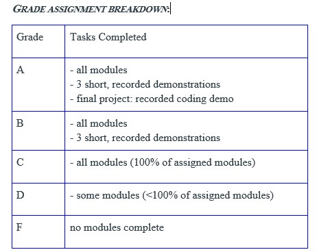

--- 
title: 
site: bookdown::bookdown_site
documentclass: book
bibliography: [book.bib, packages.bib]
biblio-style: apalike
link-citations: yes
description: ""
---
# Marine Genomics Semester edition

Welcome to Marine Genomics! This is a course on learning how to analyze genomic data for undergraduate and graduate students. We focused on marine organisms but these lessons can easily be applied to any taxa. We required that students have a background in biology and have completed the general biology series. Additionally, it is helpful if students have taken a course in Evolution, though this was not a requirement. We did not require any coding experience in R or Bash/UNIX. 

For most weeks, our course consists of one 75 min lecture and one 75 minute coding session per week. The lectures begin with a power point presentation where we introduce the weeks concept (for example, PCAs) and then are followed by a live coding demonstration carrier out by the instructor. The coding sessions provide an opportunity for the students to either repeat the same coding demonstration carried out during the lecture, or to extend the demonstration via coding exercises which we have written for each week and for which the solutions are available on our website (under each exercise). 

The first 5 weeks are primarily training in bash/UNIX and R basics and are structured as 2 lectures a week that are broken up with exercises for the students to practice each skill they are shown in live-coding demonstrations. The exercises typically take 5-15 minutes to complete. The remaining weeks are focused on performing a specific analysis (PCA, GWAS, Fst outlier analyses, etc). 

We provide all the data for the students to complete each weeks coding activities along with instructions for how to download the data. Additionally, the students found the website a phenomenally helpful resource.

## Cloud computing versus individual laptops

This course was designed to be carried out on the NSF funded Extreme Science and Engineering Discovery Environment (XSEDE) cloud computing resource [Jetstream](https://portal.xsede.org/jetstream). 

Jetstream is a unique user-friendly cloud computing resource in that it provides the students with an environment with root privileges, making program installation less complicated. Jetstream also provides a Desktop simulator which allows students to transition between bash and R using the same exact directory paths as the instructor, reducing the confusion of students having unique file paths and providing a more streamlined approach to what for many students is their first coding class. 

Jetstream educational allocations can be applied for through [XSEDE](https://portal.xsede.org/jetstream#allocations:education). The process of applying for a jetstream allocation for educational purposes is relatively straightforward and simply requires a course description, the number of students anticipated to participate, and a calculation of the computing resources required, and the instructors CV. Allocations are typically approved in two to three days and can be submitted ~2 weeks prior to the start of the course.

Alternatively, these course materials can be used on students and instructors individual laptops. The file paths will need to be modified and we cannot guarantee that the installation of programs and R packages will proceed as they did on Jetstream. Thus, progam installation will need to be verified for each week by the instructor.

## Assessment

We will be using a transparent module-based form of assessment. For each section of material covered in the course, a module will be released which will consist of several quizzes with multiple-choice questions relevant to that module’s material. These modules will reinforce your understanding of the material and you will be able to take each quiz multiple times to ensure accurate completion. There will be nine modules throughout the course. You will also have the option of submitting short recorded demonstrations that can be recorded through Zoom, for additional graded credit. There is no need to have sound or video showing during these recordings; further instructions will be provided on how to make and submit a recording. The option of submitting a final recorded project demonstration that will showcase multiple skills learned throughout the course will be discussed later in the course, for maximum graded credit. 

## Short recorded demonstrations

The purpose of these demonstrations is to showcase the skills you have learned in the course. There will be a list of possible demonstrations for each module once the assessment for that module is released. These demonstrations will include no more than four related skills per recording. For example, in the bash/UNIX module you could record a demonstration of yourself changing directories, making a new directory, and generating a new file in that new directory, and editing that file. These recordings are expected to be no more than 5-10 minutes long (and many could be recorded in much less time). You are free to choose which module(s) you would like to prepare a demonstration for, with the only restriction being that your three recorded demonstrations must each come from a different module. 

## Final demonstration

This demonstration will allow you to show that you have mastered the skills we have covered in class, but can also extend your abilities and complete somewhat “novel” analyses. These optional demonstrations focus on the final set of modules (#s 4-9) using skills in both bash and R, focusing on questions that we pose to you at the end of each module. For example, we may ask you to repeat an analysis that we did in class but with a different parameter, and then compare the difference between what we did in class and your results with the changed parameter. We will also require you to submit your code which can be saved as a simple text document (instructions on how to do this will be provided). For a sense of the types of questions that we will ask, please look at the end of each section of this website from a previous iteration of the course where we ended each week with Exercises/Practice Questions: https://baylab.github.io/MarineGenomics/

